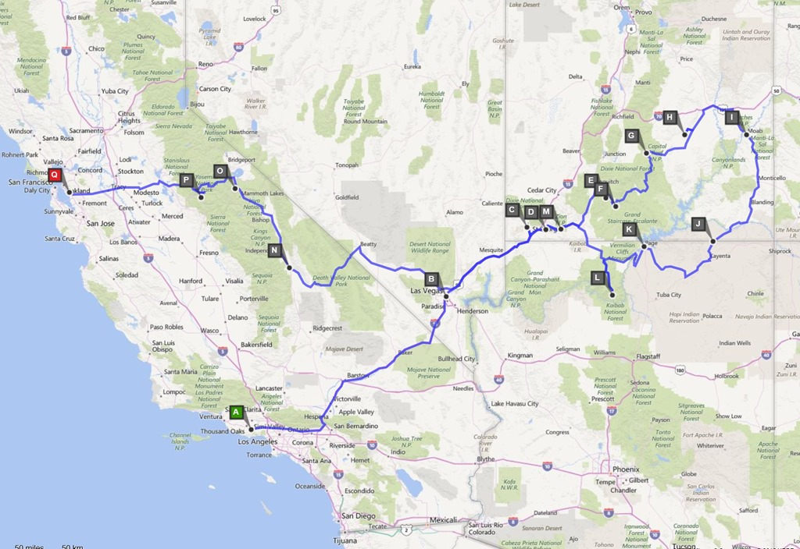

Na ongeveer 3500 kilometer gereden te hebben in 4 weken, komen we tot de volgende conclusies:

- Amerika is waarschijnlijk het enige land ter wereld waar je nog meerdere malen per dag een auto-alarm hoort afgaan.

- Reizen met een anderhalf jaar oud kindje gaat prima. Ik moet zeggen dat ikzelf met name nogal opkeek tegen de vluchten, maar dat is allemaal prima gegaan. Je moet haar natuurlijk wel bezighouden en het hebben van een eigen stoel met daarin de autostoel heeft volgens ons geholpen om haar rustig te houden. Op de vliegvelden krijg je alle hulp en krijg je voorrang zodat je niet in die ellendig lange rijen bij de diverse security checks hoeft te staan.

- De Chevrolet Tahoe blijft een fantastische wagen!

- In het algemeen zijn we de dagen vroeg begonnen zodat Sofie na het ochtendprogramma op de camping kon slapen of terwijl wij een stuk rijden naar de volgende bestemming. Twee nachten op dezelfde camping geeft extra rust, voor zowel ons als voor Sofie.

- De camping Anthony Chabot bij San Francisco is de perfecte eerste danwel laatste stop. De camping ligt erg mooi in de natuur (en 's avonds uitzicht op de verlichte Bay Area), heeft alle voorzieningen en binnen 45 minuten ben je bij het verhuurstation van Road Bear. Bovendien liggen in het toegangsstadje Castro Valley de gangbare supermarkten.

We zijn alweer voorzichtig aan 't bedenken wat we volgend jaar gaan doen. Bij het inleveren van de camper hoorden we dat Road Bear volgend jaar april een vestiging opent in Seattle. Het wordt waarschijnlijk vanuit San Francisco of Denver naar Seattle, maar dat gaan we nog allemaal bekijken.
