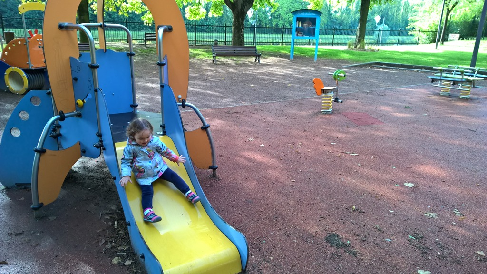
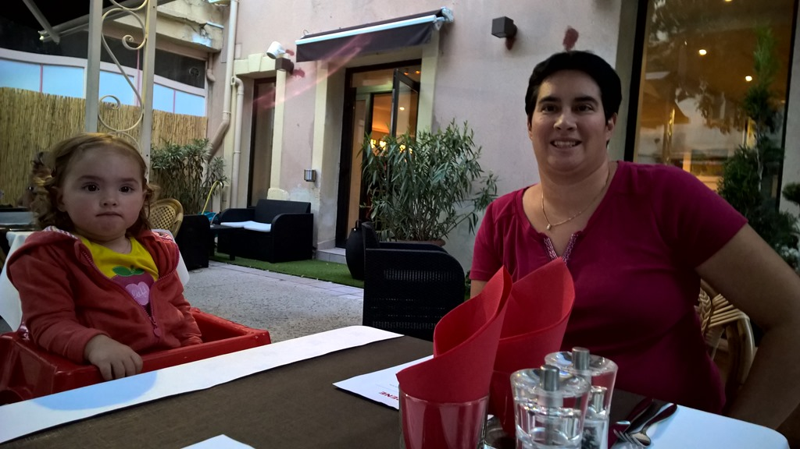
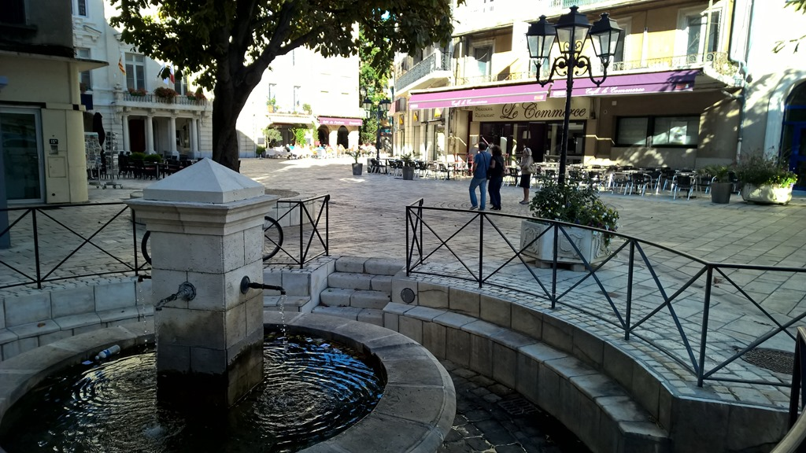
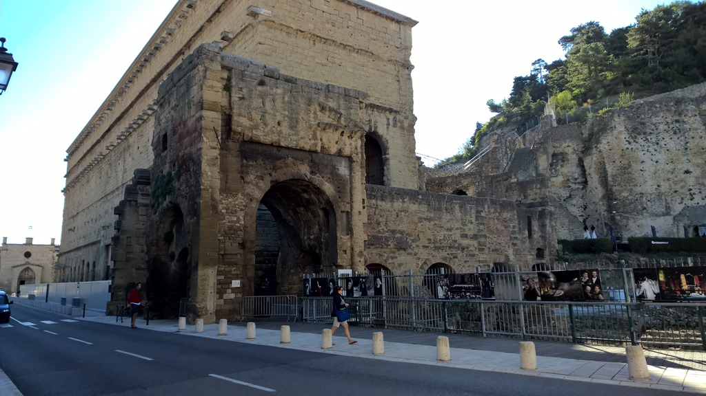
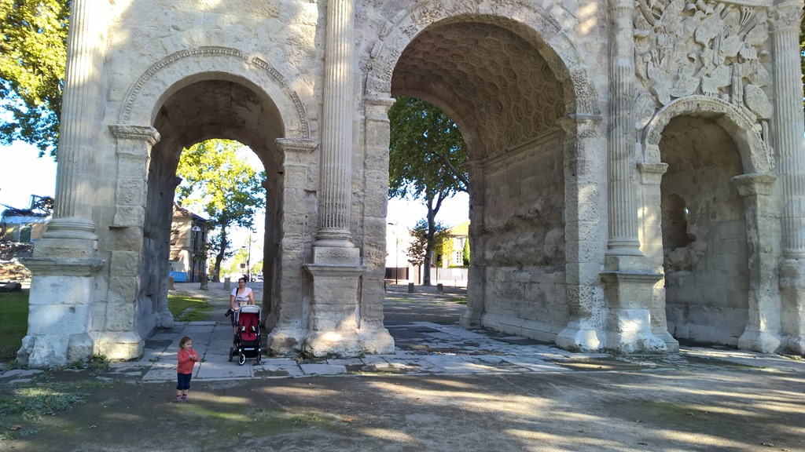

De najaarsvakantie van 2015 gaat naar Calonge, aan de Costa Brava. We hebben de totale afstand van ruim 1400 kilometer opgesplitst in 3 etappes: Van Den Bosch naar Thionville, dan naar Orange, dan naar de eindbestemming Calonge.

Direct na het avondeten zijn we vertrokken richting Thionville, ongeveer 4 uurtjes rijden van Den Bosch. Op het verlaten van Den Bosch zelf na (de gemeente lijkt niet te snappen dat het onhandig is om zowel de noordelijke als de zuidelijke toegangswegen tot de stad af te sluiten, waardoor al het lokale verkeer ook de A2/A59 op moet), ging de rit voorspoedig. Sofie viel een half uur voor we het hotel bereikten pas in slaap, dus ze werkte niet helemaal mee met ons plan, maar ze heeft zich voorbeeldig gedragen. Hotel Mercure in Thionville was niet echt super, maar het bed en het ontbijt was goed genoeg. We hebben best goed geslapen, ondanks dat de kamer letterlijk helemaal vol met bed stond. Het hotel was zo aardig geweest een fullsize bed voor Sofie in de toch al krappe kamer te zetten, met als gevolg dat je halsbrekende toeren moest uithalen om van je bed naar de badkamer te komen.

De volgende ochtend zijn we eerst wat door Thionville gaan wandelen. Sofie heeft de lokale aire de jeux aan een intensieve test onderworpen en goed bevonden.

Rond het middaguur zijn we weer gaan rijden via de Autoroute du Soleil. Bij Lyon was het wat druk, maar het bleef allemaal goed doorrijden gelukkig. En dus kwamen we mooi op tijd aan bij het Best Western hotel Arene Kulm in Orange. Wat een leuk hotel zeg, in een doodlopend straatje en met erg vriendelijk personeel. We kregen een upgrade naar een betere kamer. In de kamer was een trapje naar de badkamer, en Sofie vond dat maar erg interessant. Trapje op, trapje af, trapje op, trapje af… We hebben heerlijk gegeten buiten op het terras.

Na het ontbijt hebben we een korte wandeling door het stadje gemaakt. Orange is een oude Romeinse stad, en het antieke theater is een van de best bewaarde in Frankrijk. Ook is er nog een triomfboog.

Uiteindelijk waren we om 4 uur bij ons huis in Calonge.
