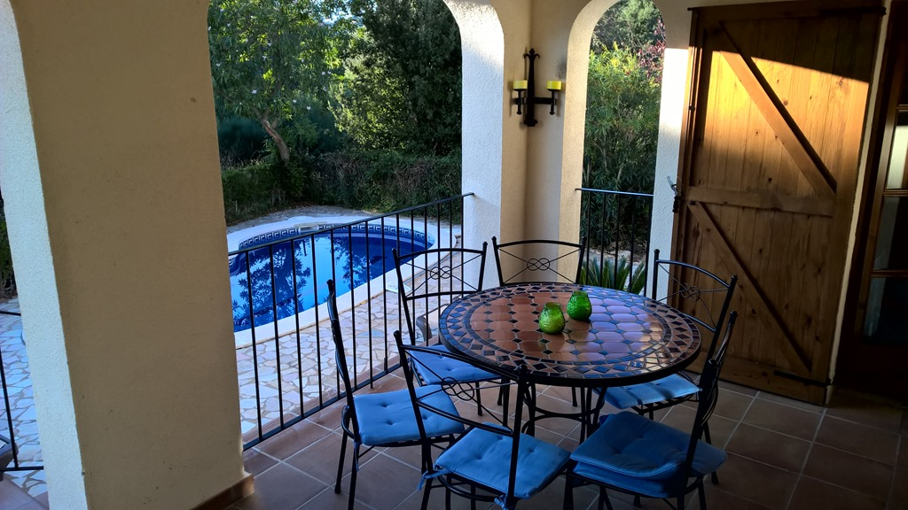
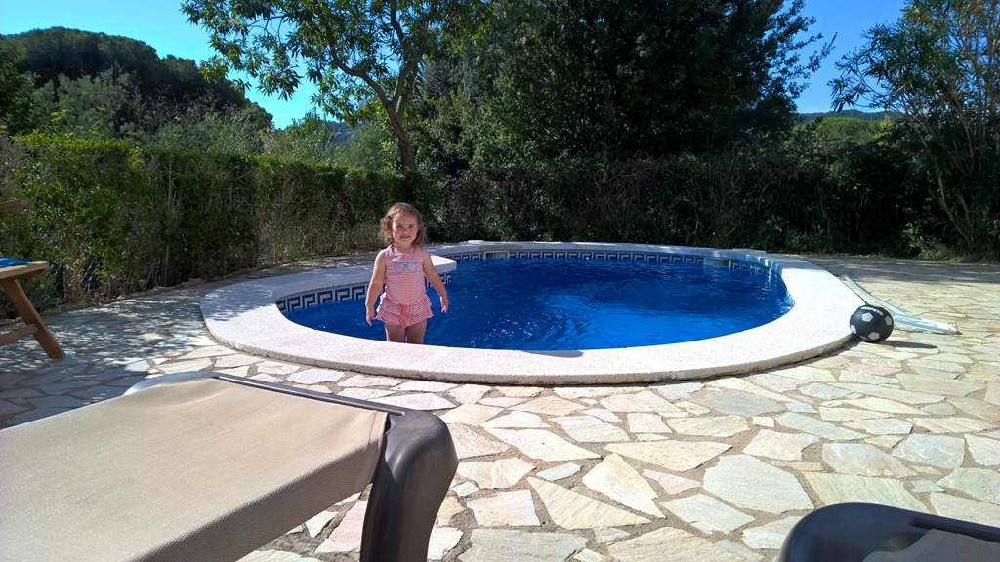
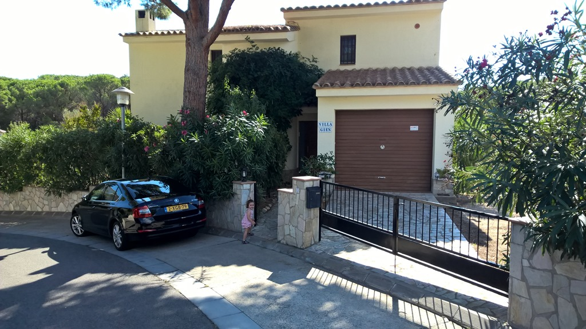
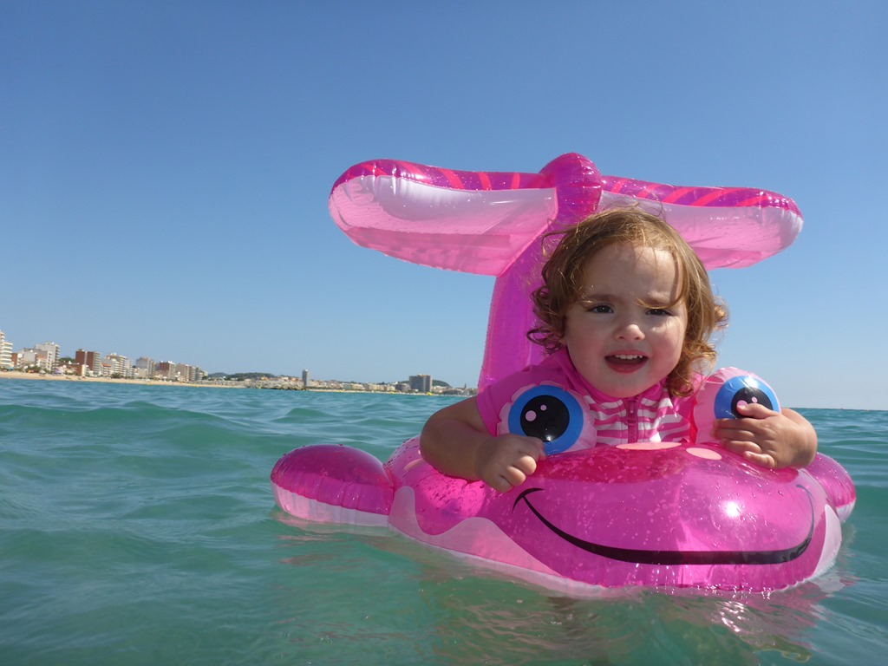
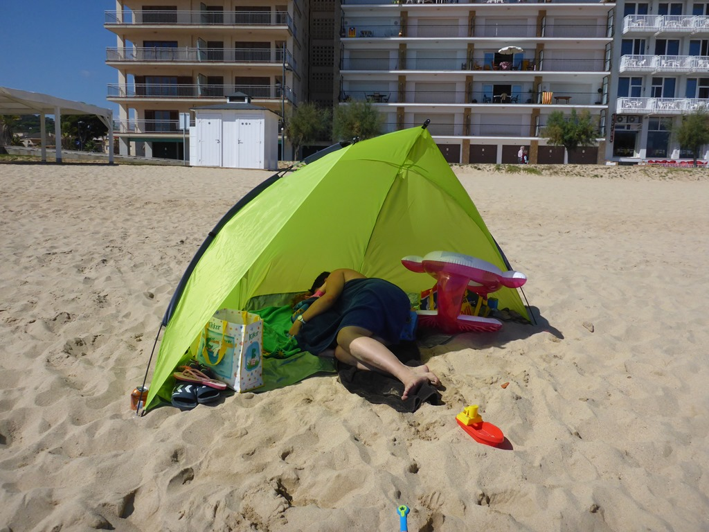

Ons huis voor deze week bevalt erg goed. Op de keuken na, is het allemaal brandschoon. De vorige huurders waren smeerkezen en hebben de vuile vaat laten staan, dus de schoonmaakster heeft op het laatste moment de hele vaatwas moeten vullen. Helaas heeft ze het korte programma gekozen, want het spul kwam er nog smerig uit. Dus hebben we maar alles met de hand afgewassen. En gelukkig zijn de bedden erg goed!

Maandagmiddag zijn we naar het strand geweest, is nog geen 10 minuten rijden. Sofie vond het zand leuk, maar de zee helemaal niet. Ze wilde niet lang in het water blijven.

En dat terwijl het zeewater warmer is dan dat van ons zwembad! We denken dat ze gewoon erg moe was, want ze wilde in de tent een dutje doen…

## 2 opmerkingen

### Gerard 23 september 2015 om 00:21

He vakantiegangers, het ziet er allemaal leuk uit en Sofie heeft blije oogjes en heeft het dus naar de zin. Ook het weerzien bij Pieter en Eva en de kids was een leuke gebeurtenis. Sofie had twee speelmaatjes die natuurlijk alles voor haar over hadden.
Veel plezier nog de komende dagen, geniet er maar lekker van

### fam. van Kuil (junior) 24 september 2015 om 18:27

Het ziet er weer harstikke gezellig uit hoor. En wat vindt sofie het ook weer fantastisch. Toch lijkt het op de foto alsof ze van de zee geniet met haar zembandje. Nemen jullie de zon mee??? het is hier brrrrr
