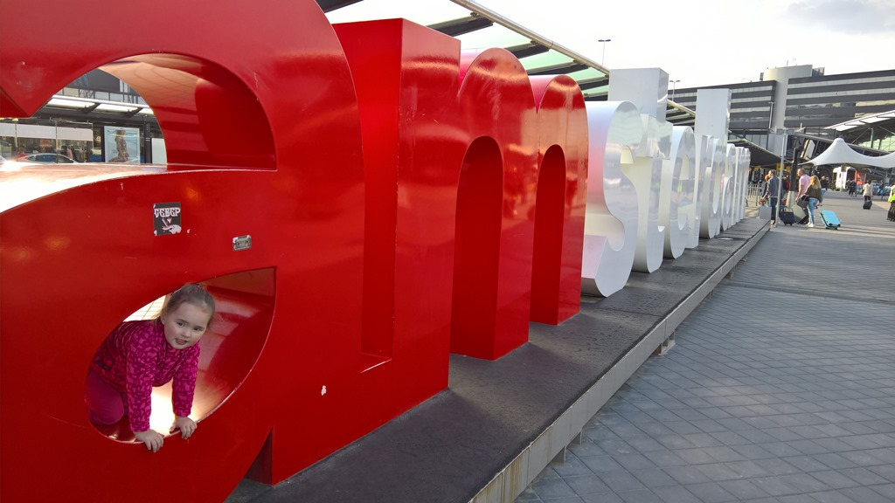
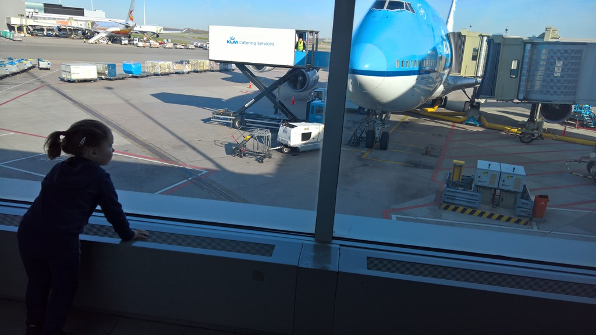

Omdat we nogal vroeg op Schiphol moesten zijn, zijn we een dag voor vertrek al naar de luchthaven vertrokken en hebben we overnacht in de CitizenM, pal naast de vertrekhal. Op deze manier konden we op ons gemak Schiphol verkennen en was de stress voor vertrek een dag verplaatst. Na de maaltijd bij Dakota, zijn we onder de supermoderne wol gekropen van CitizenM (alles in de kamer is te bedienen via een tablet).

Het inchecken duurde iets langer dan voorheen, maar de verwachtte drukte en (zichtbaar) aanwezige extra security viel heel erg mee.

Sofie heeft zich gedurende de 10 uur en 20 minuten durende vlucht voorbeeldig gedragen, ze heeft zelfs ruim twee uur geslapen. We hebben niet alle kadootjes hoeven aanwenden om haar rustig te houden, dus die houdt ze nog tegoed. De hele douane-afhandeling in Los Angeles ging ook voorspoedig, dus we waren al snel op weg naar Alamo voor de huurauto (GMC Yukon deze keer) om vervolgens via Ikea (voornamelijk vanwege de kinderstoel) naar ons hotel voor de eerste twee nachten op Amerikaanse bodem te rijden: Howard Johnson Hotel in Anaheim. Dit hotel heeft als slogan "Retro Family Fun", waarbij je dus ouwe zooi zou kunnen verwachten, maar het tegenovergestelde bleek waar. Een ruime kamer, en een leuk waterparkje waar papa en Sofie direct na aankomst een duik in hebben genomen, terwijl mama wat ging rommelen met de koffers. De keuze voor dit hotel ligt voor de hand: het ligt op minder dan 10 minuten wandelafstand van Disneyland... Onze eerste echte bestemming deze trip!

## 1 opmerking

### Gerard 13 mei 2016 om 00:56

Ja, je kunt Sofie goed mee op reis nemen. Ze is bij mama en papa, dan is alles goed.
