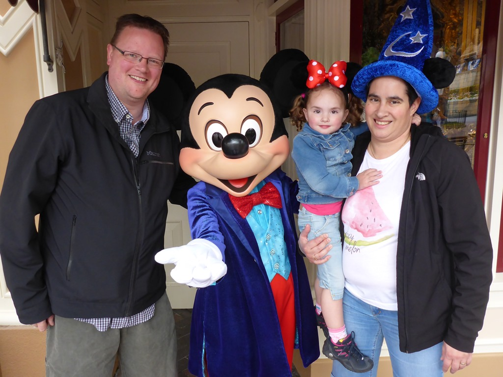
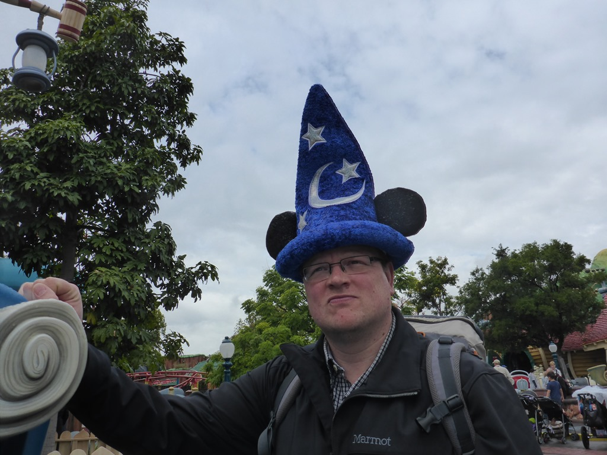
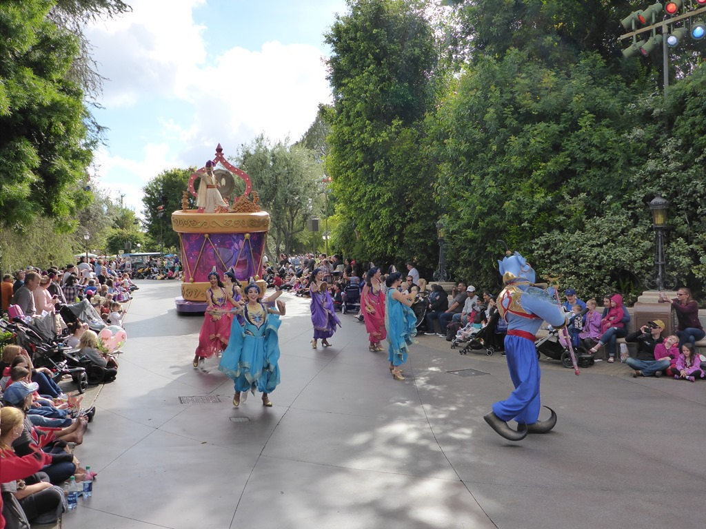
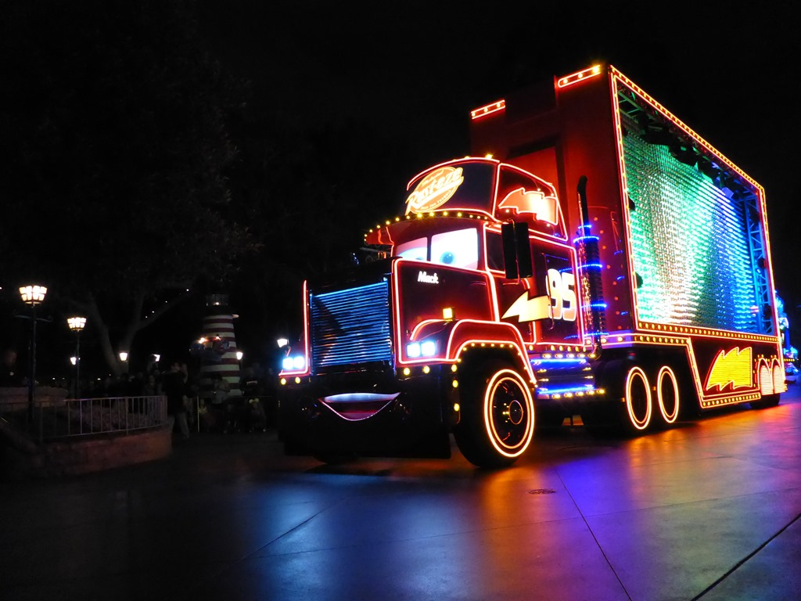

Dankzij de jetlag was Sofie (en *grrr* wij dus ook) klaarwakker om 2.30 in de nacht, dus de eerste uurtjes op de hotelkamer verplichte bezigheidstherapie. Na een stevig ontbijt bij Mimi’s Cafe, tegenover het hotel, stonden we om 9 uur voor de poort van Disney. En we konden direct op de foto met Mickey, Sofie was erg onder de indruk, maar vond het helemaal geweldig.

Na de foto konden we de regenjassen aantrekken, want het ging behoorlijk hard regenen. Gelukkig duurde de bui maar kort, en de rest van de dag was het prima toeven in het park, en werd het zelfs warm. Met name Toon Town, waar Mickey, Mini, Donald en de rest wonen, viel in goede smaak bij de jongste van het stel. Het was zo mooi om te zien hoezeer Sofie aan het genieten was.

Van het bezoek aan het huis van Mini en Mickey, de boomhut van Chip and Dale (Knabbel en Babbel) tot aan de achtbaan aan toe, alles vond ze leuk. Ze bleef maar rennen en stuiteren.

Na de parade van half vijf zijn we even teruggegaan naar de kamer om een beetje uit te rusten, want 's avonds wilden we heel graag nog naar de lichtjesparade gaan.

Wat een spektakel! Dat is toch wel iets wat die Amerikanen heel erg goed kunnen!

## 1 opmerking

### Gerard13 mei 2016 om 00:58

Leuk te zien hoe jullie genieten
