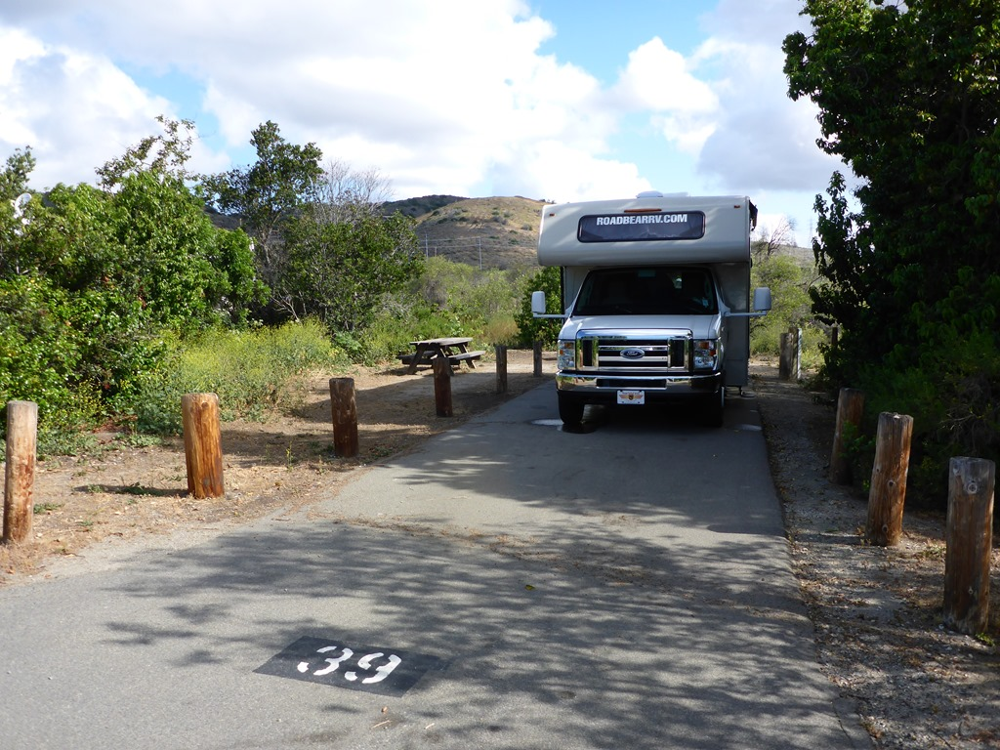
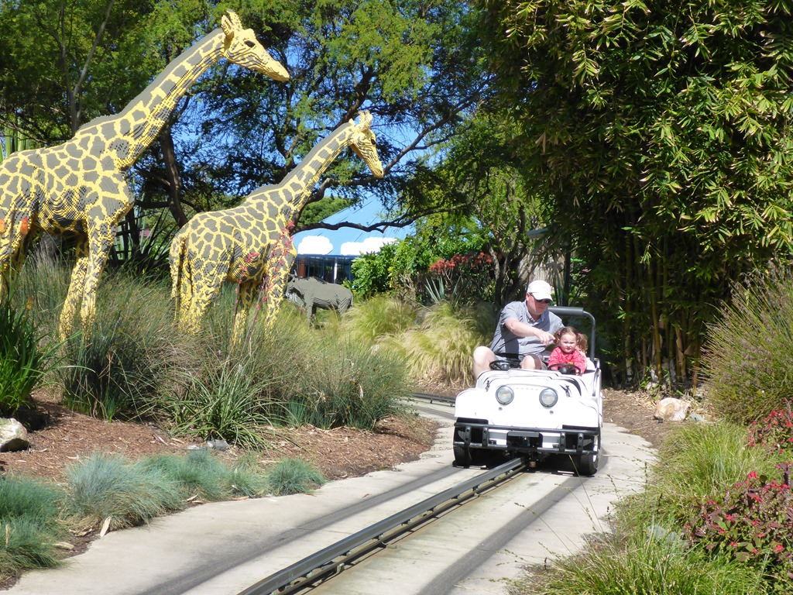
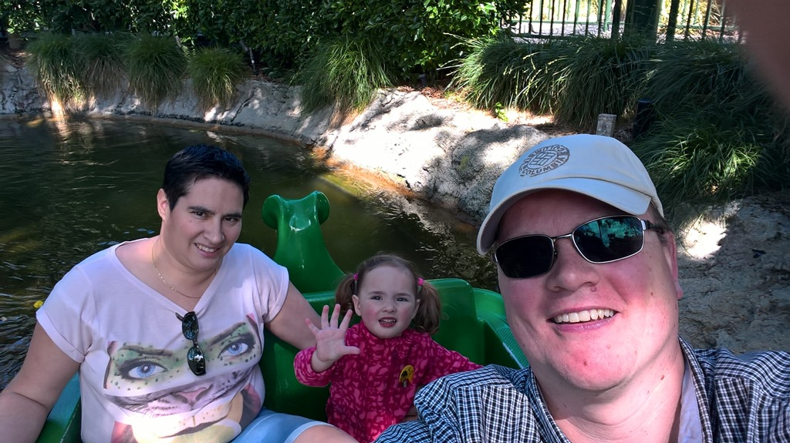
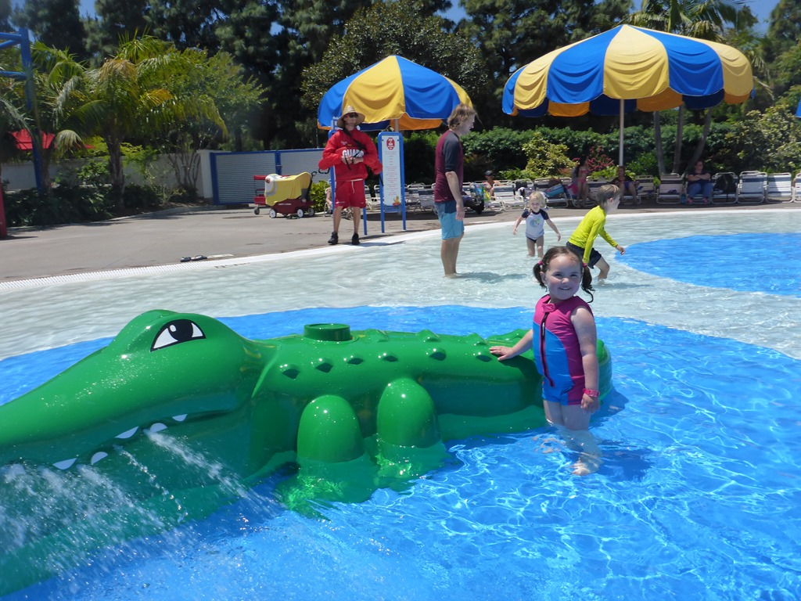
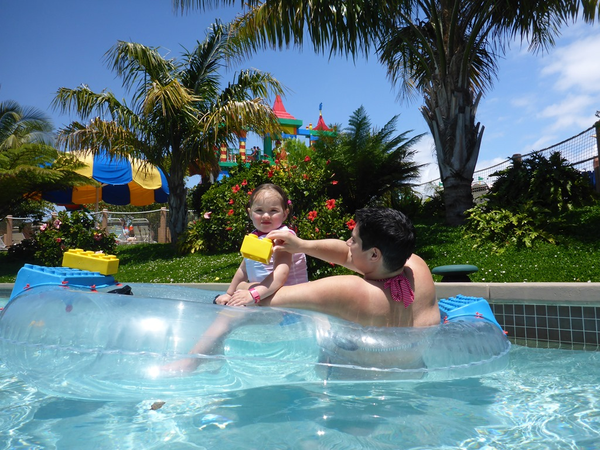
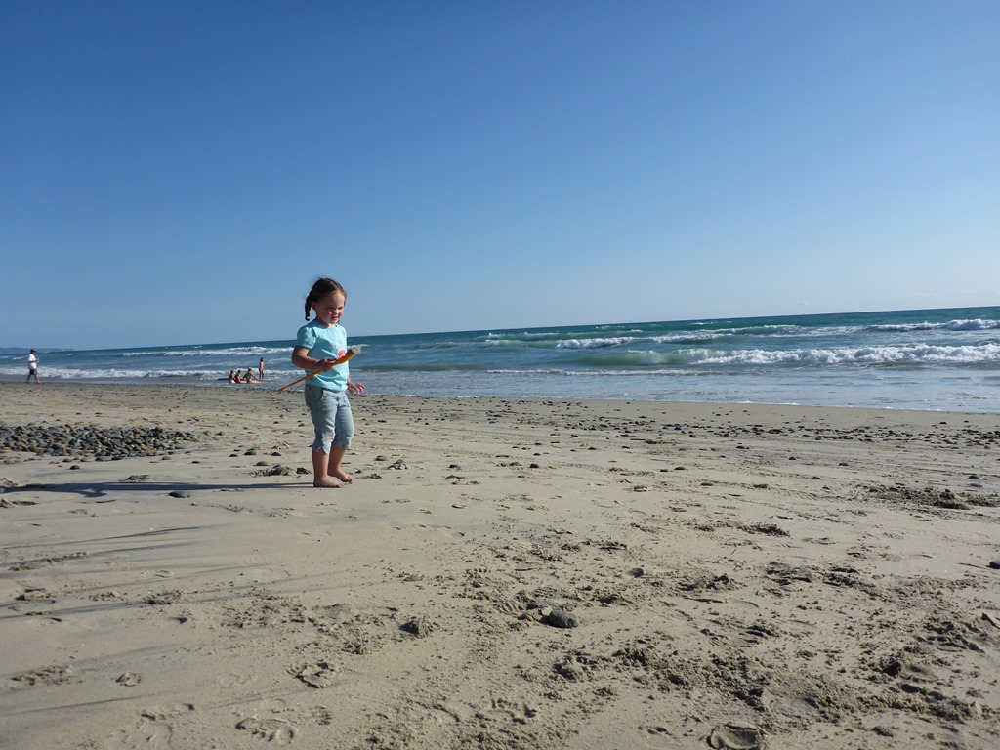
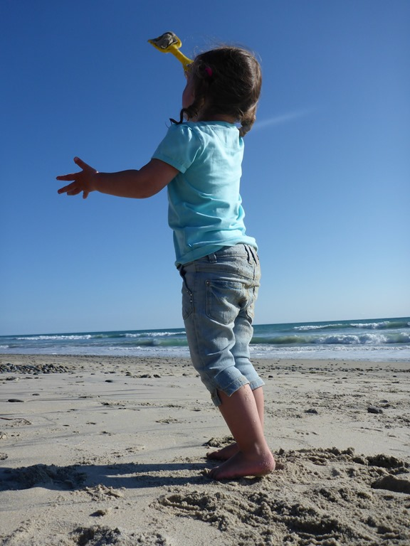

Gisteren hebben we de camper opgehaald bij Roadbear, en daarna boodschappen gedaan bij de lokale Safeway (hier Vons genaamd). De GMC voiture hebben we teruggebracht bij Alamo op Long Beach Airport, en daarna nog even bij de Walmart geweest voor de BBQ en twee fietsen. Daarna snel doorgereden naar camping San Mateo in San Onofre State Beach. Camping was wel aardig, en we hadden in ieder geval stroom en water, wat de eerste dag altijd wel fijn is.

De volgende morgen moesten we een beetje op tijd opstaan, want vandaag staat Legoland op het programma.P1030978

Legoland is een heel leuk park, voornamelijk bestemd voor kinderen natuurlijk, maar het is ook voor volwassen best leuk om te bezoeken. We hebben met een autootje door een soort dierentuin gereden, waarbij alle dieren van Lego gemaakt zijn.

Toen met een bootje langs allerlei sprookjestaferelen.

Na de speeltuin en een ritje in een draaimolen was het waterpark aan de beurt. Wat een feest was dat zeg.

De toegangsprijs van bijna 100 dollar per persoon is erg stevig natuurlijk, maar als je bedenkt dat bij ieder zwembadje minstens 6 lifeguards staan, die hun baan allemaal zeer serieus nemen, dan valt het eigenlijk nog wel mee.

We hebben overnacht op de camping van South Carlsbad State Beach, en stonden pal aan het strand. We hadden een erg mooi plekje, met uitzicht over de Pacific en hebben ‘s avonds de BBQ en een kampvuur aangestoken.

