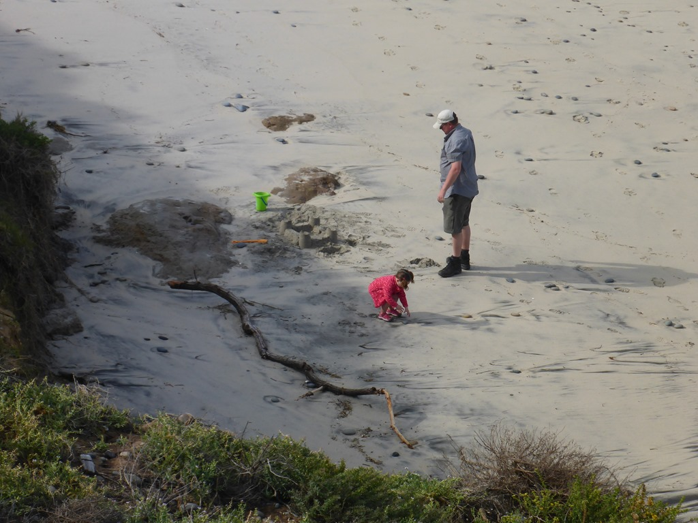
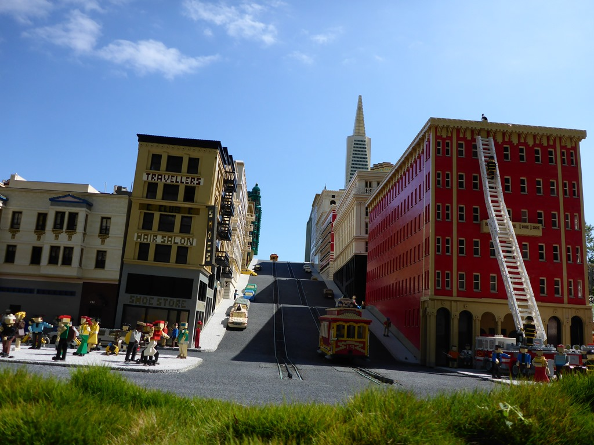
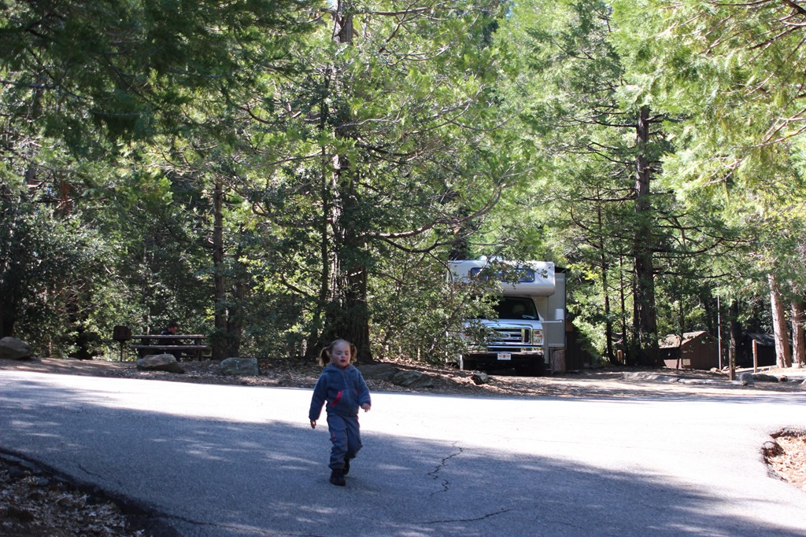
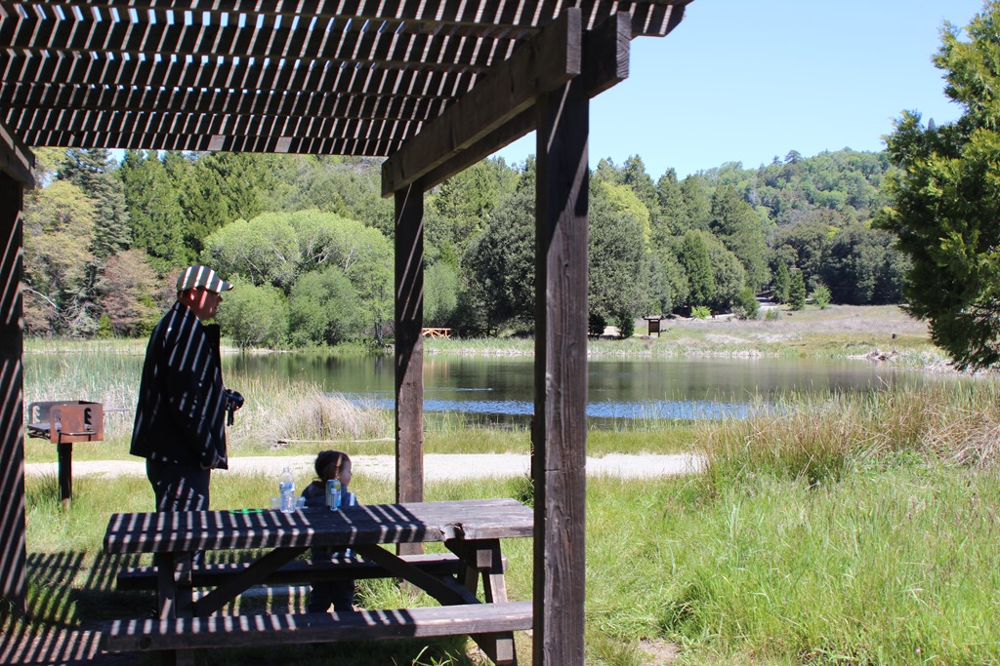
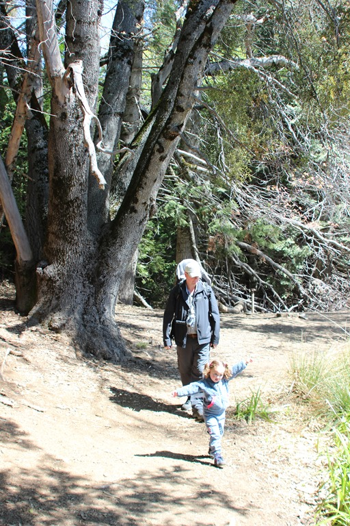
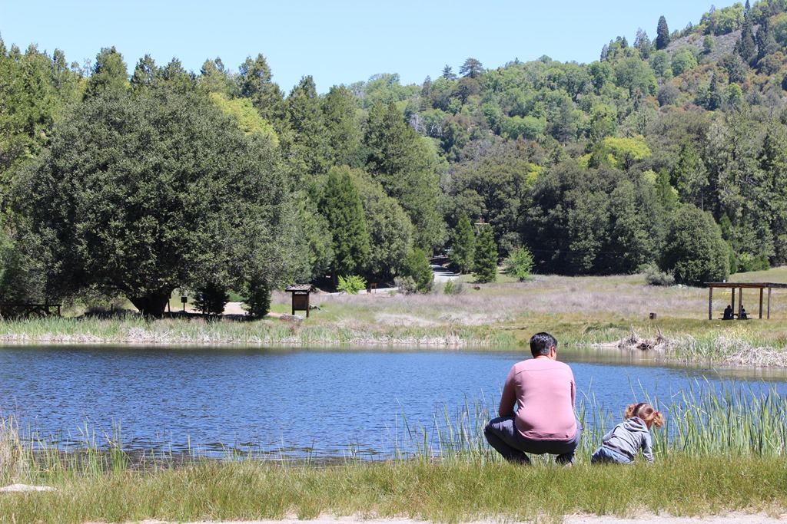
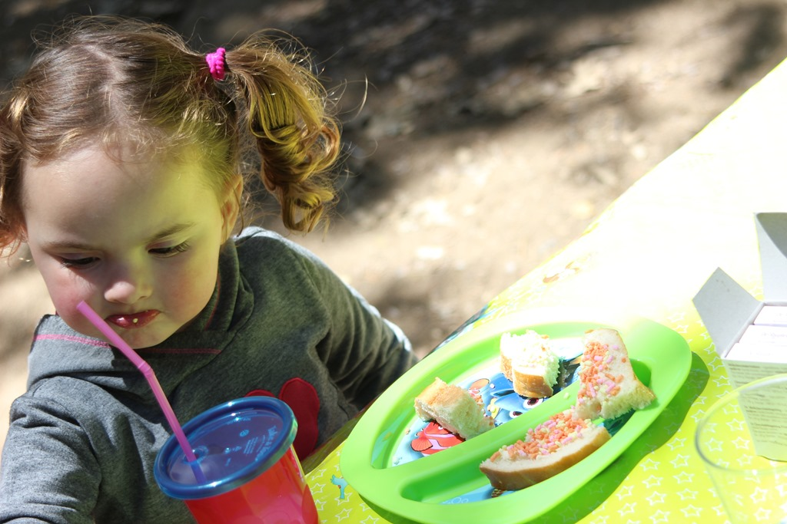
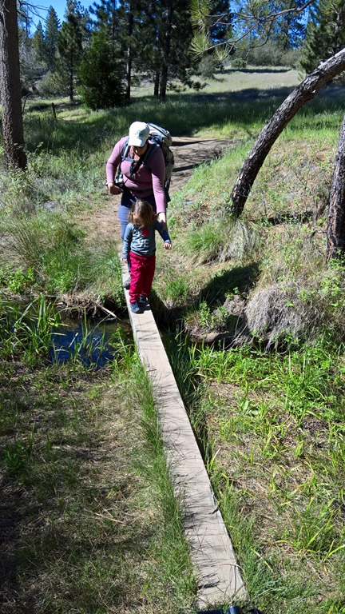
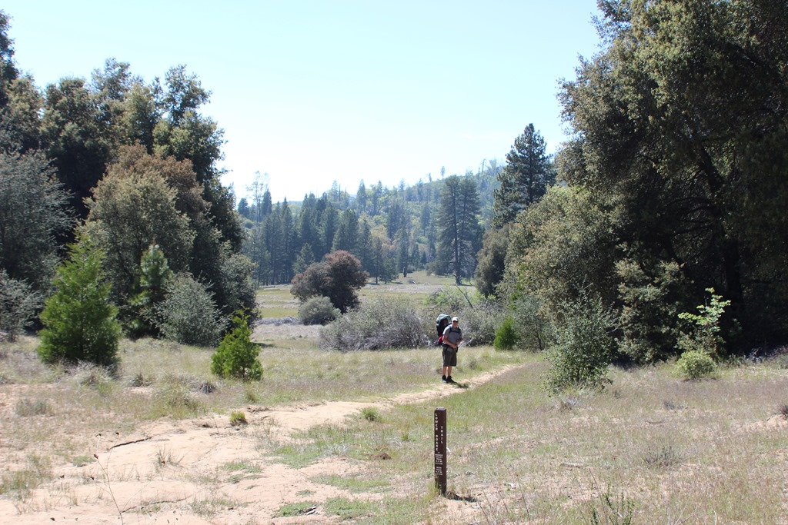
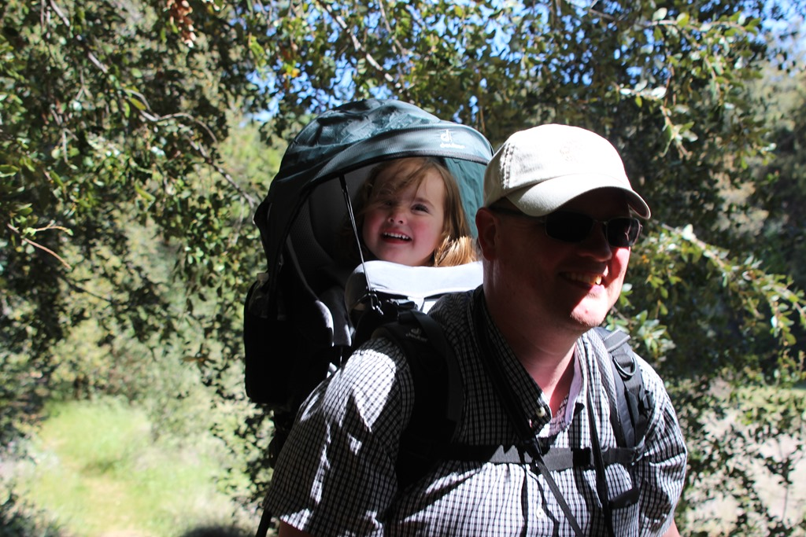

's Morgens hebben we nog een laatste bezoek gebracht aan het strand, Legoland en het waterpark. Ze hebben in Legoland een soort Madurodam genaamd Miniland USA, waar ze wat highlights van de States in miniatuur hebben nagebouwd met Lego.

Na de lunch zijn we vertrokken naar Palomar Mountain State Park. Het ligt een beetje uit de richting blijkbaar, want er zijn slechts 3 plekken bezet op de camping. Van de ene kant jammer, want het is hier erg mooi, van de andere kant is wel heel erg rustig zo. We waren van alle beslommeringen zo moe, dat we met z'n allen om acht uur zijn gaan slapen. We hadden mooi plekje, toevallig ook nog eens de enige site waar wij met onze camper in mochten.

Het was behoorlijk fris vanmorgen (we zitten immers op een mountain), dus we hebben ontbeten met de kachel aan. Daarna warmde het buiten gelukkig redelijk snel op, en dus hebben we een mooi wandelingetje kunnen maken rond de lokale plas.

Na de siesta hebben we een wat langer, erg mooi, wandelingetje gemaakt rond de camping, die bij tijd en wijle best spectaculair was.



Het wandelen bij papa in de rugdrager bevalt duidelijk prima!

## 1 opmerking

### Gerard13 mei 2016 om 01:05

Dat is toch maar weer lekker genieten met z'n drieën!!!!!!
