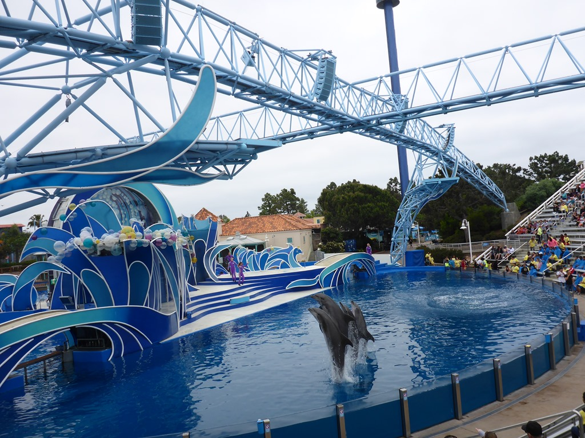
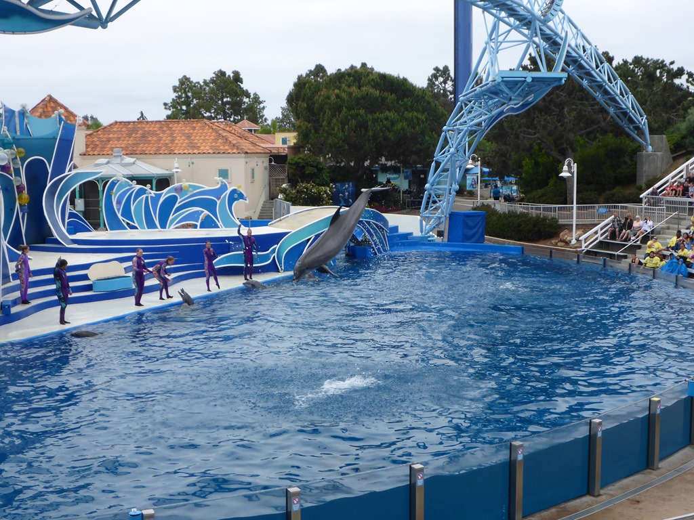
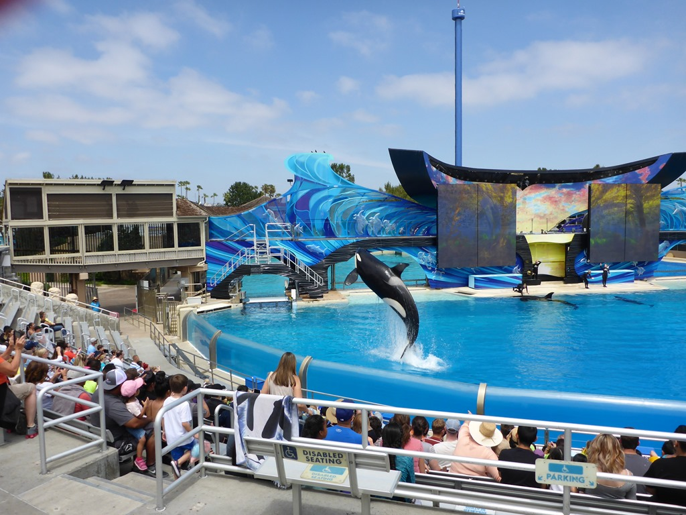
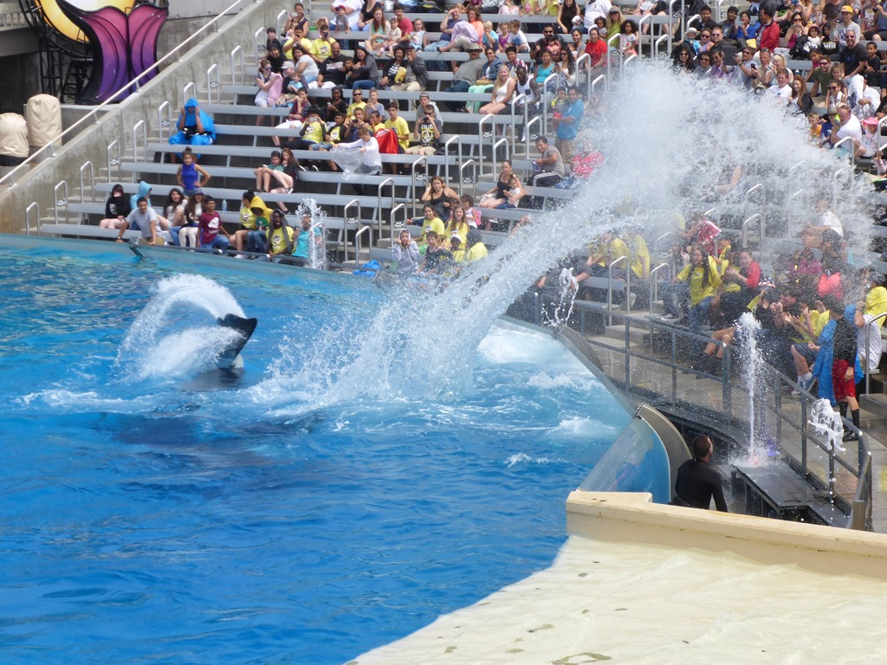
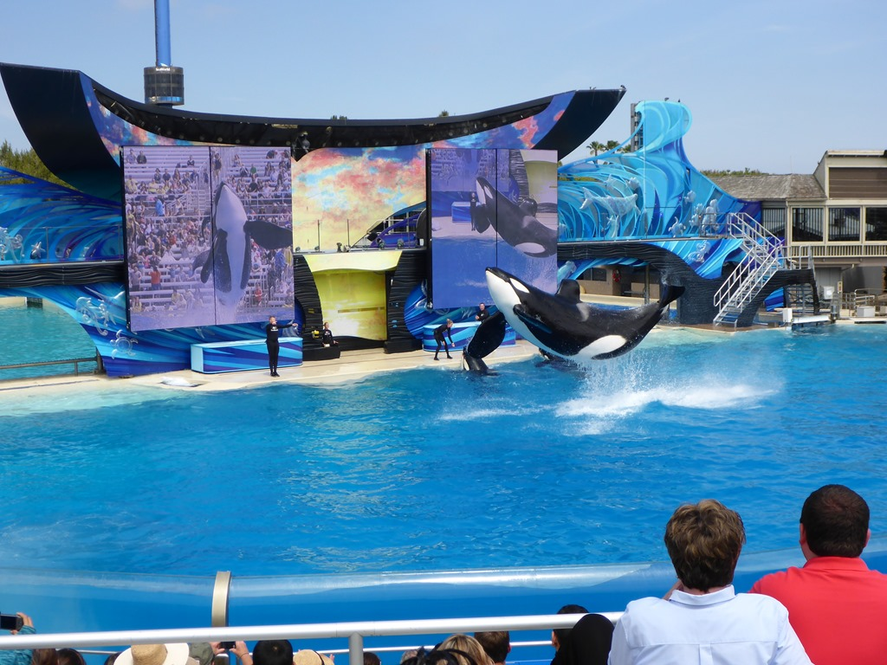
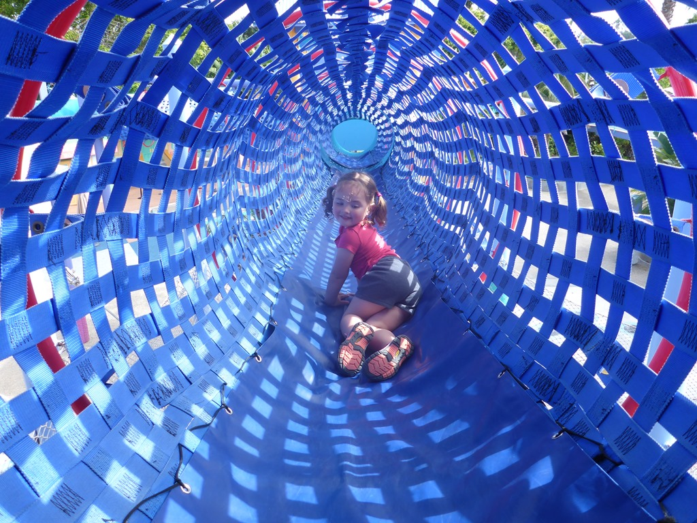
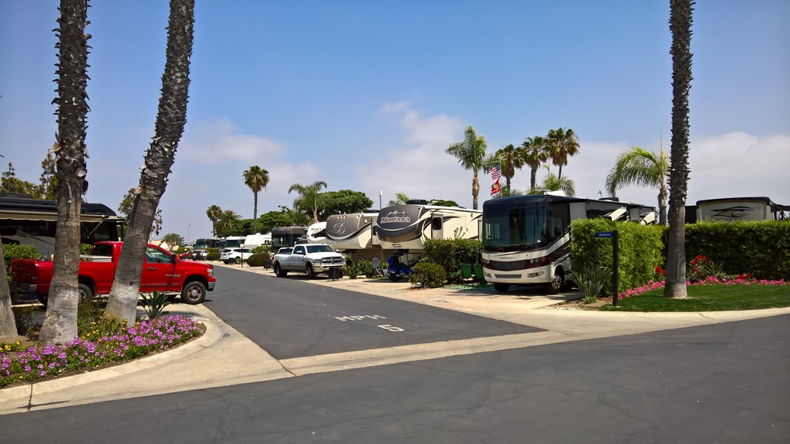

Met 1.3 miljoen inwoners is San Diego op acht na de grootste stad van de VS, en dat is goed te merken aan het verkeer: de snelwegen kruisen elkaar tot zes rijstroken breed op vijf niveaus. We hebben er dan ook redelijk lang over gedaan om bij Sea World te raken. We waren maar net op tijd voor de dolfijnen show, wederom met veel Amerikaans spektakel. De dolfijnen hadden er duidelijk zin in, en sprongen er driftig op los.

Na de dolfijnen hebben we nog de haaien, schildpadden en natuurlijk de pinguïns bezocht. Na de lunch was het tijd voor het spektakelstuk van Sea World: de orka-show. Dierenactivisten strijden al jaren lang tegen deze show, en het schijnt dat de shows volgend jaar gaan stoppen. De show begon met een eerbetoon aan allen die hun leven hebben moeten laten bij de strijd voor de vrijheid. We werden vriendelijk verzocht om allemaal te gaan staan, terwijl er een mierzoete film werd afgespeeld. We vonden het niet passen bij het geheel, en hadden er zo onze bedenkingen bij. De show was verder prima in orde trouwens.

De eerste tien rijen van de arena vormen de zogenaamde soak zone. Als je daar gaat zitten, dan loop je terdege het risico dat je versneld een nieuwe iPad, telefoon en/of camera kunt gaan aanschaffen. Het schijnt dat die apparaten niet goed tegen (veel) zout water kunnen.

Na de show mocht Sofie nog even in de speeltuin rond rennen.

De camping voor de komende twee nachten is Chula Vista RV Resort. Bij die naam krijg je wellicht associaties bij een romantisch, idyllisch campinkje. De Amerikaanse idyllische camping ziet er zo uit…

Amerikaanse commerciële campings zijn meestal voorzien van idyllisch, welhaast Anton Pieck-achtig beton, meestal gelegen naast een snelweg (of spoorbaan). In dit geval echter vlakbij een start- en landingsbaan van San Diego International Airport. Gelukkig staat de wind gunstig, want we hebben er niet al te veel last van, op wat helikopters na af en toe. Onze camper valt in het niet bij de knapen die hier staan. Met name de zogenaamde fifth-wheelers (vergelijkbaar met onze caravans) zijn vaak onwaarschijnlijk groot. En dan nog de auto die ervoor (of erachter) hangt... Het mag wat kosten blijkbaar.

We zijn overigens zo’n 16 kilometer verwijderd van Tijuana in Mexico, dus we zijn behoorlijk zuidelijk inmiddels. Hier praten ze dan ook Engels met een zachte G.

Na een goede nachtrust hebben we voor de eerste keer onze fietsen uit de kelder gehaald om naar het lokale speeltuintje te rijden.

's Middags hebben de dames nog even gezwommen in het zwembad, daarna ging alras de BBQ weer aan.



## 1 opmerking

### Gerard 14 mei 2016 om 10:37

Jullie zaten dus buiten de gevarenzone en dat levert toch mooie plaatjes op. Je hebt trouwens zo te zien weer goede rijwielen.
