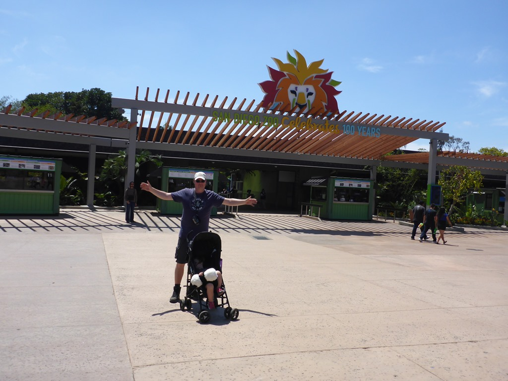
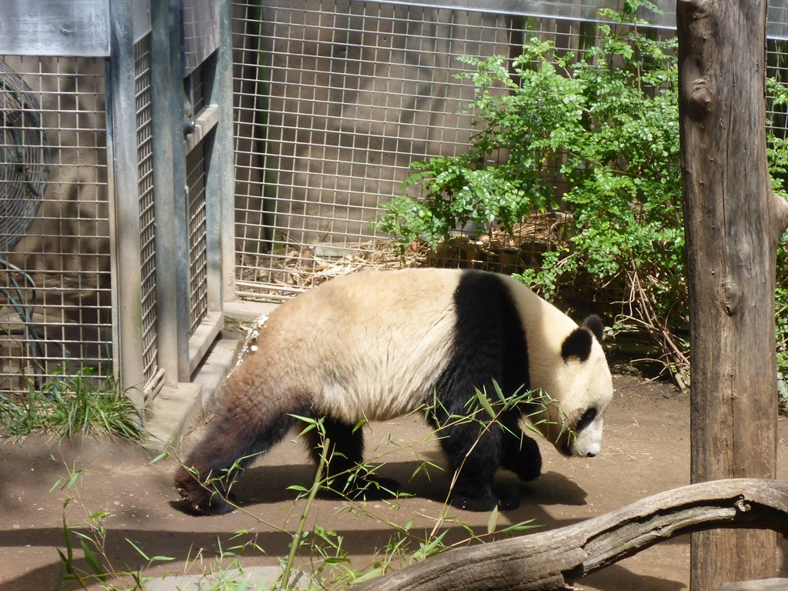
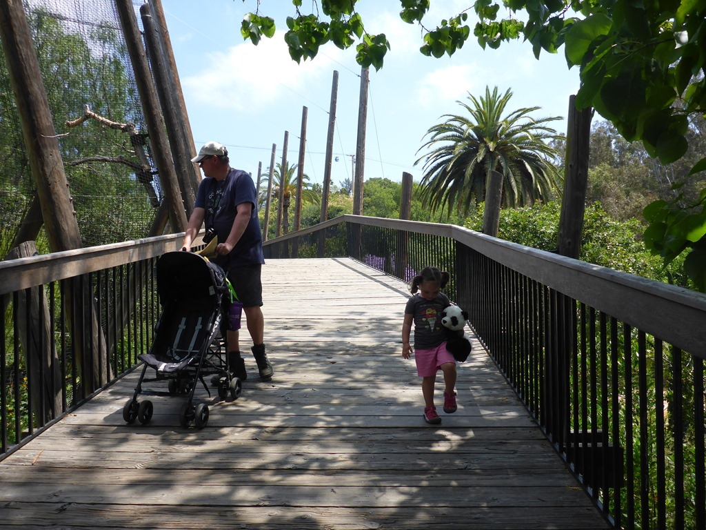
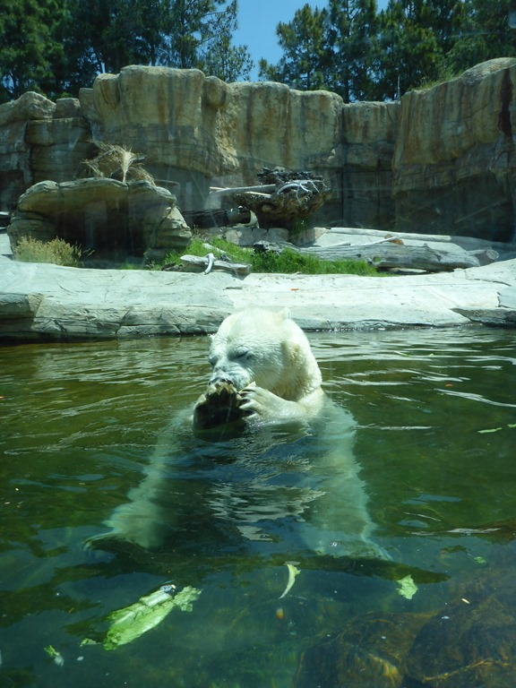
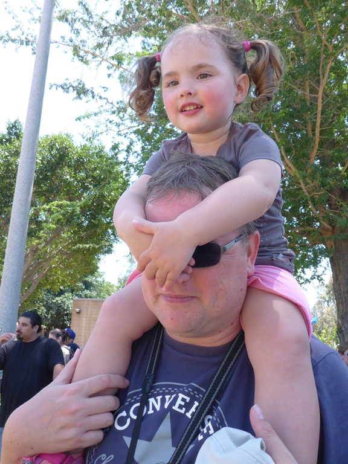
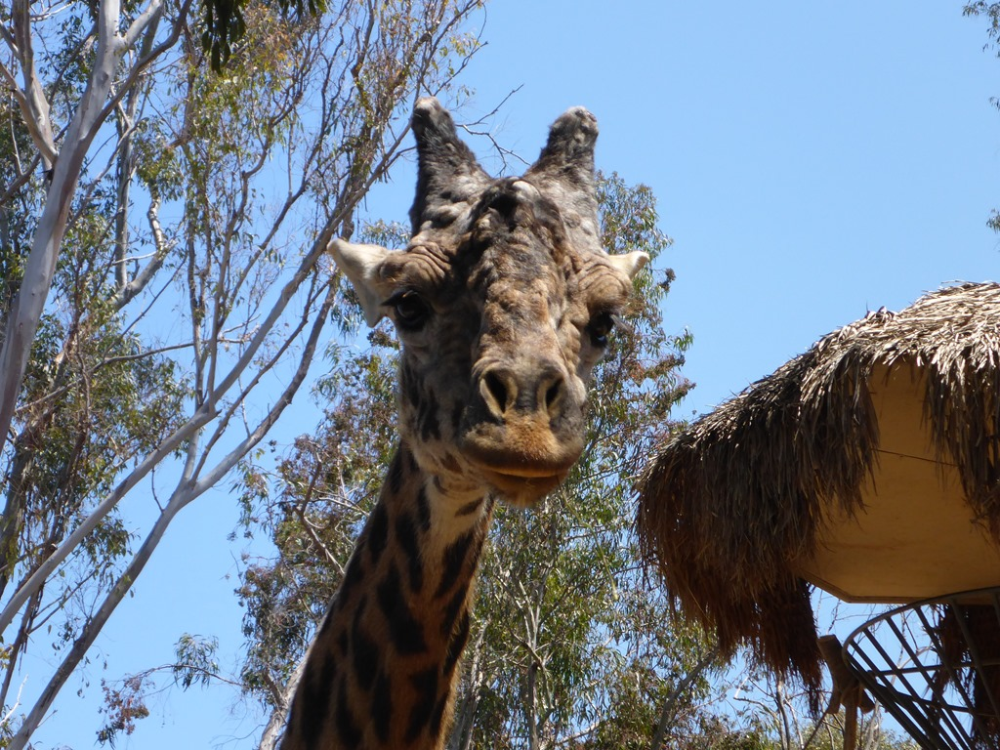

We maakten ons gisteravond toch een beetje zorgen over het feit dat Sofie een kakkerlak van zeker 7 centimeter een "lieveheersbeestje" noemde... Het lieveheersbeestje in kwestie had zijn domicilie in het washok van de camping, en rende daar lustig rond.

Vandaag staat het laatste "pretpark" op het programma: de San Diego Zoo. Volgens Wikipedia verblijven er zo’n 4000 dieren van meer dan 800 verschillende diersoorten op het 40 hectare grote terrein. Het is een van de weinige dierentuinen in de wereld met reuzenpanda's. Het is werkelijk een prachtige dierentuin, je wandelt door een botanische tuin waarin alle verblijven verwerkt zijn. Het weer hielp ook een handje, het was erg warm en zonnig, en bovendien helemaal niet druk.

Sofie had de tijd van haar leven, ze bleef maar nieuwe dieren verzinnen die ze nog wilde zien.

De zoo krijgt de panda's in bruikleen van de Chinese overheid en de zoo betaalt daar per panda 1 miljoen dollar voor. De panda was ernstig bedreigd, op een gegeven moment waren er wereldwijd nog maar een stuk of 600. Er is vervolgens onderzoek gedaan waarom er maar zo weinig jongen worden geboren. Het blijkt dat de vrouwtjes slechts drie dagen per jaar willen paren. Deze wetenschap stelt dierentuinen als die in San Diego dus in staat om mannetje en vrouwtje op het juiste moment bij elkaar te brengen om de natuur vervolgens zijn ding te laten doen.

Na al dit moois hebben we wat boodschappen gedaan en naar de volgende camping gereden, San Diego RV Resort, en die ligt, jawel, tussen Interstate 8 en een spoorlijn!

## 2 opmerkingen

### Gerard 14 mei 2016 om 10:19

Roger, je moet Sofie ook uitleggen dat alleen lieveheersbeestjes rood zijn en stippels hebben. Het is trouwens maar goed dat Sofie bij Roger op de schouder zit. Zij kan hem de weg wijzen want zien kan hij niks!!!!!

### Anoniem 15 mei 2016 om 19:39

Toet toet, tuuuut tuuuut! Hopelijk hebben jullie toch lekker geslapen. Gisteren leuke bruiloft gehad. Nu zijn wij ook klaar voor de USA. De eerste stapjes zijn gezet, dus dat wordt een hike van 0,25M. Leuk dat jullie zo'n plezier hebben. Duidelijk dat jij Roger Mouse een echte wizard bent haha!
