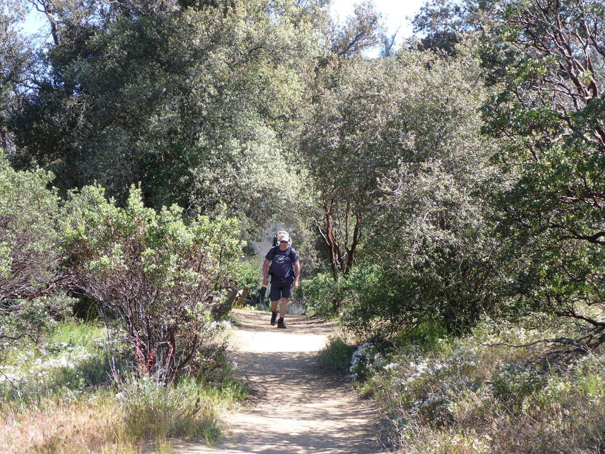
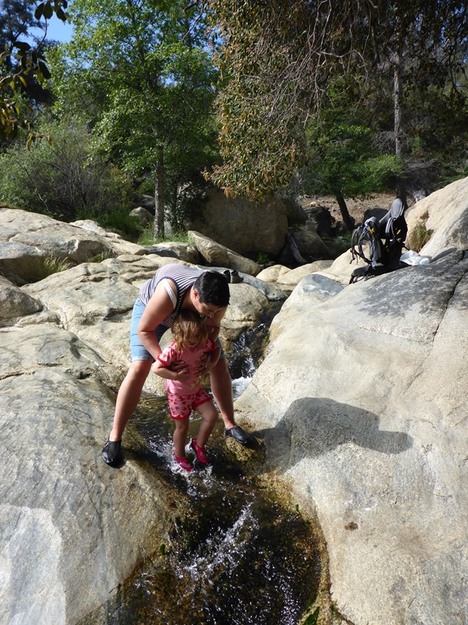
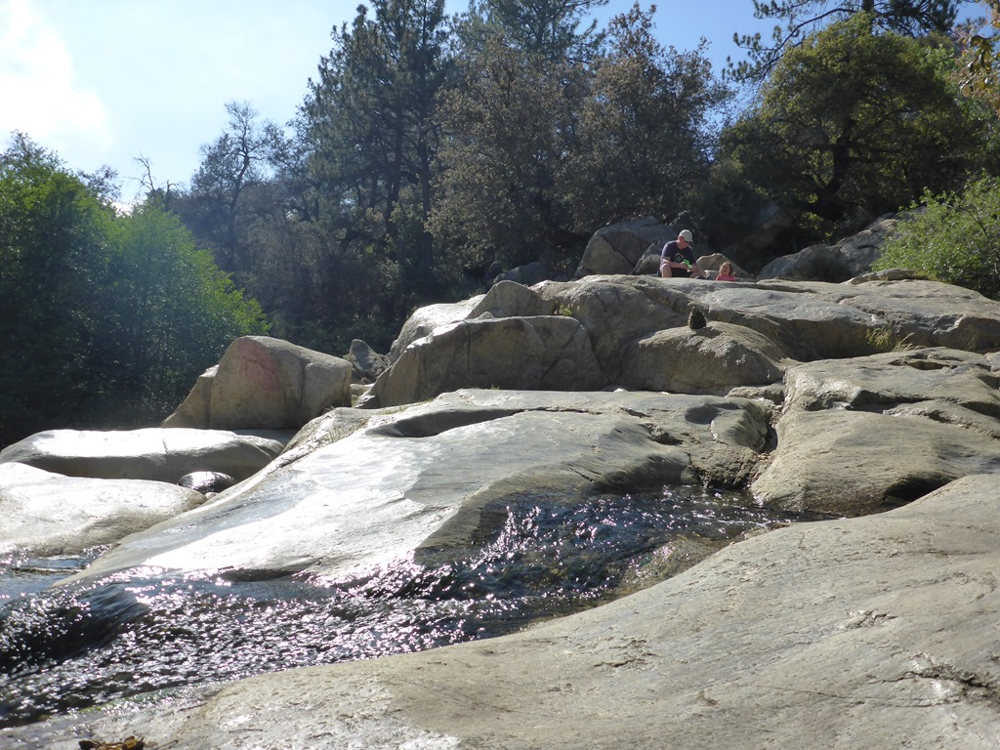
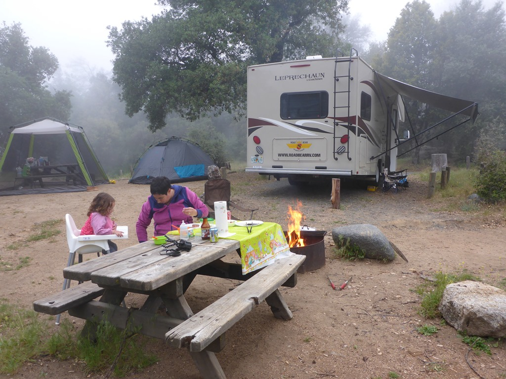
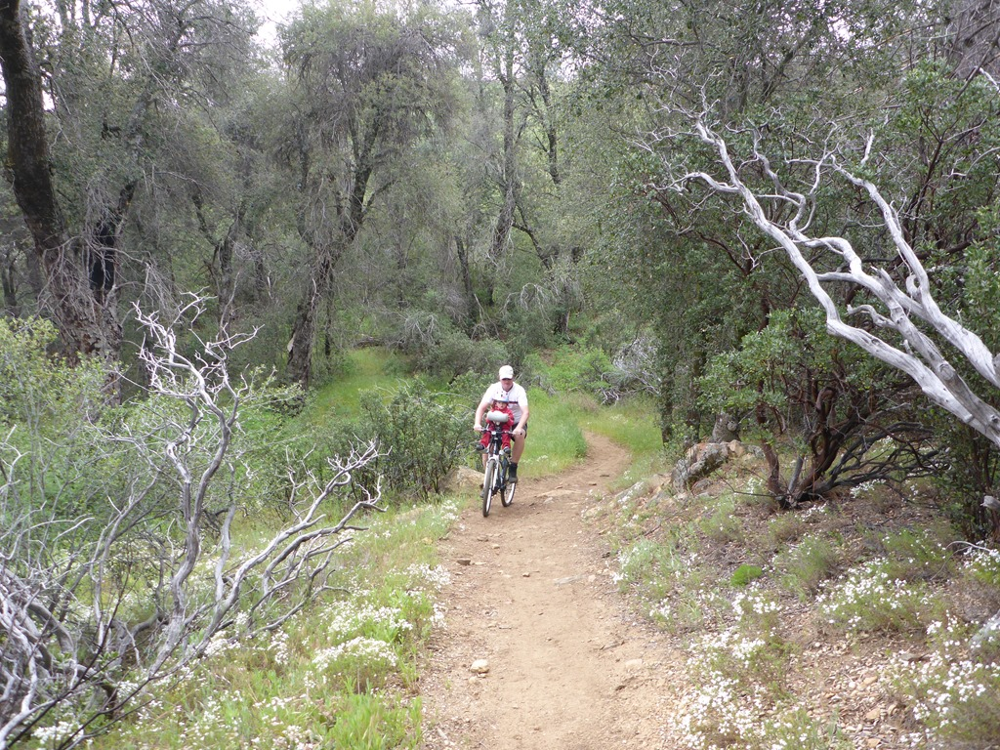
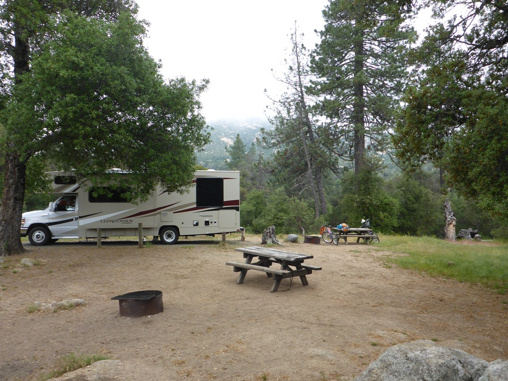

We waren eigenlijk nog van plan om met de tram (die stopt naast de camping) naar Gaslight en Oldtown in San Diego te gaan, maar uiteindelijk besloten we dat voor een volgende keer te bewaren. Nu hebben we er maar een rustige dag van gemaakt, en zijn naar de volgende bestemming gereden: Cuyamaca Rancho State Park, iets ten oosten van San Diego. Het is een boomrijk park en geliefd bij de inwoners van San Diego om het weekend door te brengen. We komen aan op zaterdag en de camping staat helemaal vol.

Aangezien het vandaag warm is, en voor morgen minder weer is voorspeld, zijn we direct na het middagdutje naar de lokale waterval gewandeld. Waterval is een groot woord hoor, was niet al te spectaculair, maar Sofie heeft even lekker in het water kunnen spelen.

Bij het avondeten trok de lucht helemaal dicht, en werden we omringd door wolk. Het werd meteen fris, maar goed dat het kampvuurtje al aan was.

Na een koude nacht hebben we na het ontbijt de fietsen gepakt en zijn een stuk gaan fietsen. Het is op de fiets al snel een stuk heuvelachtiger dan in de auto, het kost in ieder geval veel meer moeite om naar boven te gaan. Het was een leuk padje, af en toe klauteren, maar erg leuk. Onderweg nog een boterham gegeten, en toen ging het alleen nog maar naar beneden.

In 2003 heeft een verdwaalde jager een vuurtje gestookt om zodoende gevonden te worden. Het vuurtje was al snel niet meer onder controle en resulteerde in de grootste geregistreerde bosbrand ooit in Californië, en verwoestte ondermeer zo’n 90% van het Cuyamaca Rancho State Park. Het is mij onduidelijk of de jager het heeft overleefd.

## 1 opmerking

### Gerard 18 mei 2016 om 00:52

Zo vakantiegangers, het is toch wel heel bijzonder wat jullie zien en meemaken. Erg leuk om te volgen op de blog. En Roger, de bosmier bij Sofie heeft het, neem ik aan, toch niet overleefd.
