Het contrast kon vandaag amper groter zijn: vanmorgen nog de winterjas aan, terwijl het in Palm Desert (bij Palm Springs) 35 graden was. Bij het verlaten van Cuyamaca Rancho State Park hebben we nog een bezoek gebracht aan Lake Cuyamaca. Het meer ligt aan de noord-grens van het park en er loopt een wandelpad omheen. Wij hebben een stukje gelopen naar een schiereilandje in de plas.

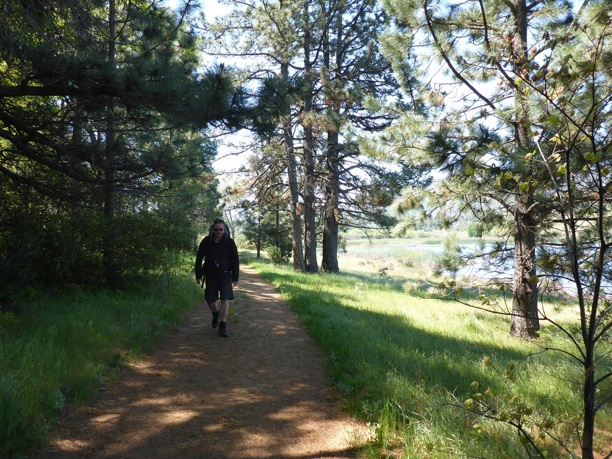

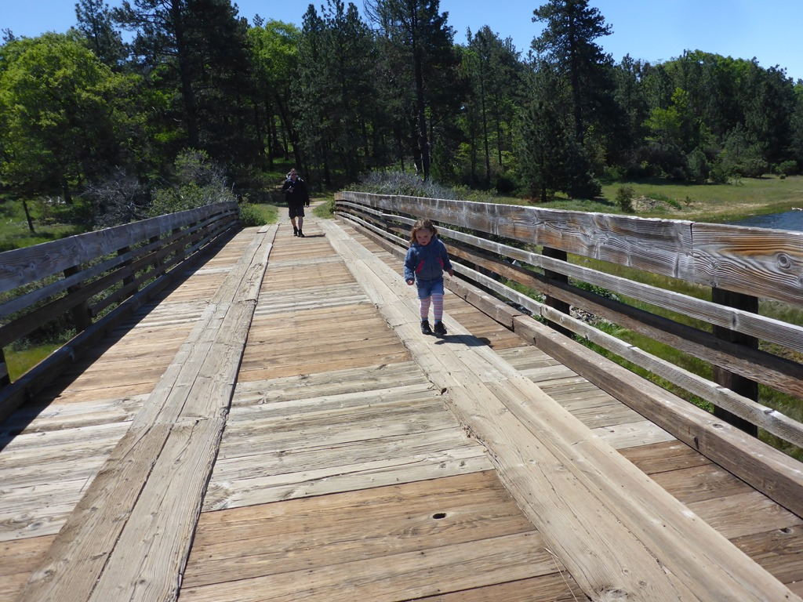

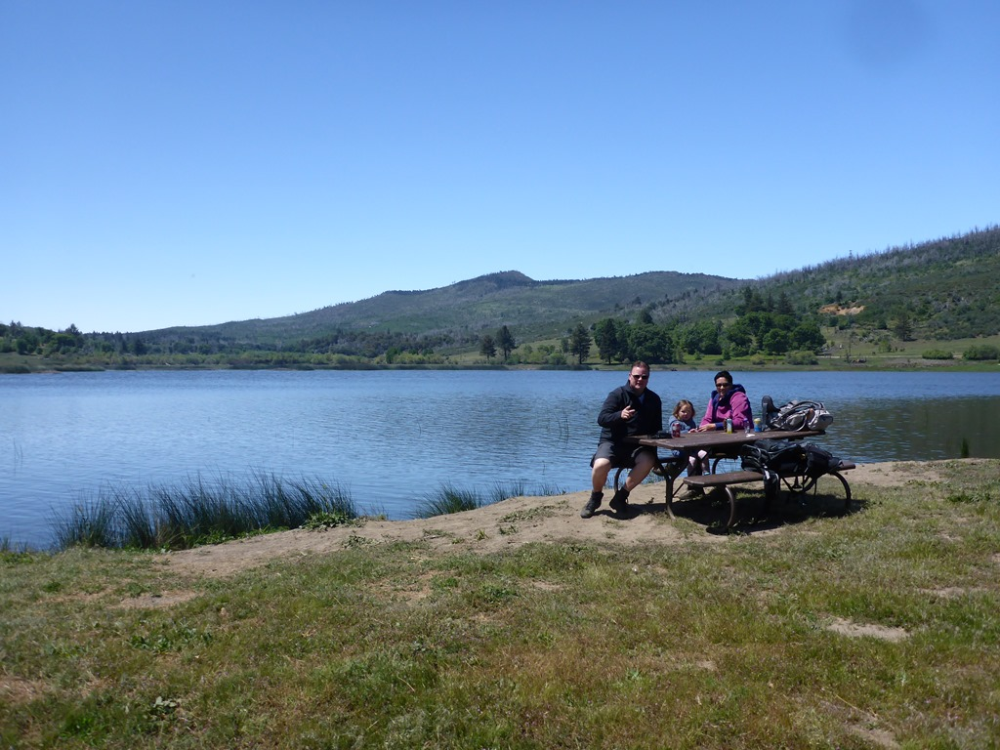

Op het schiereilandje hebben we wat gegeten en gedronken en daarna zijn we teruggelopen naar de camper en zijn we over de prachtige CA-79 naar Palm Desert gereden. We verblijven twee nachten op Emerald Desert RV Resort. Deze vijf sterren camping heeft mooie grote sites, een mooi zwembad en voortreffelijke wifi. Palm Desert (en het bekendere Palm Springs) zijn na de tweede wereldoorlog uit de gortdroge grond gestampt, en is een aaneenschakeling van golfbanen (in de woestijn!) en countryclubs. Gedurende de wintermaanden is het hier vergeven van de bejaarden die komen overwinteren: de befaamde snowbirds of grey nomads komen dan met hun 45+ feet RV's op resorts staan en gaan een balletje slaan op een van de golfbanen. Nu wij er zijn is het erg rustig. Het schijnt dat redelijk wat campings gedurende de zomermaanden gesloten zijn, simpelweg omdat het hier veel te warm wordt. 43 Graden Celcius is geen uitzondering. Direct na aankomst zijn we het zwembad in gedoken, we waren de enige klanten...

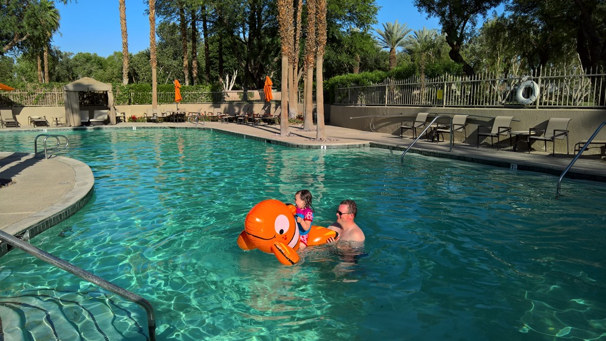

De volgende morgen hebben we de wandelschoenen weer aangetrokken om Murray Canyon te verkennen. De wandeling was erg mooi, maar ook iets te warm. Het pad loopt namelijk dwars door de woestijn om vervolgens een stroompje water te volgen naar een waterval.

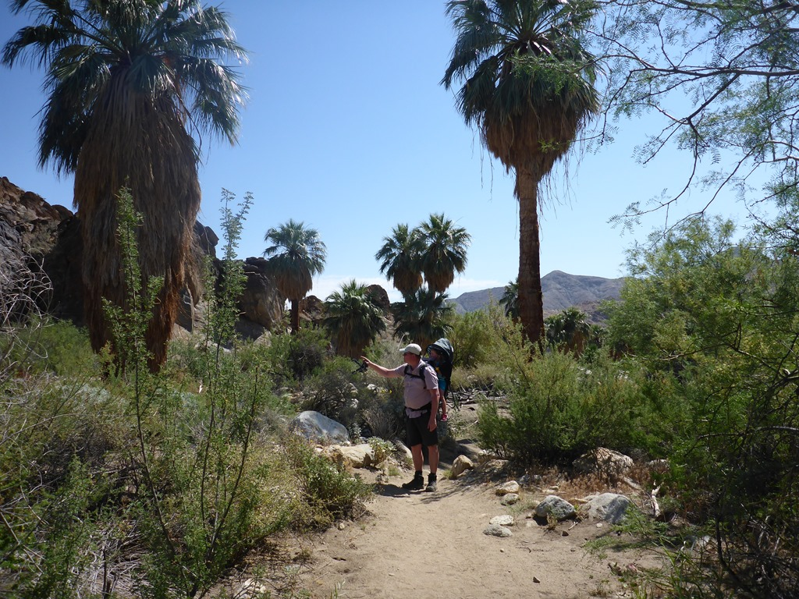

We zijn de tel kwijtgeraakt, maar we zijn zeker twintig keer door het water moeten lopen en dat is voor de jongste van het gezin iedere keer weer leuk.

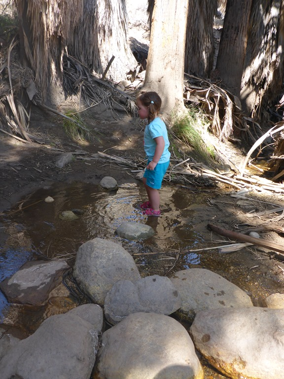

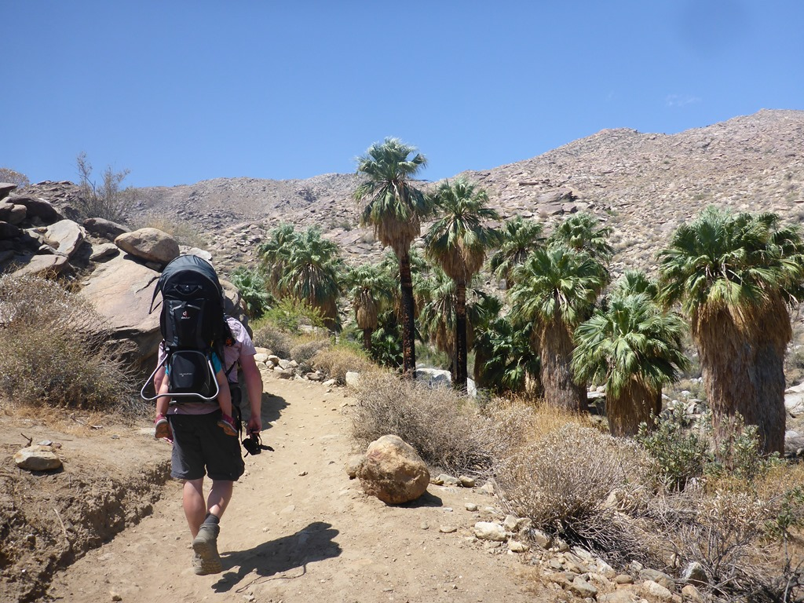

Na 3 kilometer kwamen we op een passage die niet echt verantwoord was om met de rugdrager te overwinnen. De twee dames zijn daarom in de schaduw gaan lunchen en ik heb de laatste driehonderd meter op handen en voeten gekropen naar de eindbestemming: de waterval. Nou ja, uit de douchekop van onze camper komt meer water!

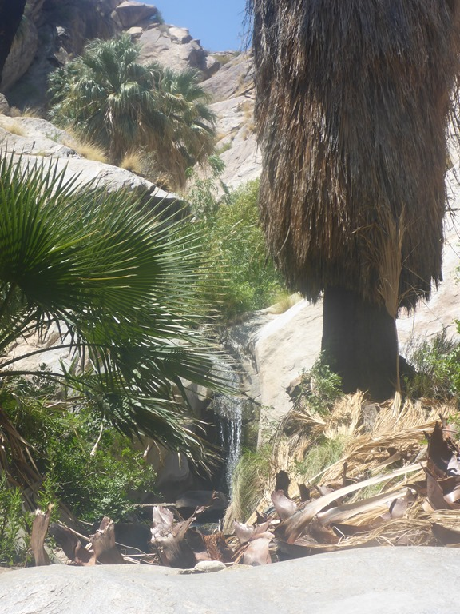

Ondanks dat de wandeling aangemerkt stond als easy, was het toch zwaar vanwege de hitte en het mulle zand. We waren allemaal blij toen we weer bij de camper waren in ieder geval.

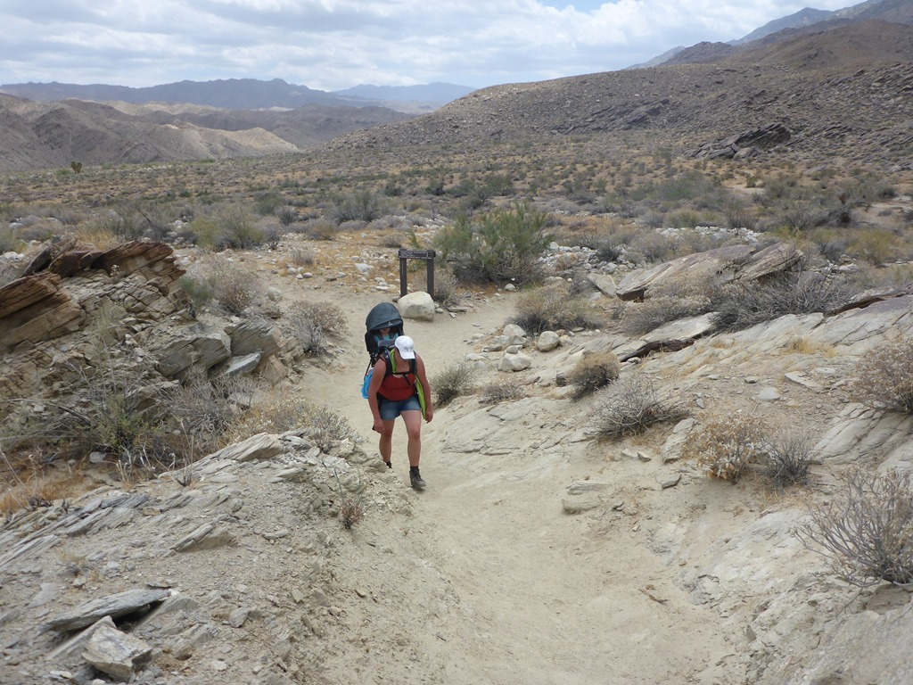

Op de weg terug naar de camping hebben we nog even snel boodschappen gedaan, en toen weer heerlijk gezwommen. ‘s Avonds zijn we gaan uit eten bij de Applebee’s, die ligt op fietsafstand van de camping.

De volgende ochtend zijn we nog even gaan zwemmen en zijn toen naar de volgende camping Arizona Oasis RV Resort gereden. We moeten nogal wat kilometers afleggen tussen Palm Desert en Prescot, vandaar dat we de rit in twee stukken hebben gehakt. Deze camping ligt direct over de grens in Arizona en ligt aan de Colorado River. We hebben pal voor onze deur toegang tot een strandje met een hangmat.

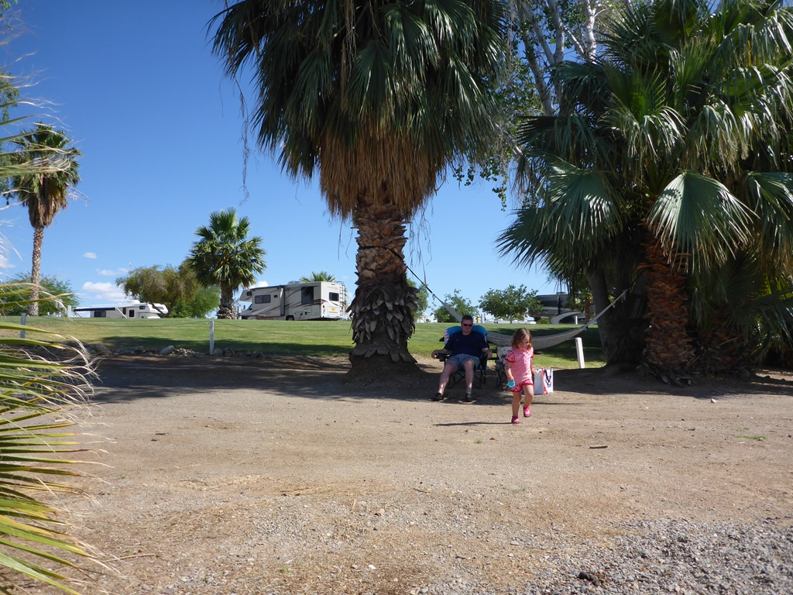

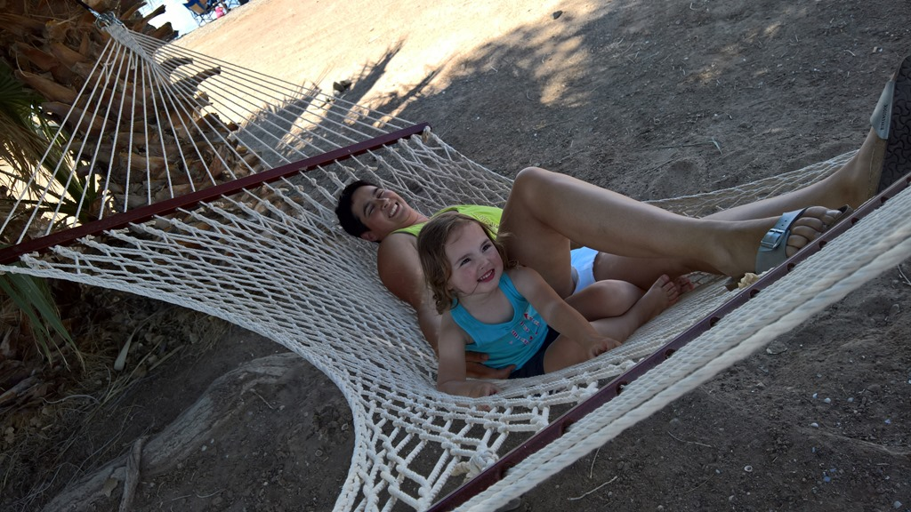

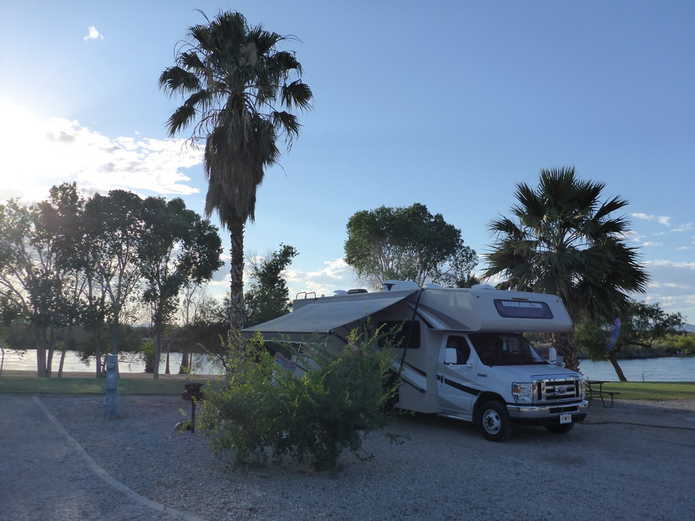

## 2 opmerkingen

### Anoniem 20 mei 2016 om 22:00

Lekker de warmte in. Samen in de hangmat met dezelfde glimlach! Wij strepen nu elke dag af!! Have fun :)

### Gerard 21 mei 2016 om 01:16

Wat lekker zo'n mooie camping na een drukke warme dag en wat fijn zo'n hangmat die waarschijnlijk volledig door de meisjes is geannexeerd!
