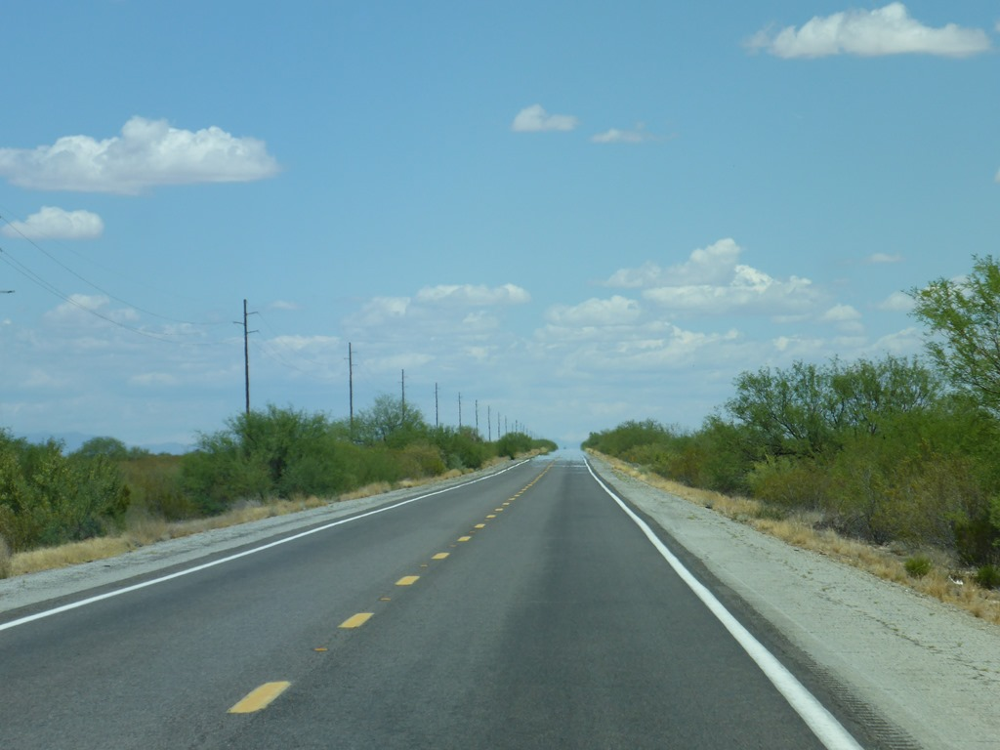
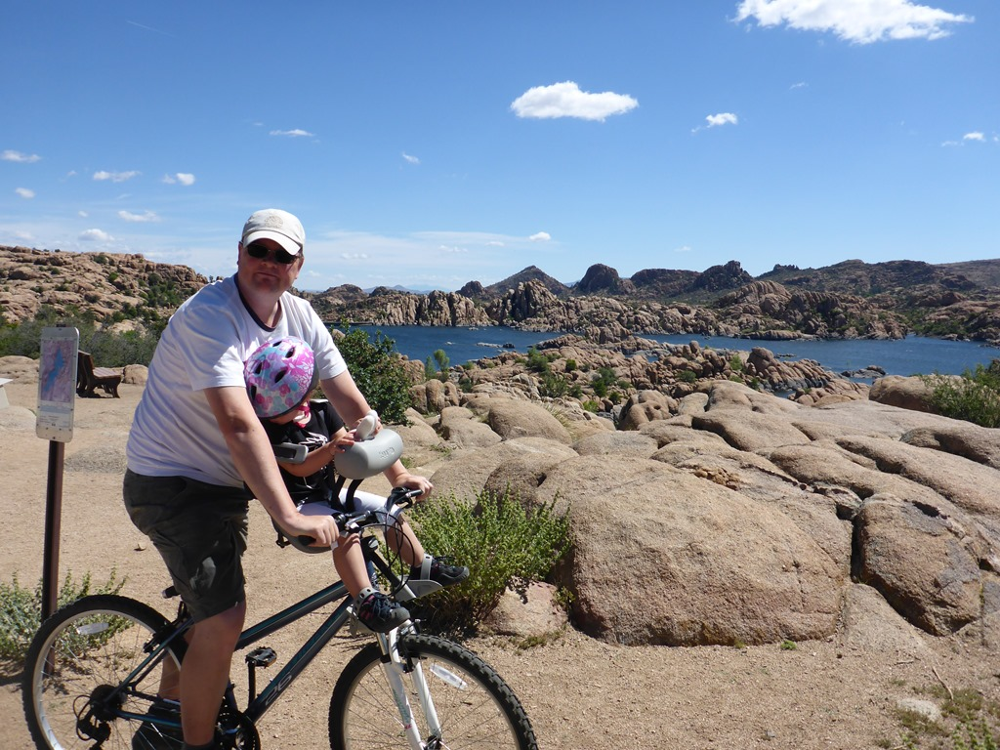
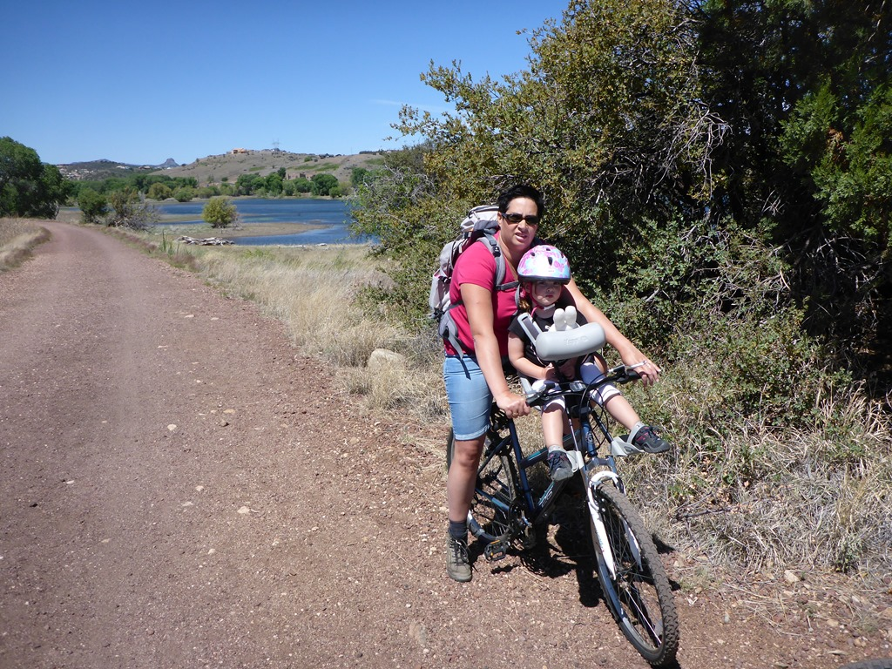
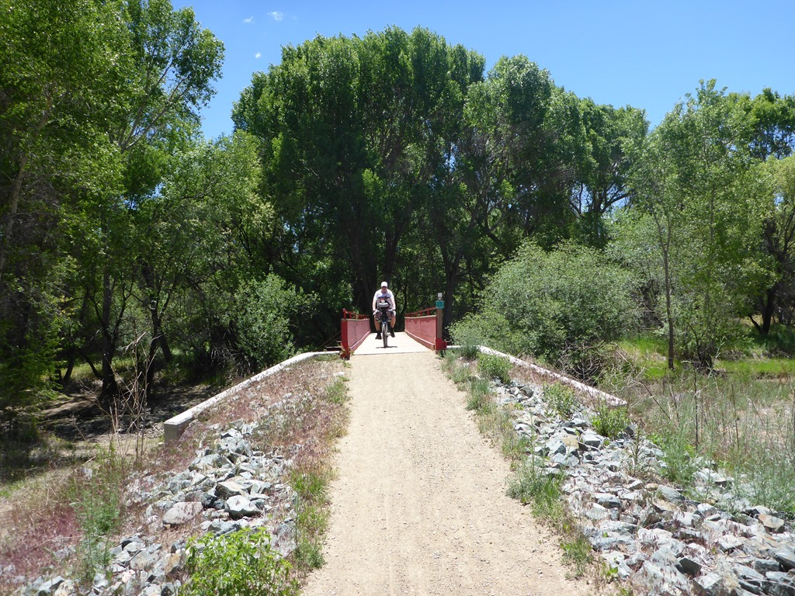
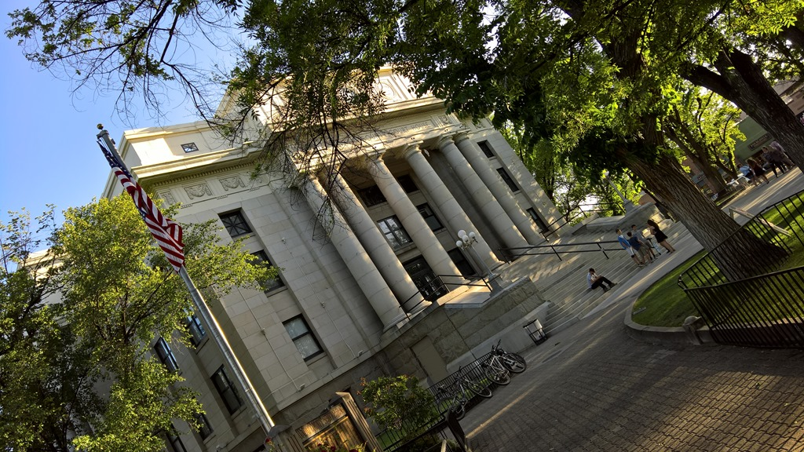
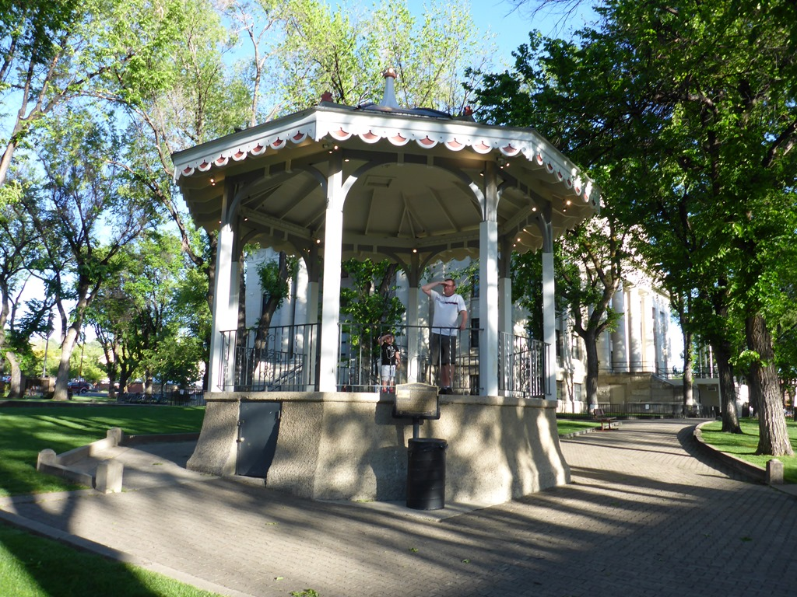

De rit over Interstate 10 duurt gelukkig niet al te lang (36 mijlen), want saai en rechtdoor. Daarna gaan we via de highways 60 en 71 naar de 89. De eerste twee gaan voornamelijk rechtdoor, door dor landschap met hier een daar een struik en een verdwaalde cactus.

Maar highway 89 is prachtig! De weg gaat behoorlijk omhoog en omlaag en we slingeren van links naar rechts. Ik was voor 100% happy camper. De 89 gaat via Prescott en Sedona richting Flagstaff en de Grand Canyon. We verblijven twee nachten in Prescott op de Point of Rocks Campground. De camping ligt aan Watson Lake. Dit meer dient als waterreservoir voor de noodzakelijk irrigatie van de lokale landbouw, maar er wordt ook volop met bootjes gevaren en de wandelaar en fietser kunnen helemaal rond het meer lopen danwel fietsen. Aangezien we in een luie bui waren hebben we bij de lokale pizzaboer wat eten besteld. Daarna zijn we nog even naar de speeltuin geweest.

De dag na aankomst hebben we de stalen rossen uit de kelder gehaald en zijn we een stuk rond het meer gefietst. Het pad begon eenvoudig, maar na een paar kilometer werd het toch wat te gortig en zijn we omgekeerd. Bovendien had ik een lekke voorband, dus onderweg een paar keer extra lucht in de band moeten pompen.

Tijdens het middagdutje hebben we de band weten te plakken. 's Avonds zijn we Prescott gaan verkennen. Het is een alleraardigst stadje, je waant je 100 jaar terug in de tijd met alle saloons en pubs. Het oogt allemaal erg vriendelijk. We hebben erg lekker gegeten bij de Prescott Brewery Company.

