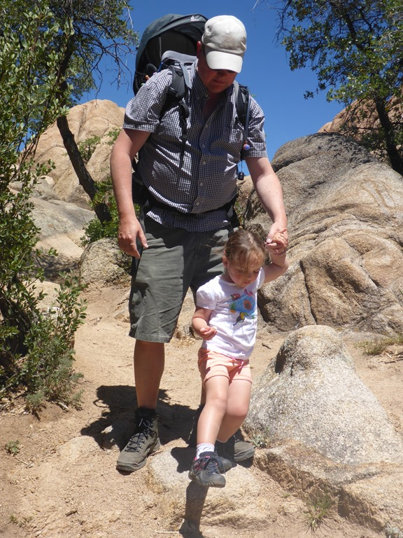
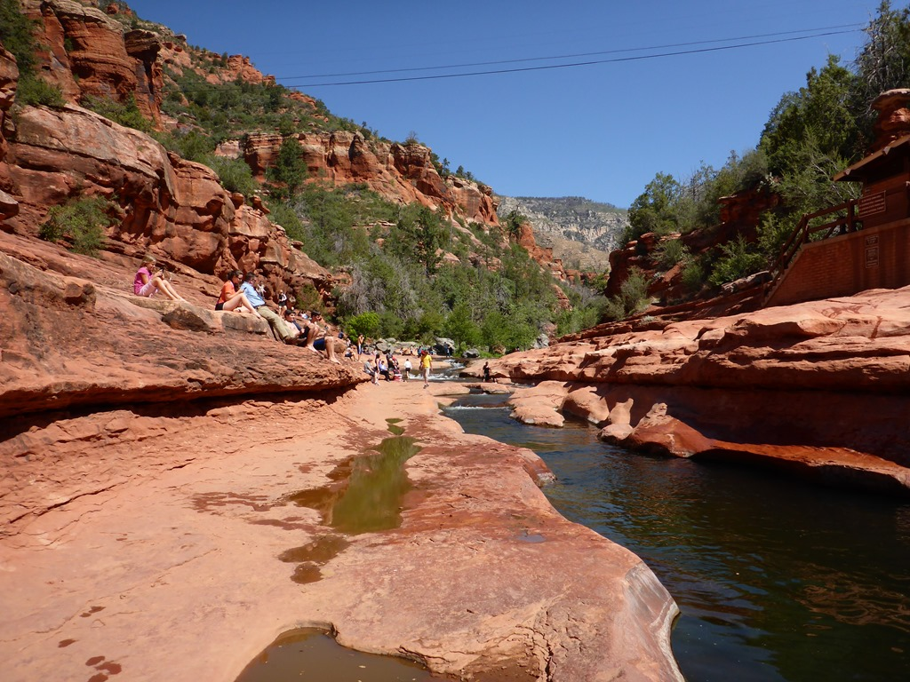
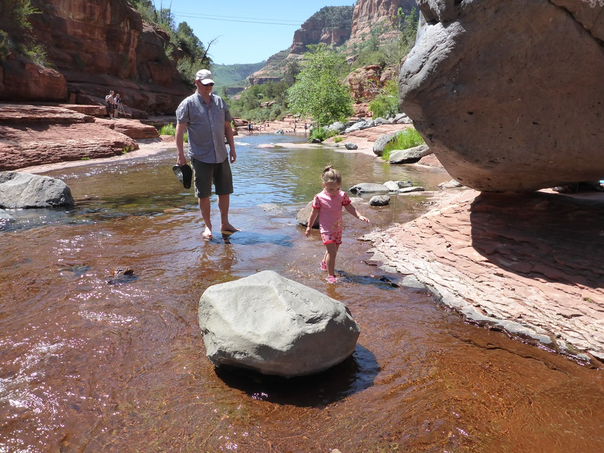
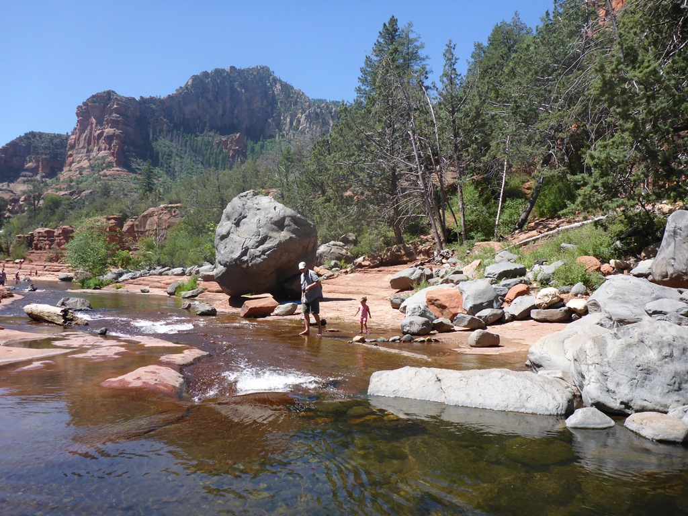
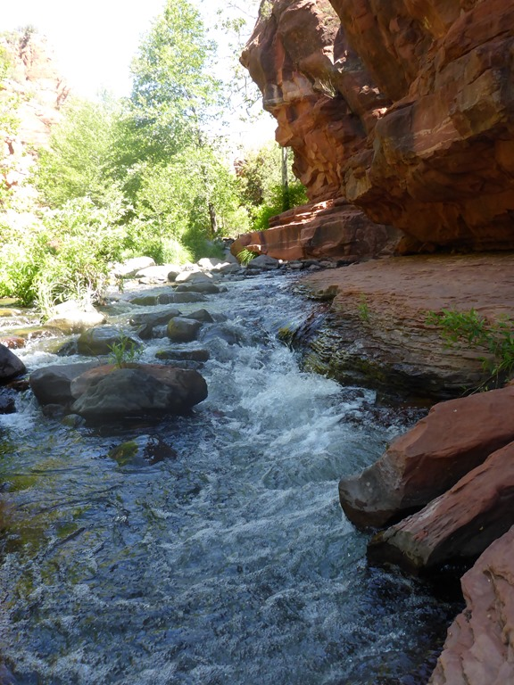
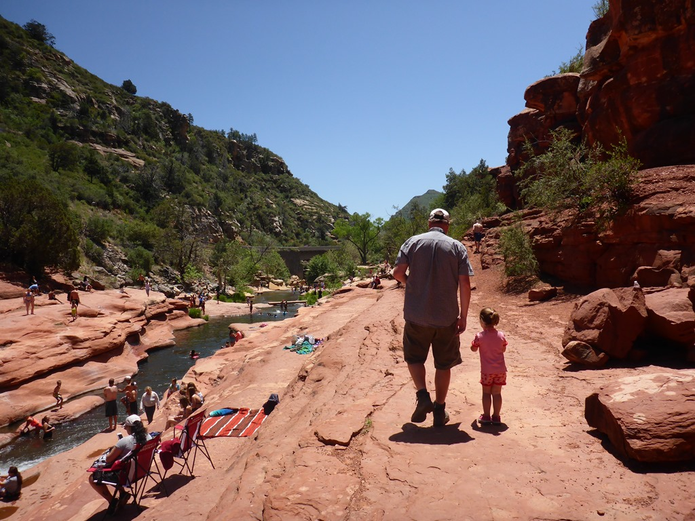
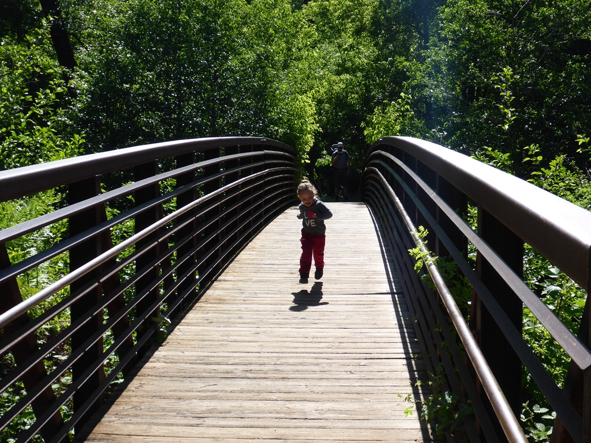
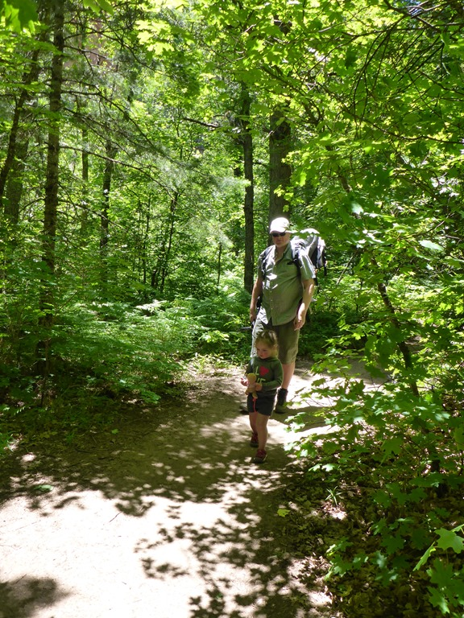
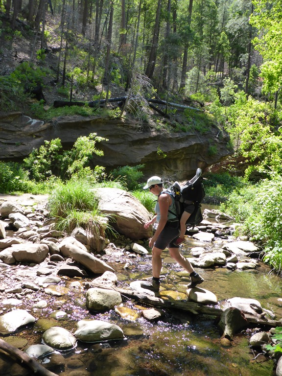
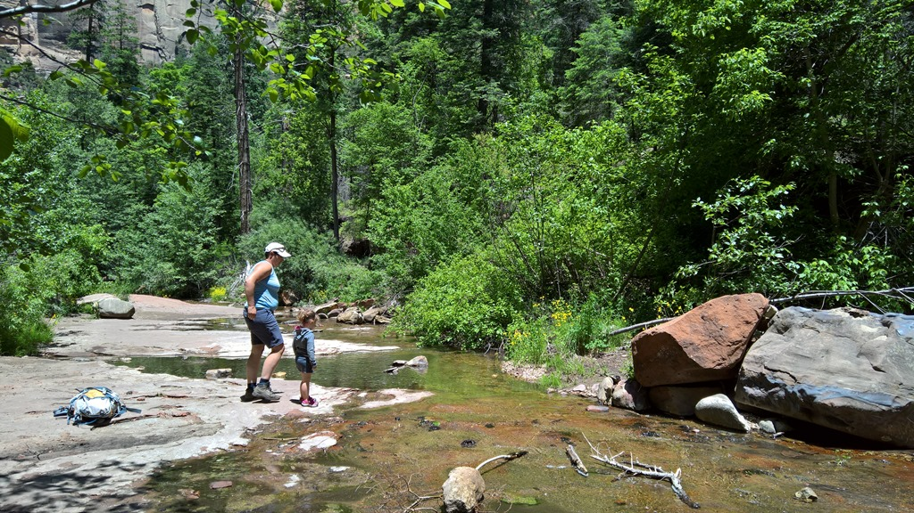

Voordat we Prescott verlaten gaan we eerst nog een klein wandelingetje maken tussen de rotsen. We vervolgen onze weg over de AZ-89 via Jerome naar Sedona, waar we verblijven op de Cave Springs campground, net ten noorden van het stadje. We hebben een mooie plek, maar de eerste avond waait het erg hard, dus we hebben binnen moeten eten.

We wilden op zondag de West Fork trail gaan wandelen, maar toen we om 8 uur bij de parkeerplaats aankwamen waren de twee (!) RV plekken al bezet. We hebben nog even overwogen om de wagen aan de kant van de weg te parkeren, maar dan moesten we nog een behoorlijk stuk langs de weg lopen en die is hier smal, en druk met weekendverkeer. Dus uiteindelijk besloten om naar Slide Rock State Park te rijden, wat niet heel ver is gelukkig.

Het riviertje stroomt over gladde rotsen, en vormt zo een natuurlijke glijbaan. Links en rechts kun je op de oever heerlijk zitten en af en toe een duik nemen. Dat laatste hebben we maar niet gedaan want het water is ijskoud.

Uiteindelijk hebben we een mooi en rustig plekje gevonden waar we tot na de lunch zijn gebleven.

De volgende dag hebben we het zekere voor het onzekere genomen en waren we om half acht al bij de parkeerplaats voor de West Fork trail, en nu hadden we geluk. De trail loopt iets van 5 kilometer stroomopwaarts langs een riviertje en in totaal moet je 13 keer de beek doorkruisen om tot het eindpunt te komen. We hadden er zin in!

Het padje was heel makkelijk, maar wel erg mooi. Met gevaar voor eigen, en andermans, leven moesten we door het water.

Na terugkomst bij de camper zijn we doorgereden naar Flagstaff, waar we, na wat boodschappen, eerst nieuwe reistassen hebben gekocht. Onze grote weekendtas heeft de heenreis namelijk niet overleefd, er zit een enorme scheur in. Daarna zijn we doorgereden naar de KOA voor een nacht.

## 1 opmerking

### Gerard 25 mei 2016 om 00:55

Wat een mooie omgeving en wat levert die erg mooie plaatjes. Sofie heeft het zo te zien erg naar de zin en het lijkt of ze erg op haar gemak is. Genieten jullie er maar lekker van!!
