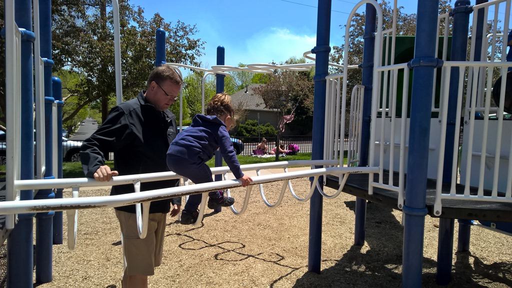
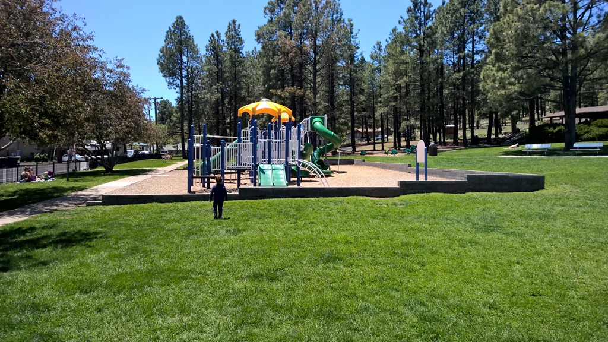
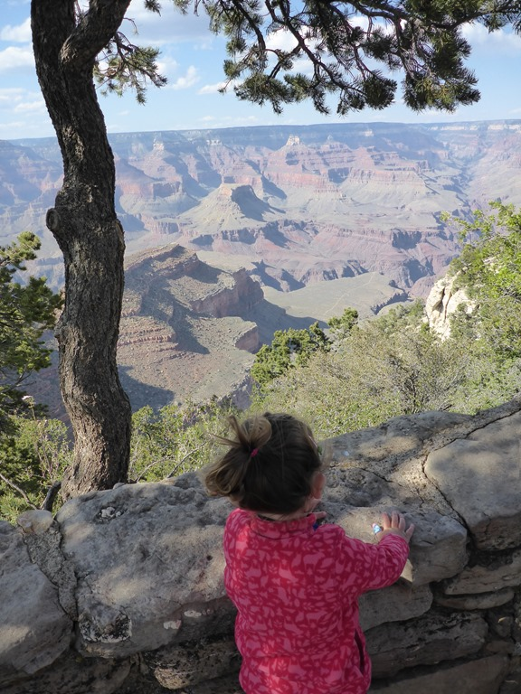
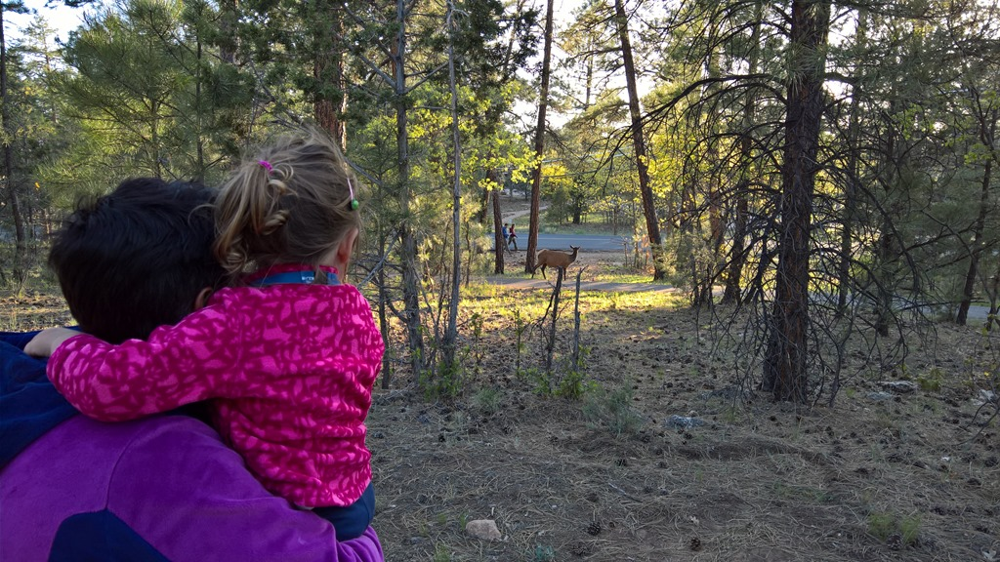
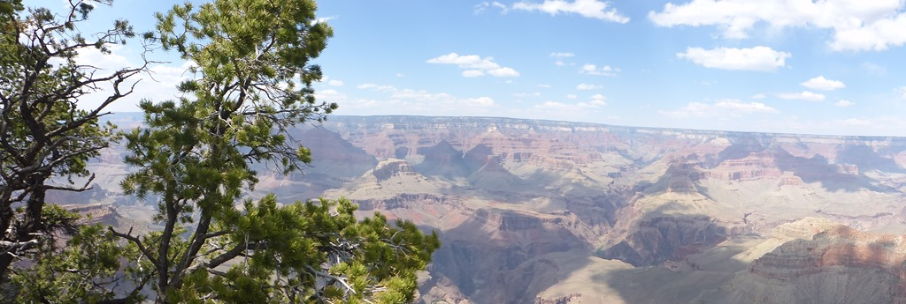
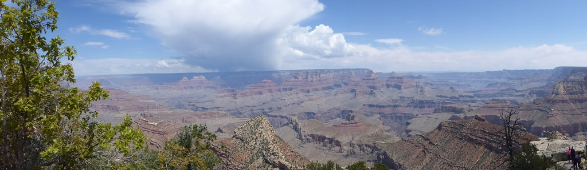

Nu we samen met Sofie reizen, zijn we er achter gekomen dat de Lonely Planet niet alleen geraadpleegd kan worden voor hotels, restaurants of mooie (dag-) wandelingen, maar ook met de mooiste speeltuinen weet de reisgids raad. Voordat we Flagstaff verlaten, zijn we dus eerst naar Thorpe Park gereden, want hier schijnt zich een mooie playground te bevinden. En jawel, Sofie (en mama) had de tijd van haar leven.



Na de lunch zijn we vertrokken richting de South Rim van de Grand Canyon, waar we twee nachten gaan overnachten op Mather Campground. We hebben een erg mooie, grote plek (numero 92). Na aankomst zijn we met de shuttle bus naar de Village gereden. De Canyon blijft erg indrukwekkend, ondanks dat we hier al verschillende malen zijn geweest. De omvang en vooral de diepte besef je eigenlijk pas echt wanneer je een stuk naar beneden (en weer naar boven!) bent gelopen. Dat hebben we een paar jaar geleden al een keer gedaan, deze keer blijven we gelukkig aan de rand.

We wilden eigenlijk gaan dineren in het El Tovar Hotel, direct aan de rand van de Canyon, maar dat bleek alleen te kunnen na reservering. Dus zijn we maar uitgeweken naar de Yavapai Lodge, waar de ribjes, mac-and-cheese en de meat loaf boven verwachting verrassend goed smaakten. Teruglopend naar de camper werden we opgewacht door een kudde white tail deer, een groot soort hert.

De volgende ochtend hebben we rustig aan gedaan, en zijn pas rond lunch vertrokken naar de visitor center, hebben daar de shuttle bus naar Yavapai Point genomen en hebben van daaruit een stuk van de rim trail gewandeld. Sofie vond het fantastisch, al had ze meer oog voor de stenen muurtjes waarover ze heen kon klimmen, dan voor de Canyon zelf.

## 1 opmerking

### Gerard 29 mei 2016 om 10:09

Wat een leuke speeltuin en wat een grappige kindveilige schommel. Sofie kijkt haar ogen uit en wij genieten mee van de prachtige uitzichten over de Grand Canyon.
