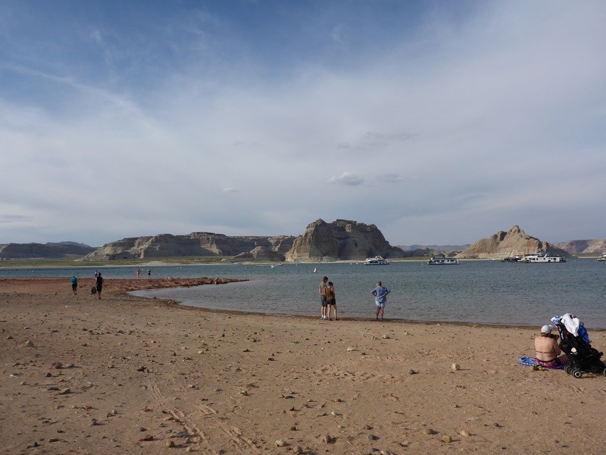
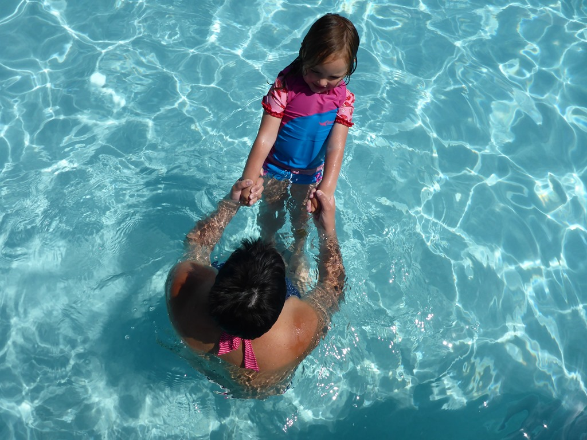
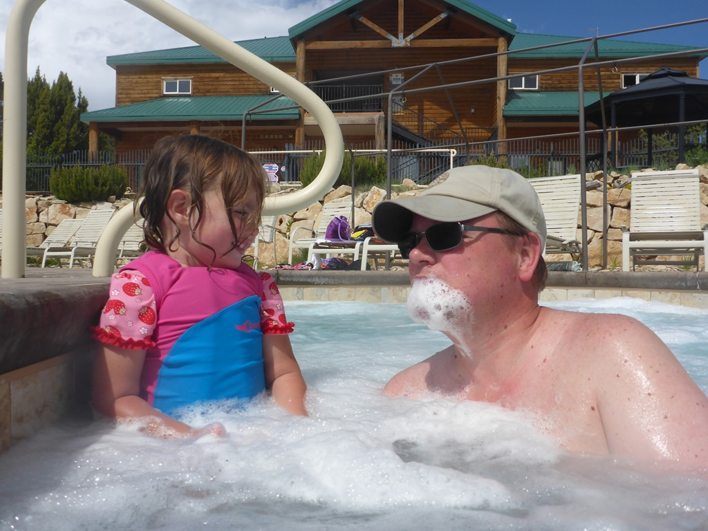
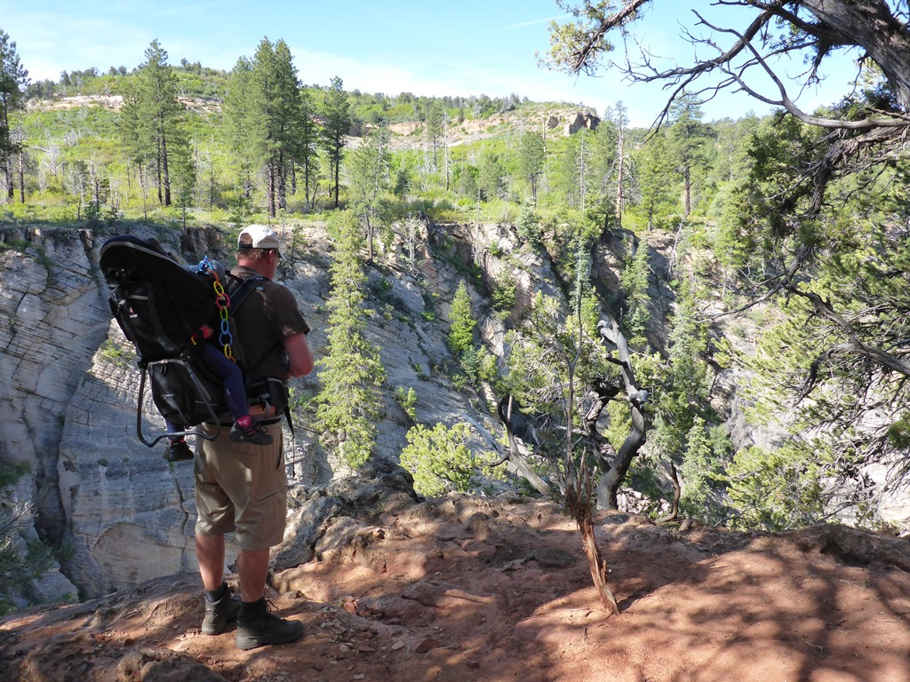
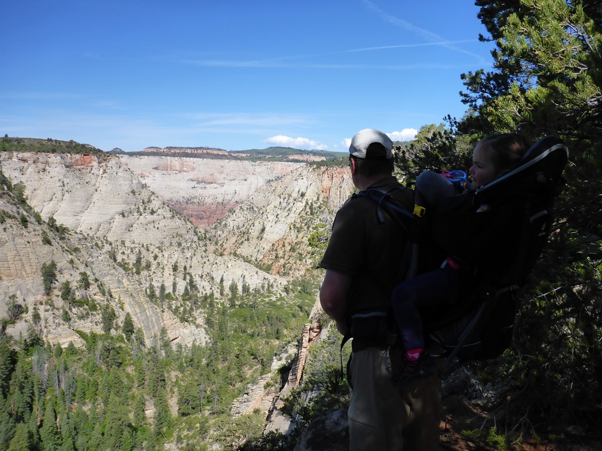
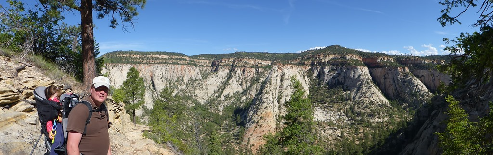
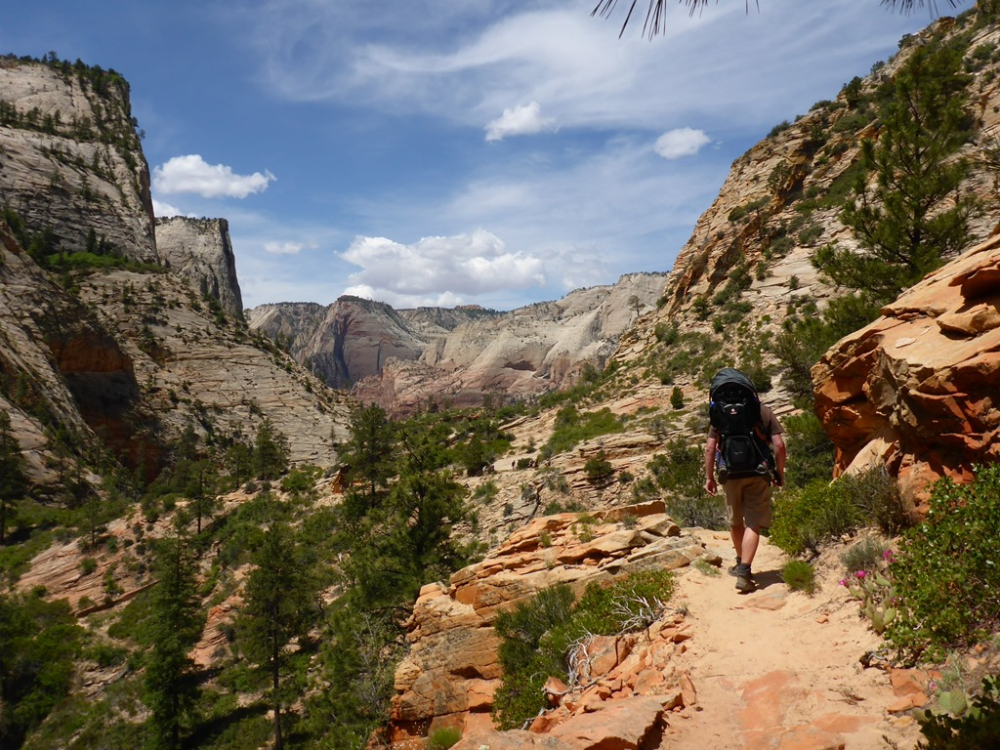
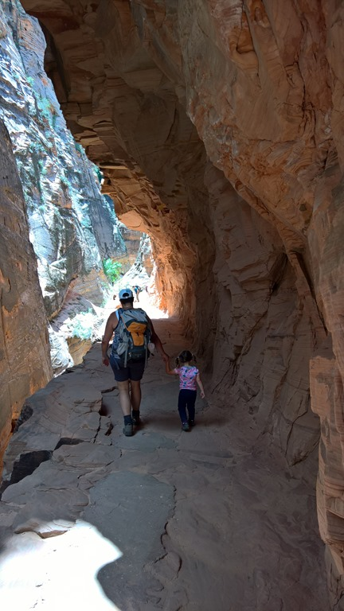

Met een tussenstop in Page op de Wahweap Campground van Glenn Canyon Recreational Area, hebben we de rit vanuit de Grand Canyon naar Zion in twee stukken opgeknipt. We hebben even tot aan de knieën in Lake Powell gestaan, maar het is veel te koud om te zwemmen. Het strandje is wel leuk, en Sofie heeft even lekker in het zand gespeeld en stenen in het meer gegooid.

De volgende morgen zijn we doorgereden naar het Ponderosa Ranch resort, iets ten oosten van Zion National Park. Het is een enorm resort, met een mooi zwembad. Een koud en een verwarmd bad en twee hot tubs. Van redelijk betrouwbare bron hebben we vernomen dat het koude bad, echt koud is, en dat het verwarmde bad dus aan te raden is. We hebben even heerlijk gezwommen en 's avonds in het restaurant van de camping prima gegeten.

Vanaf de camping kun je trails volgen die het nationale park ingaan. We hebben een shuttle geregeld die ons naar de trailhead van de East Rim trail brengt, en ons op een afgesproken tijd weer ophaalt bij het visitor center in Zion. De wandeling van in totaal 12 kilometer was fantastisch mooi, en gedurende de eerste 3 (van de 5) uur zijn we slechts een handvol andere wandelaars tegen gekomen. De trail begint mooi vlak, en daarna gaat het niet al te beste pad naar beneden het dal in van de canyon. Af en toe moesten we op handen en voeten kruipen om naar boven danwel beneden te komen. Het pad eindigt bij Weeping Rock waar we de bus nemen naar de visitor center.

## 2 opmerkingen

### Anoniem3 juni 2016 om 01:37

Gave wandeling!!
Straks nog naar Spotted Dog???

### Gerard3 juni 2016 om 02:49

Jullie hebben met z'n drieën een geweldige tijd. Leuk ook te zien hoe onze kleine globetrotter Sofie het doet.
