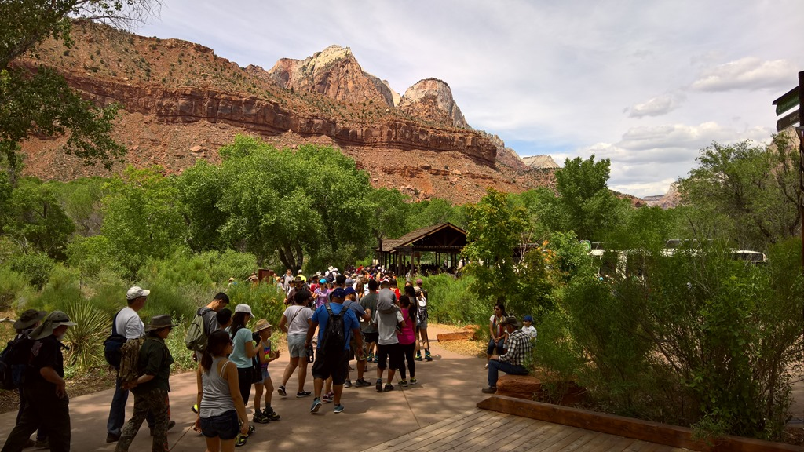
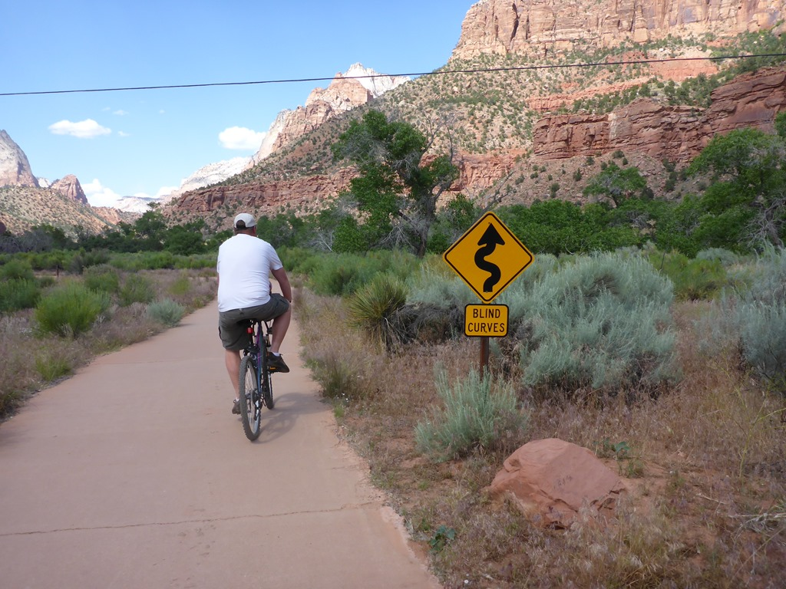
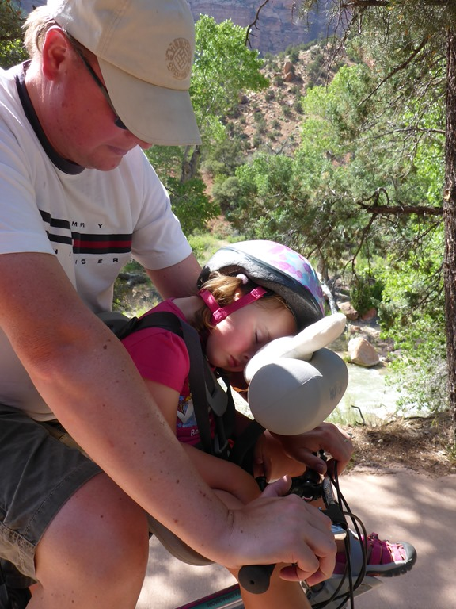
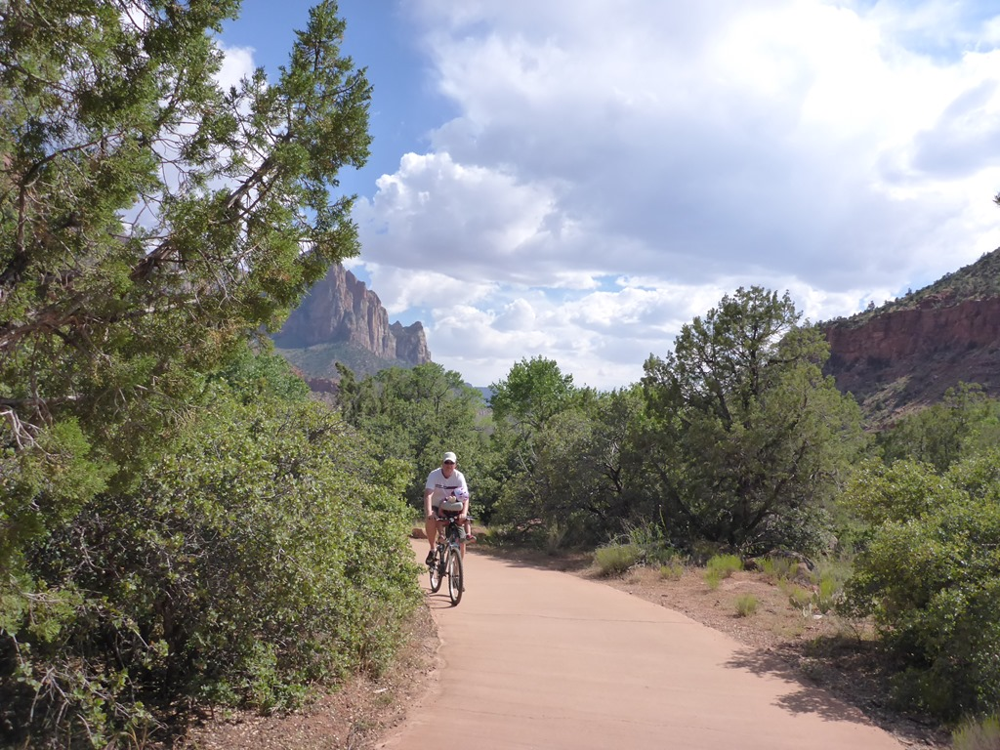
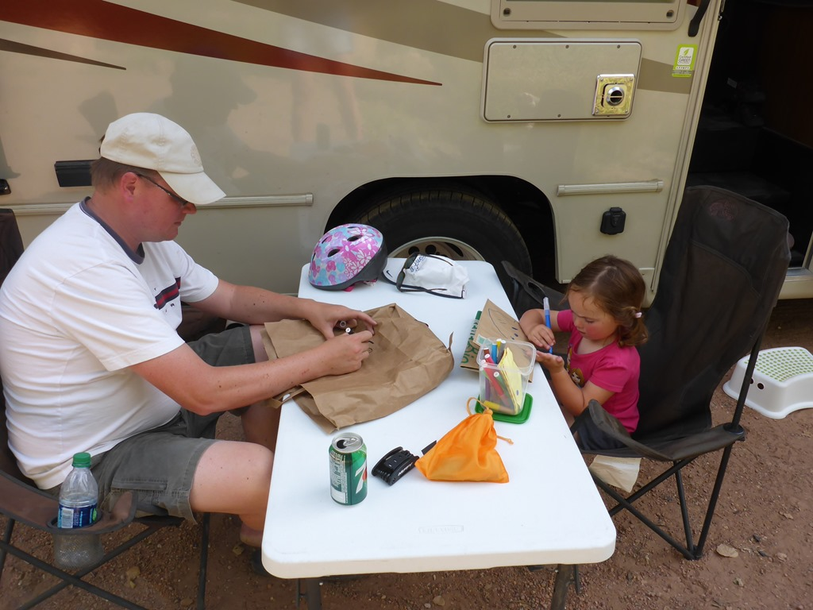
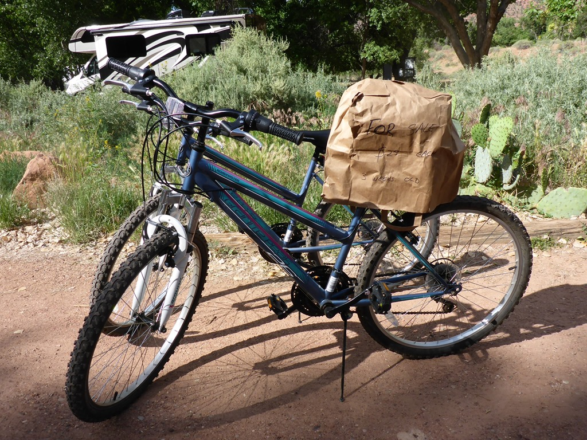
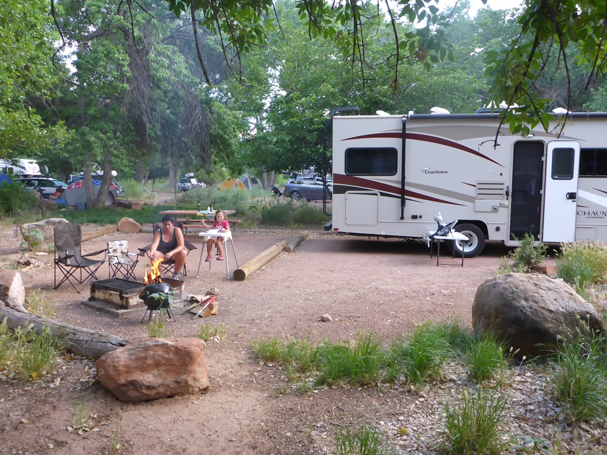

De laatste dag in Zion gaan we overnachten in het park zelf op de Watchman campground. Het was vanwege Memorial Day Weekend onaangenaam druk in het park. Op de doorgaande weg door het park was het in de vallei passen en meten om de camper zonder kleerscheuren tussen de geparkeerde auto's en voetgangers te laveren. De rij voor de shuttlebus bij de visitor center was idioot lang (wachttijd meer dan 90 minuten).

Gelukkig hedden we onze fietsen nog, en dus zijn we maar een stukje gaan fietsen (de Par'us trail). Het is best een mooi geasfalteerd padje en is prima geschikt om een dutje te doen. Het is wel levensgevaarlijk, met al die blinde bochten...

Na de fietstocht was het tijd om de fietsen in de verkoop te doen. Samen met Sofie hebben we een mooi bord gemaakt, en binnen drie kwartier waren we verlost van de stalen rossen.

's Avonds voor de laatste keer deze trip de BBQ aan en een kampvuurtje gemaakt. Morgen vertrekken we richting eindbestemming (voor de camper dan) Las Vegas.

