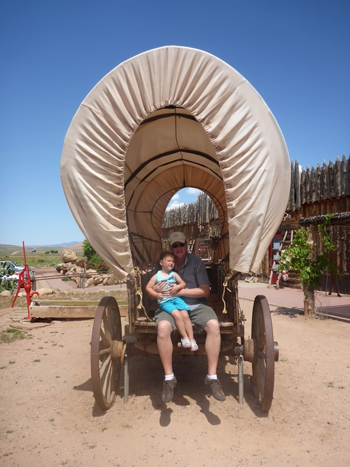
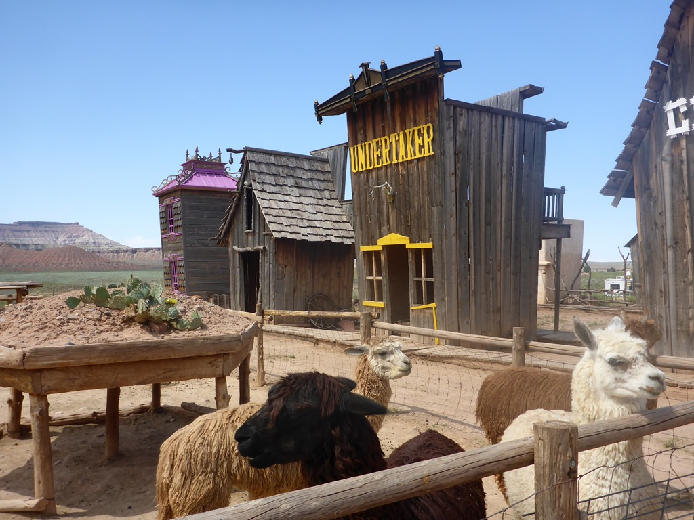
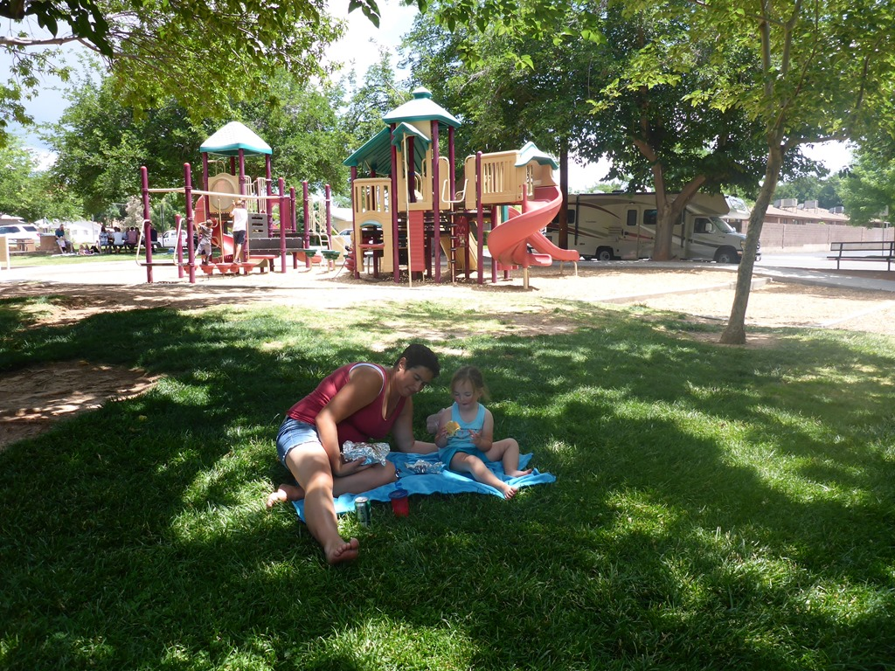
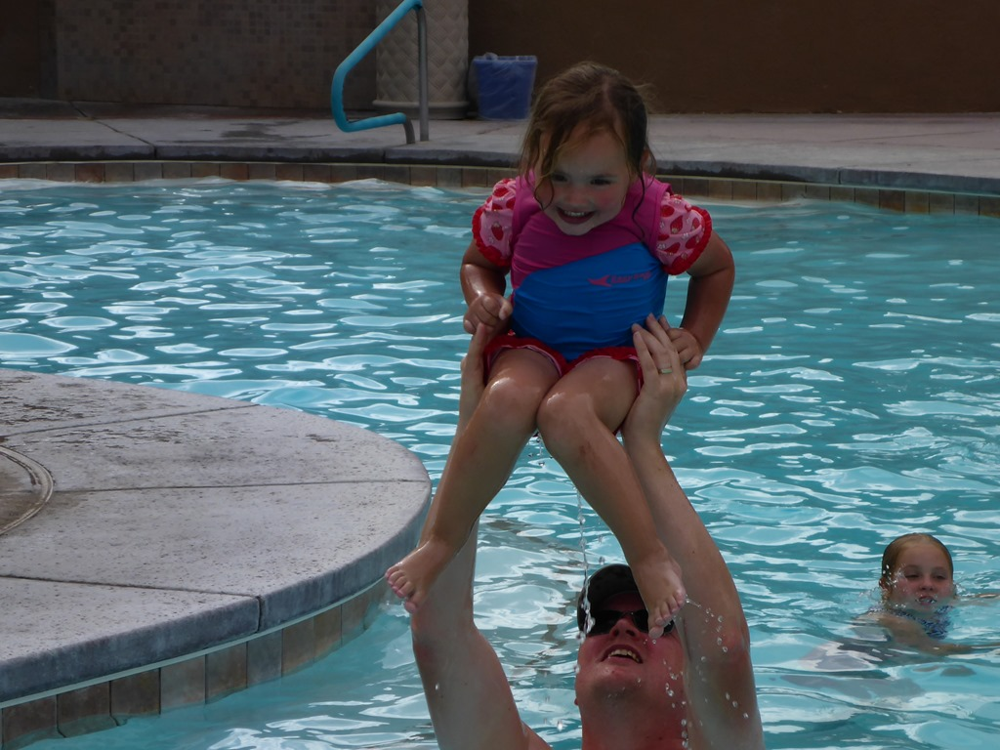

Met twee tussenstops zijn we naar Las Vegas gereden. Eerste tussenstop betreft Fort Zion, een soort kinderboerderij in western stijl, inclusief een valse lama.

De lunch hebben we genuttigd in St George in de lokale speeltuin.

Daarna zijn we doorgereden naar Oasis RV resort te Las Vegas. Dit is een prima camping, waar we al vaker zijn geweest.

Na de zeer gewenste duik in het zwembad ben ik onze huurauto gaan halen bij Alamo (Chevy Tahoe deze keer). 's Avonds hebben we de laatste restjes opgegeten en alle tassen ingepakt, morgen moeten we namelijk de camper terugbrengen bij Roadbear.
