De laatste 3 nachten verblijven we in Elara. Het ligt in een zijstraat van de Strip, en het is geen casino, dus geen last van alle casino-gangers.

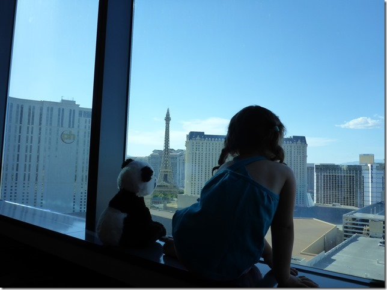

Na het inchecken hebben we even gerust en 's avonds zijn we de Strip op gegaan. Eerst eten we wat in de Rainforest Cafe, en daarna wandelen we een stukje naar de M&M shop. Sofie keek haar ogen uit naar alle lichtjes en toeters en bellen.

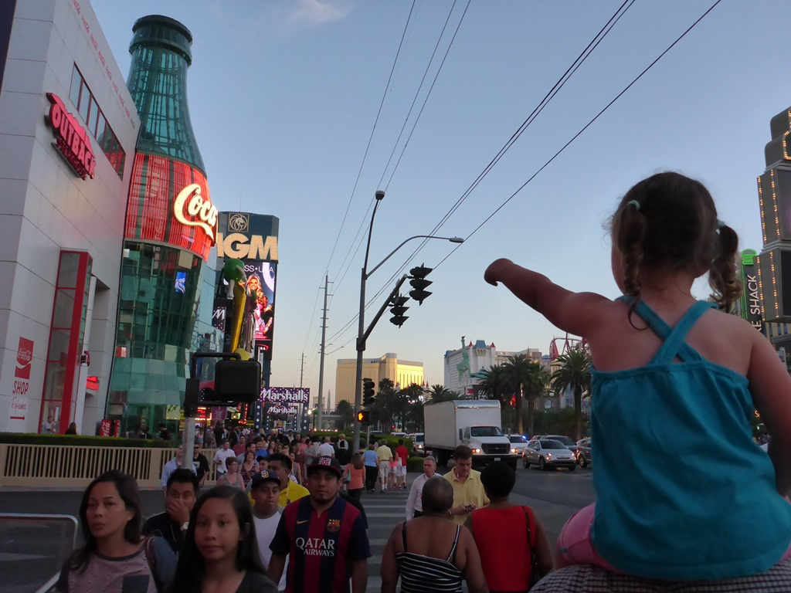

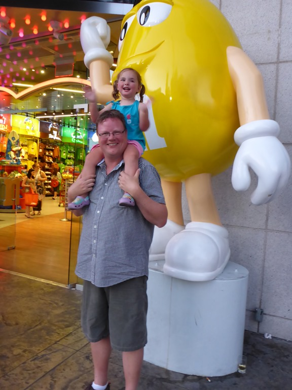

De volgende dag zijn we naar de outlet geweest om wat kleren te kopen. 's Avonds natuurlijk weer de Strip op, op zoek naar een restaurant (Cheesecake Factory deze keer).

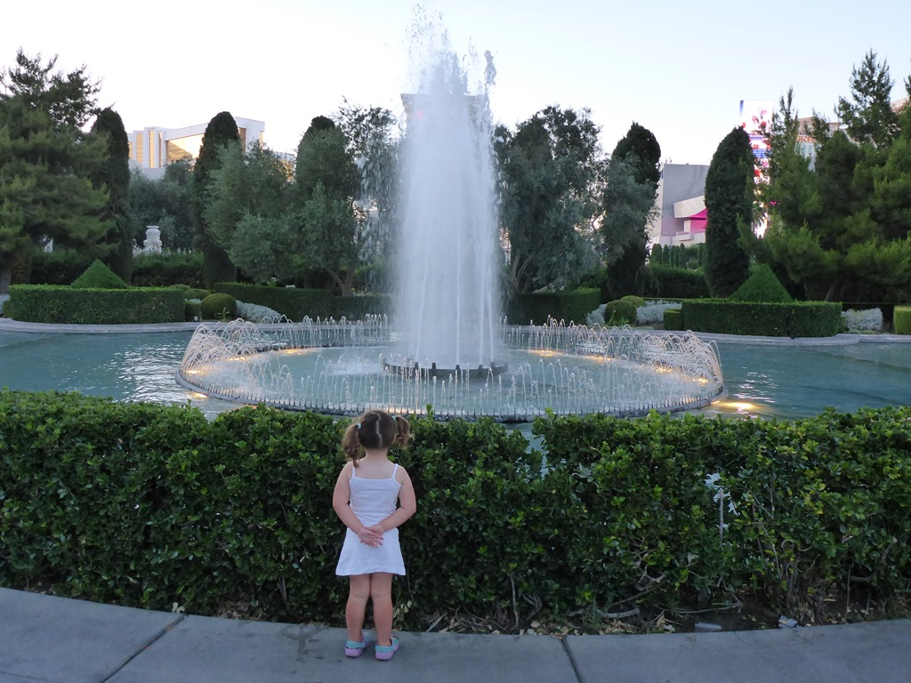

Het restaurant ligt in Caesar's Palace, en Sofie vond het smaakvol nagemaakte Romijnse rijk machtig interessant. Ze rende van de ene winkel naar de andere, en was dolenthousiast.

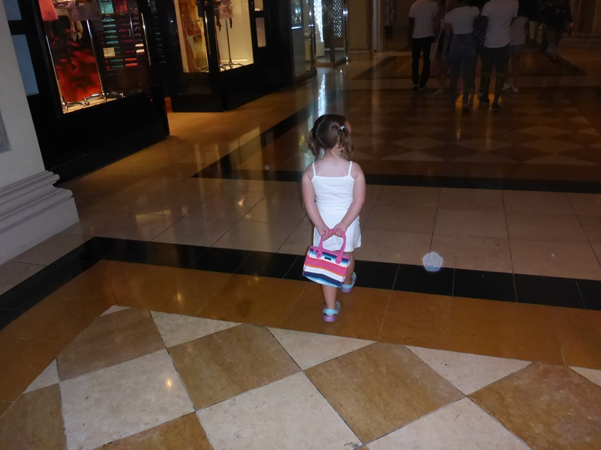

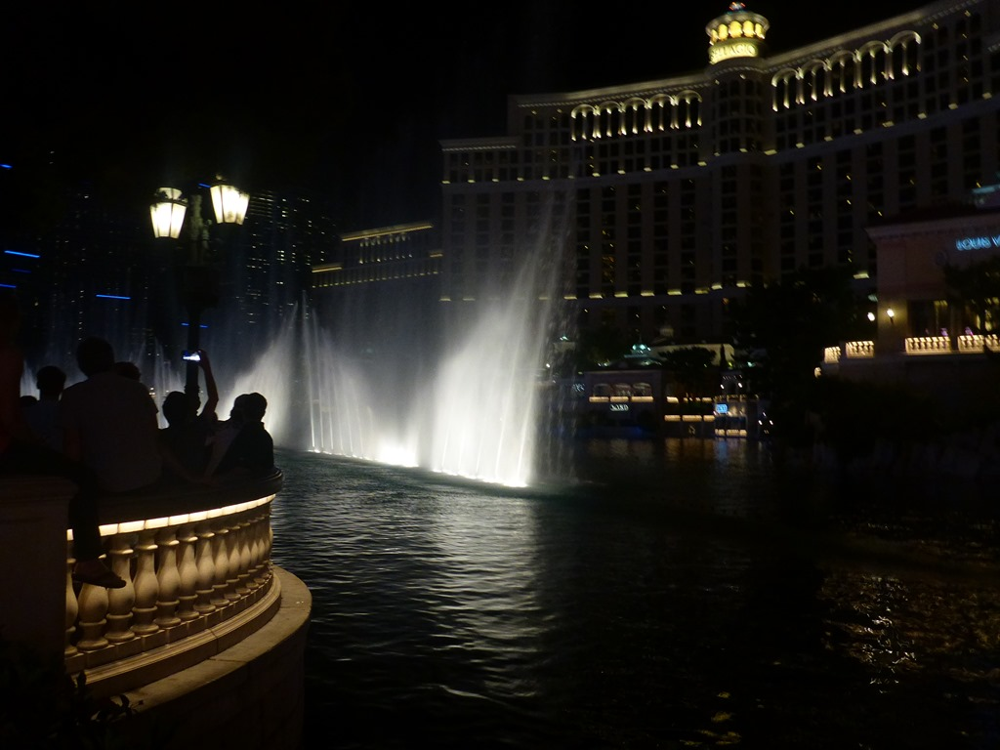

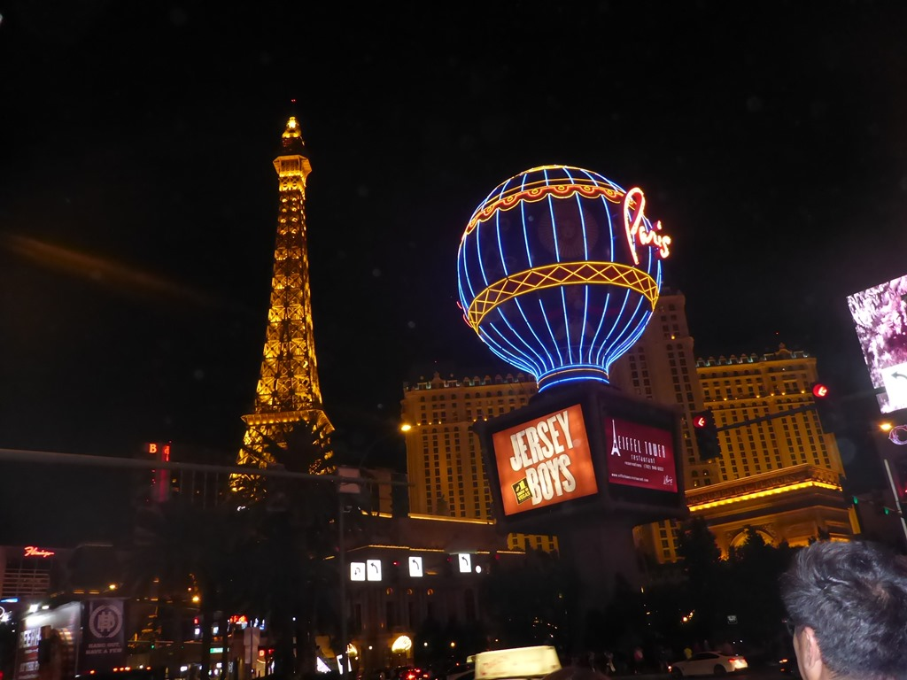

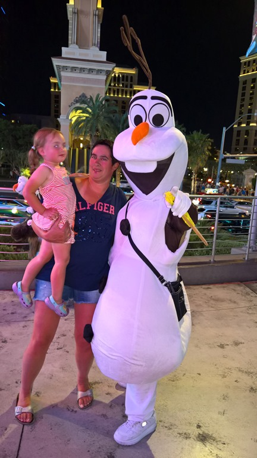

De laatste dag hebben we voornamelijk doorgebracht aan het zwembad.

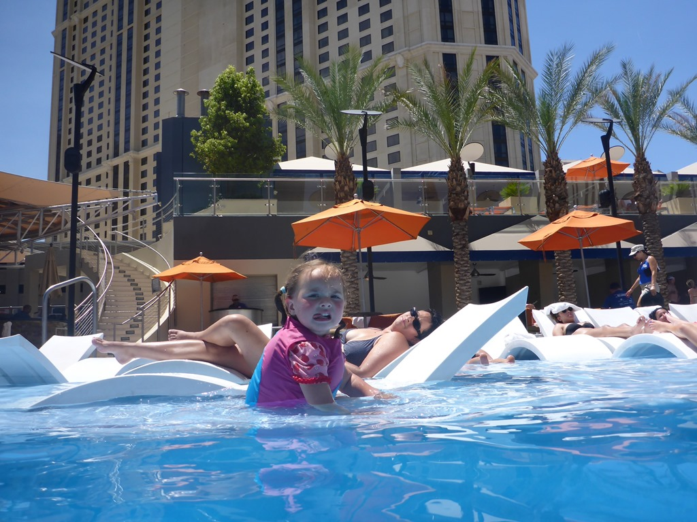

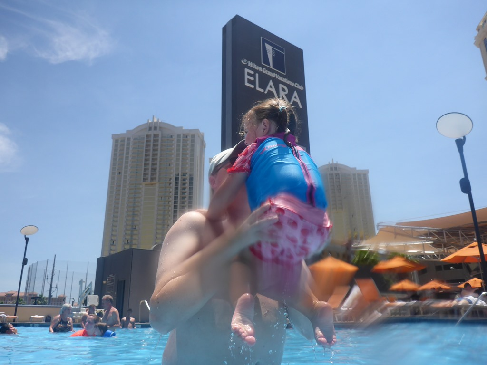

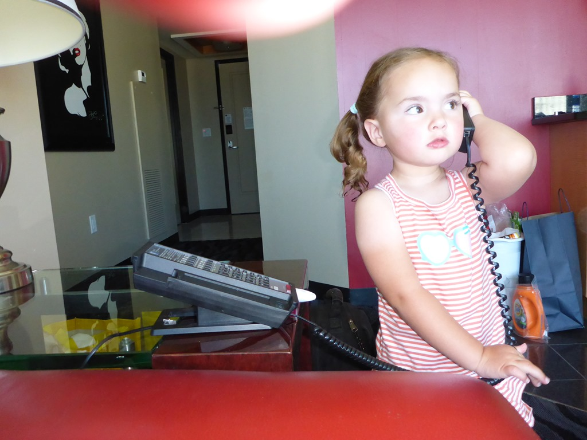

En toen was het tijd om te vertrekken naar Los Angeles, waar we nog overnachten in de DoubleTree nabij het vliegveld. Onderweg zijn we nog gestopt bij de Calico KOA voor een verfrissende duik in het zwembad. Hier ontdekten we de laatste nieuwe trend: zwemmen met eenden!

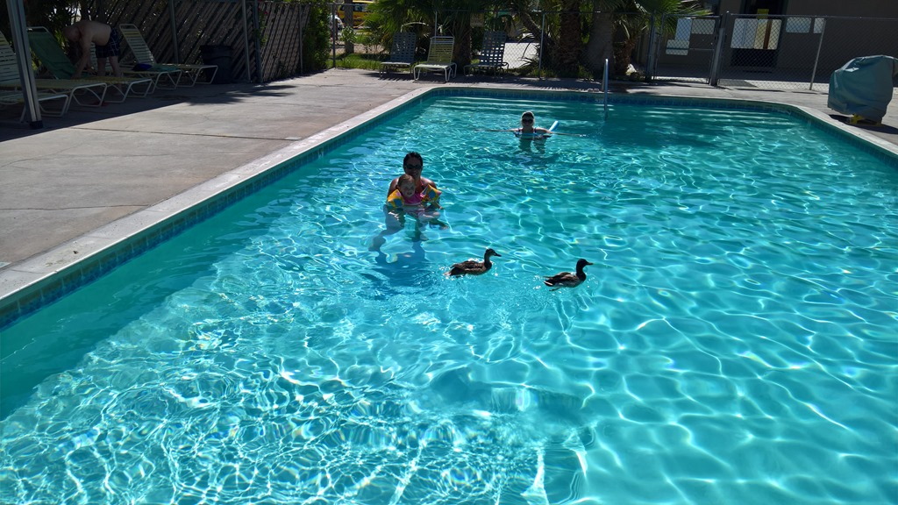

## 1 opmerking

### Gerard14 juni 2016 om 01:18

Ons bij de handje is toch maar mooi in Vegas geweest en ze loopt als een "prominentje" met haar handtas door de lobby van het hotel. Grappig te zien hoe ze zich vermaakt. Trouwens mama en papa ook....
