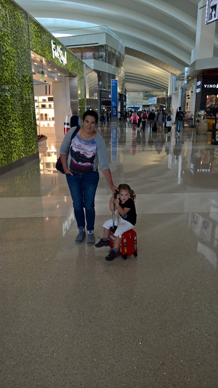
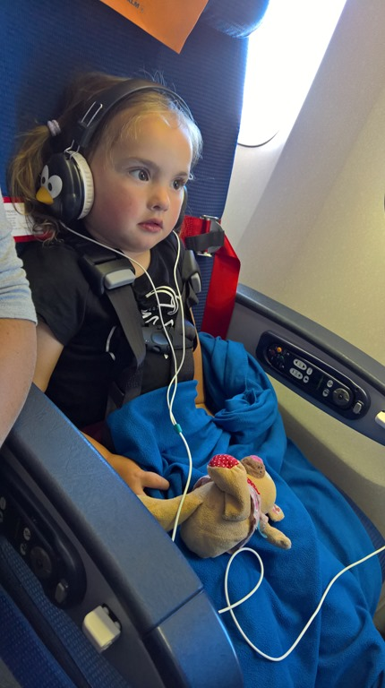
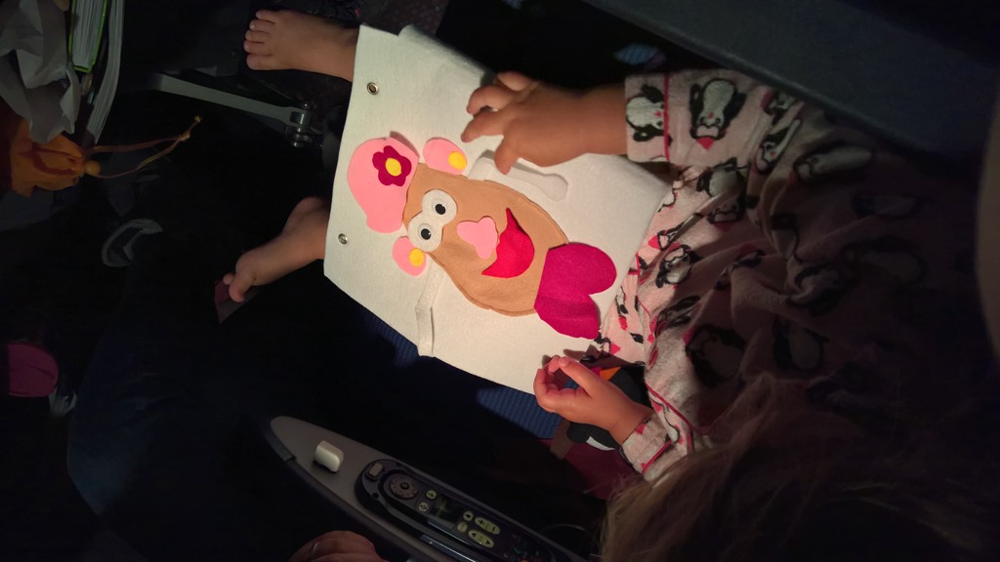
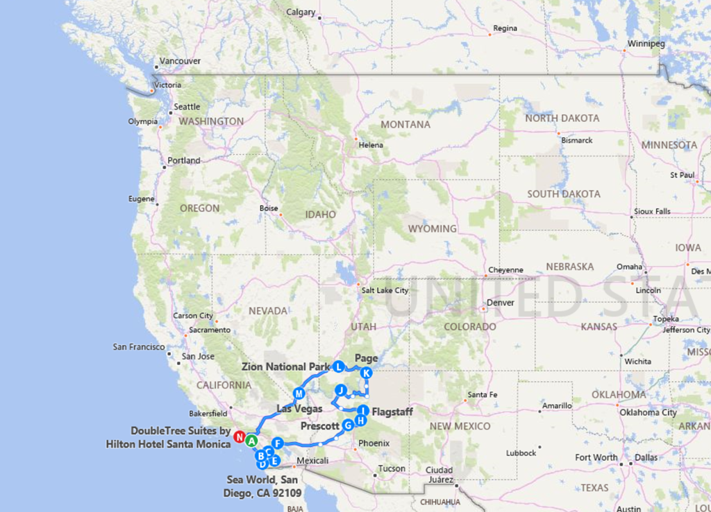

Het laatste ritje van deze rondreis gaat van Las Vegas terug naar Los Angeles en leggen we af met de Chevy Tahoe. Wat een genot is deze auto toch: je zou bijna de rammelende bestekbak en rooster van de kookplaat gaan missen. De laatste nacht brengen we door in de DoubleTree in Los Angeles. Dit is een prima hotel, en ligt op slechts een kwartiertje rijden van het vliegveld. 's Avonds in het hotelrestaurant hebben we voor de laatste keer genoten van de Amerikaanse cuisine. De Marokkaanse ober Frederique was de voormalig personal assistant van onze eigen Rutger Hauer... het kan verkeren in je leven.

De vlucht ging gelukkig weer prima, Sofie heeft zich wederom keurig gedragen.

We hebben in totaal 1455 mijlen toegevoegd aan de kilometerstand van de bijna nieuwe camper. Het ding was slechts drie maanden oud, en wij waren de tweede huurders. Hij had alleen het ritje gemaakt van de fabriek naar Los Angeles.

Het was dus slechts een klein rondje, maar dat betekende wel dat we erg op ons gemak van alles konden doen en bekijken. Hoogtepunten waren van de ene kant toch Disney en Legoland, vooral voor Sofie natuurlijk, het was echt fantastisch om te zien hoezeer ze van die dingen geniet. Van de andere kant waren voor ons de national en state parks weer geweldig, met name Zion en de omgeving van Prescott en Sedona. Enige minpuntje was toch de enorme drukte in Zion tijdens Memorial Day weekend, daar moeten we bij een volgende keer iets op verzinnen.
