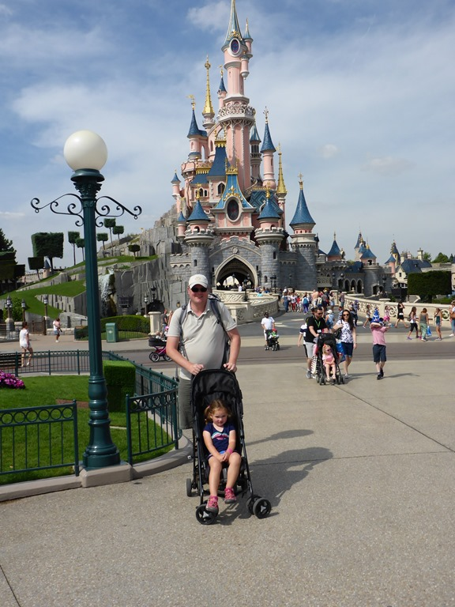
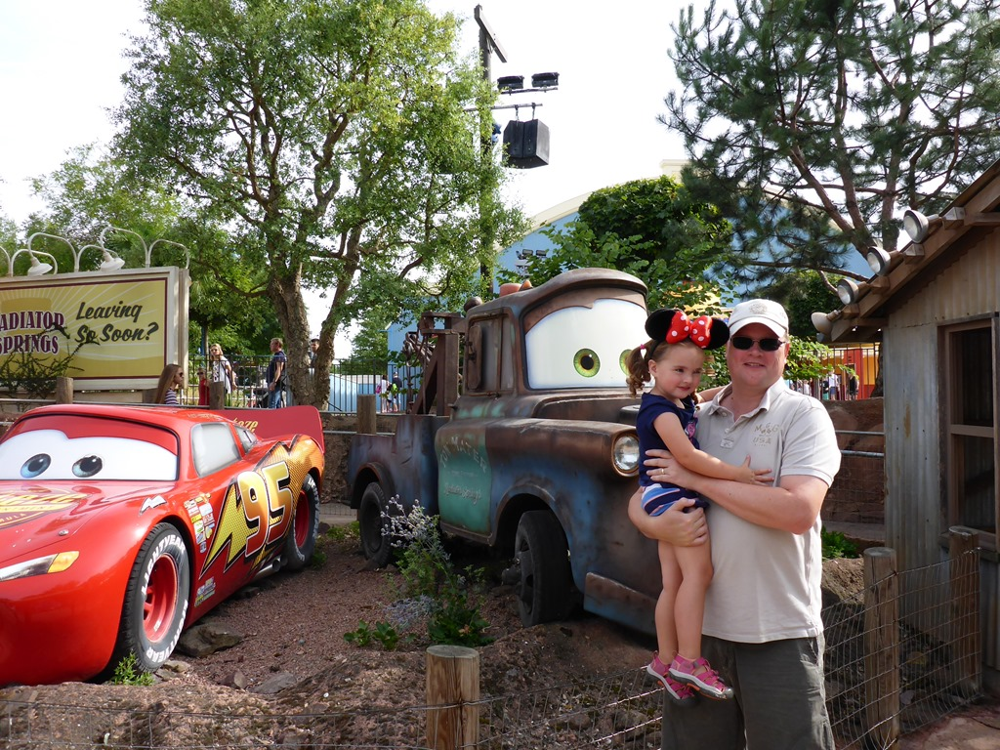
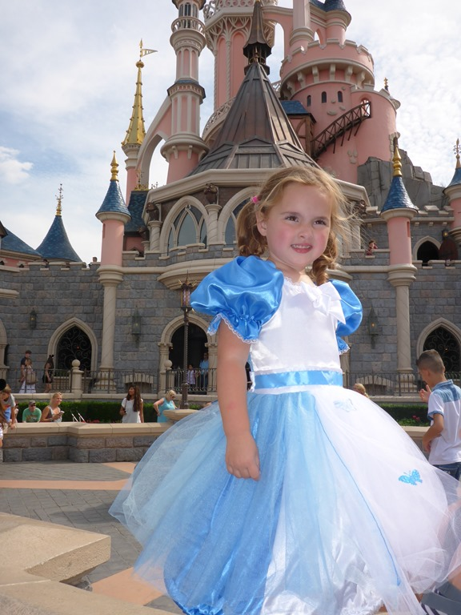
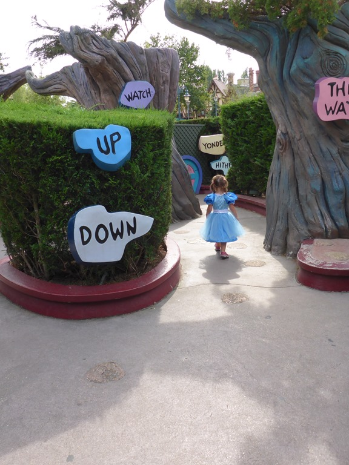
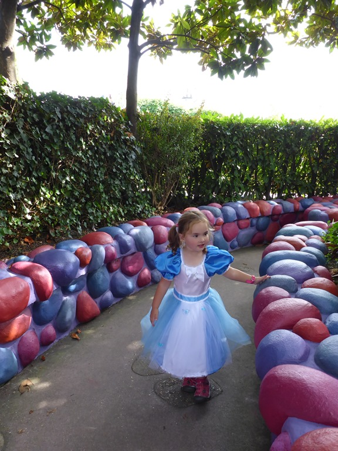
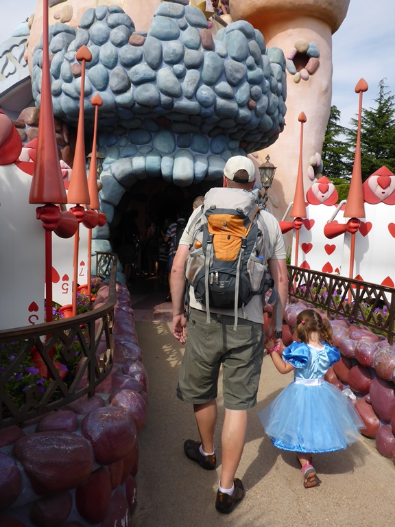
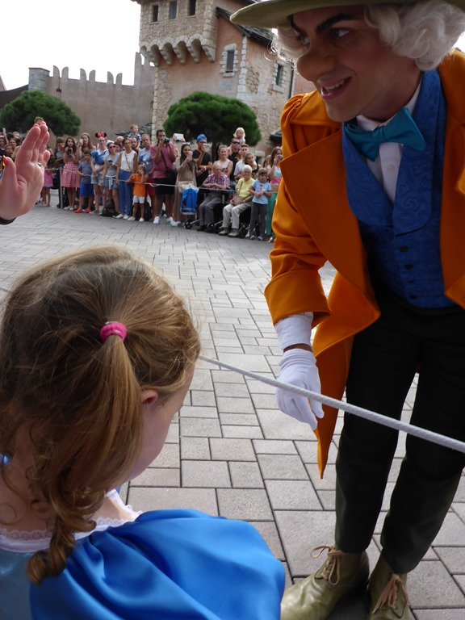
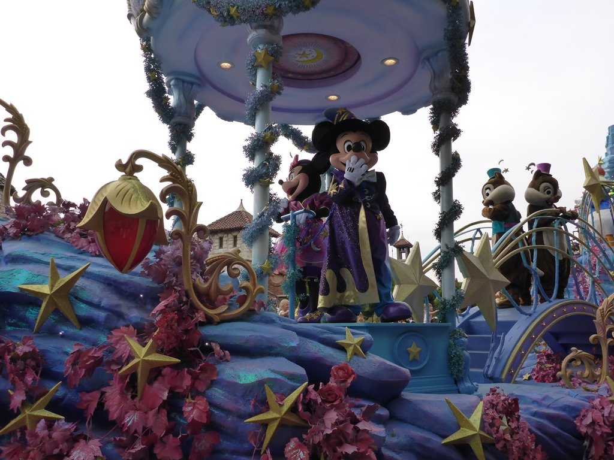
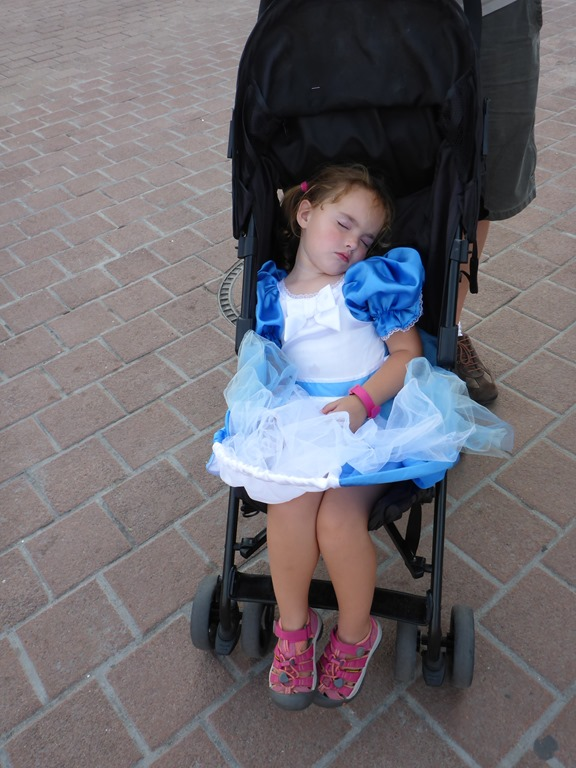

Vienna House Magic Circus bij Disneyland Paris is onze tussenstop op weg naar het zuiden. Donderdagavond zijn we rond 20.00 vertrokken, en we waren er na een ontspannen en rustige rit iets na middernacht. We hebben heerlijk geslapen, en na het ontbijt zijn we met de shuttlebus naar Disneyland gegaan. Het was mooi weer, niet al te warm en het was erg rustig in het park. We zijn in verschillende attracties geweest.

Sofie was ook erg rustig, ten minste, totdat we bij een winkel kwamen waar ze onder andere kleding van Disney karakters verkochten. Ze stond te stuiteren bij een feestjurk van Alice in wonderland, we hebben er maar een gekocht. Ze was de koning(in) te rijk, en stond de hele tijd rondjes te draaien.

 

En toen was het tijd voor de parade waarbij een hele zwik bekende en onbekende Disney figuren in optocht aan je voorbij komen. Wat een feest!

Helemaal aan het einde komt dan eindelijk de eindbaas Mickey en z'n lover Mini.

's Avonds waren we allemaal doodmoe, en hebben wederom heerlijk geslapen, de een wat eerder dan de ander...

## 1 opmerking

### Gerard7 september 2016 om 10:10

Dit is wel een heel mooi begin van jullie vakantie. En Sofie past met haar jurk erg goed in het Disney park.
