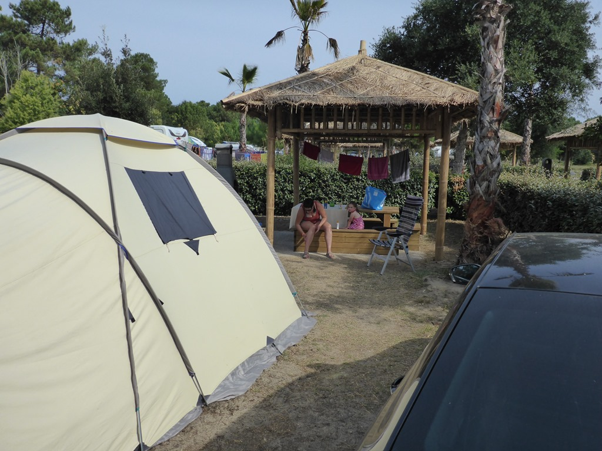
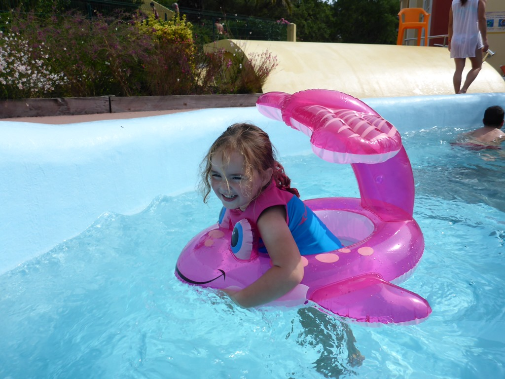
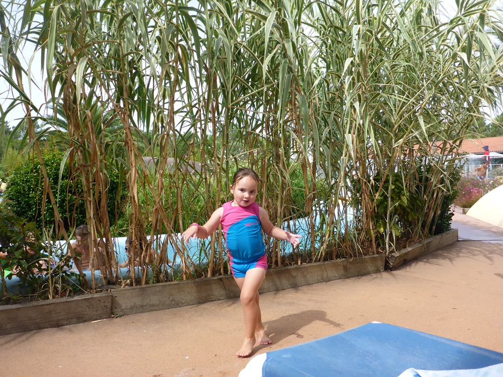
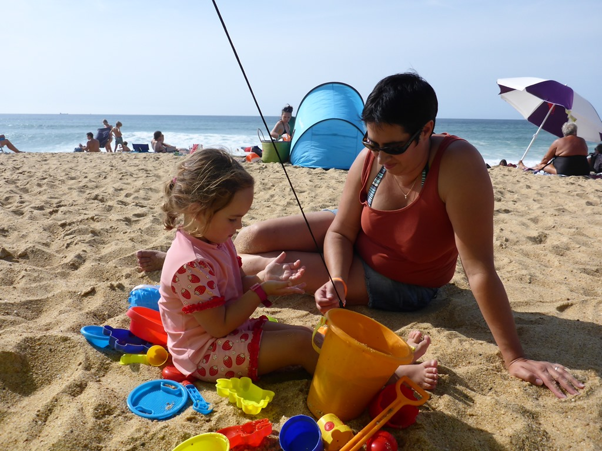
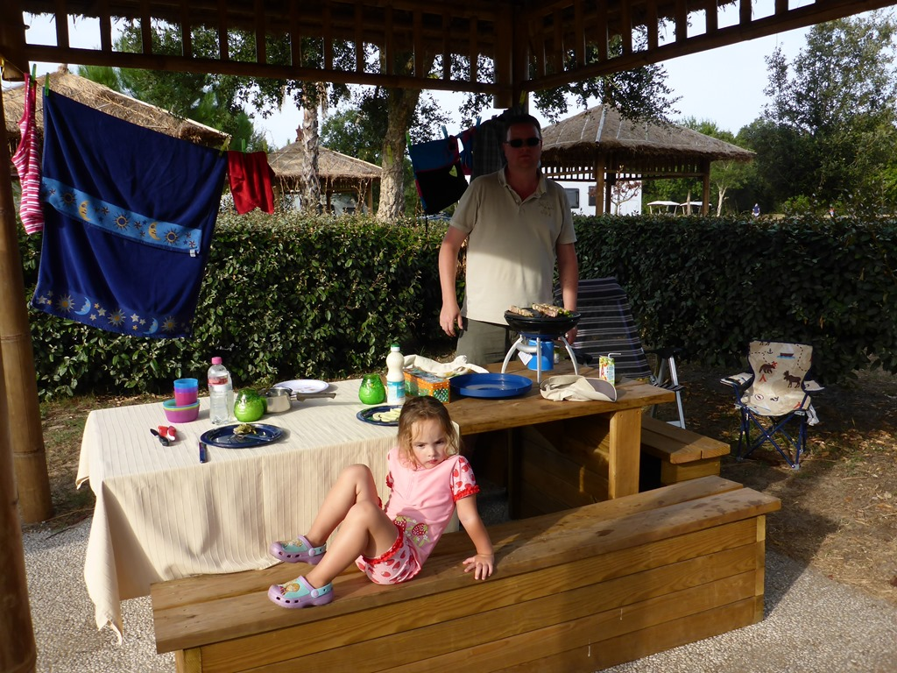

Het is nog bijna 800 kilometer rijden naar Labenne-Ocean, dus we zijn op tijd vertrokken. Na een kleine stop bij de lokale supermarkt voor proviant voor onderweg, zijn we op pad gegaan. Het was redelijk rustig op de snelweg, en dus waren we uiteindelijk tegen zessen op de camping Sylvamar in Labenne. Ontvangst bij de receptie was zeer vriendelijk, en onze plek ligt redelijk centraal. Speeltuin, zwembad en douche/toilet zijn allemaal dichtbij. Ondanks de drukte (enorm veel Spanjaarden), zijn de toiletten en douches opvallend schoon. Nadat we de tent hebben opgezet, hebben we pizza gegeten van het restaurant op de camping. Smaakte prima!

Zondagochtend werden we vanaf 10 uur onaangenaam verrast door de poolparty van de naast ons gelegen camping. Het doordringend gebeuk ging de hele dag door, en even waren we bang dat dit een dagelijks terugkerend fenomeen zou gaan worden. Begin van de middag ben ik beklach gaan doen bij de receptie, want hier worden we echt niet vrolijk van. Er werd ons verzekerd dat de party alleen vandaag zou zijn, en dat was gelukkig ook zo. We kozen er toch voor om het gebonk te ontvluchten, en dus trokken we de zwembroek aan en zijn we 's morgens naar het zwembad op de camping gegaan.

Na de lunch zijn we naar het strand gegaan. De regio hier schijnt wereldberoemd te zijn in de surfers-scene vanwege de hoge golven. Vandaag mochten we echter niet de zee in, niet eens pootjebaden was toegestaan, vanwege de sterke stromingen. De zee was heel erg wild, wat altijd spectaculair blijft om te zien.

's Avonds hebben we een lekker spiesje op de grill gegooid en lekker gegeten.

Het was al met al een leuke dag, ondanks de constante bas op de achtergrond, maar die hield gelukkig om 10 uur in de avond eindelijk z'n muil. Het klagen bij de receptie had trouwens een voordeel: we kregen een gratis wificode voor een tweede device.

## 1 opmerking

### Gerard8 september 2016 om 18:55

Leuk zo'n prieeltje achter je tent,je kunt er relaxed eten. Sofie heeft het zo te zien erg naar de zin.
