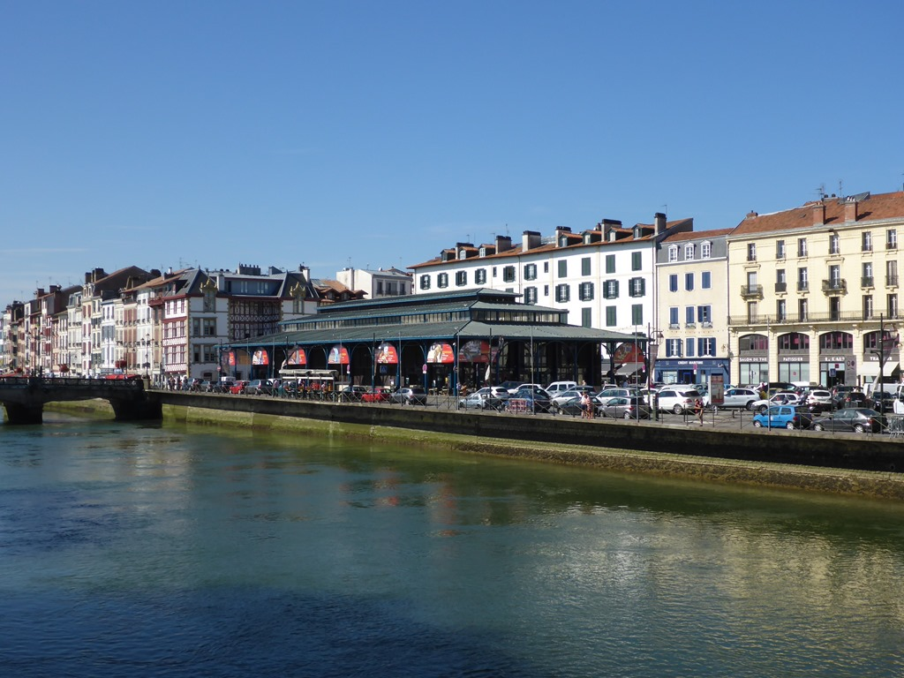
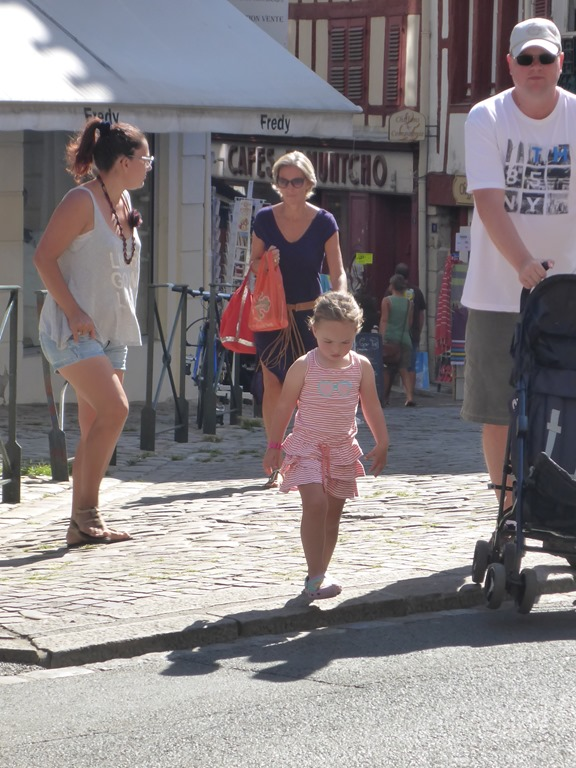
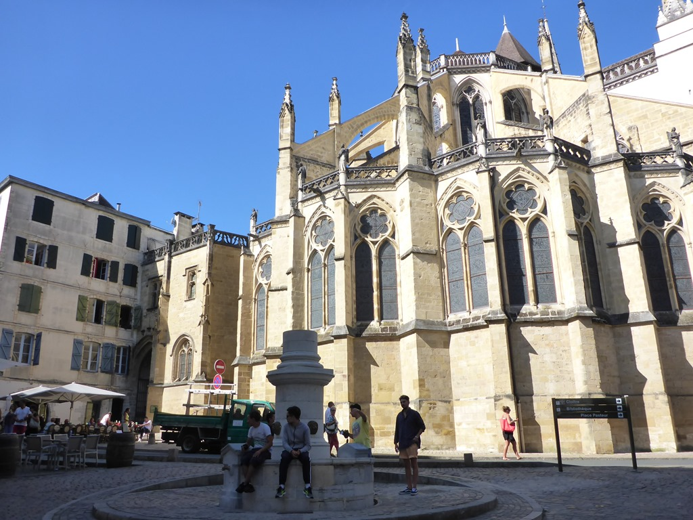
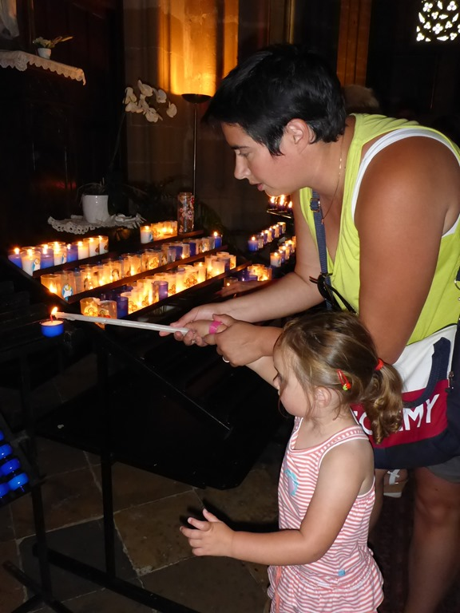
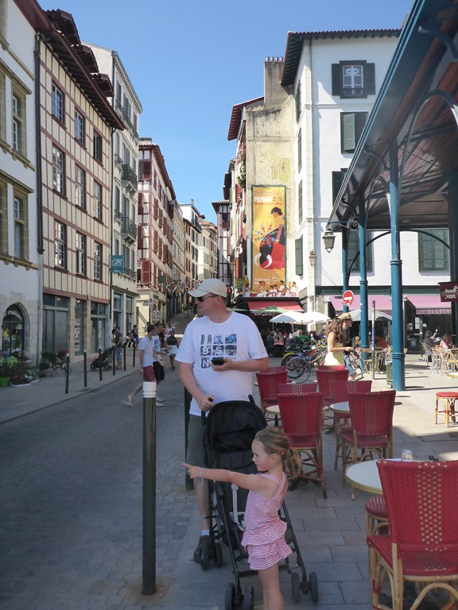
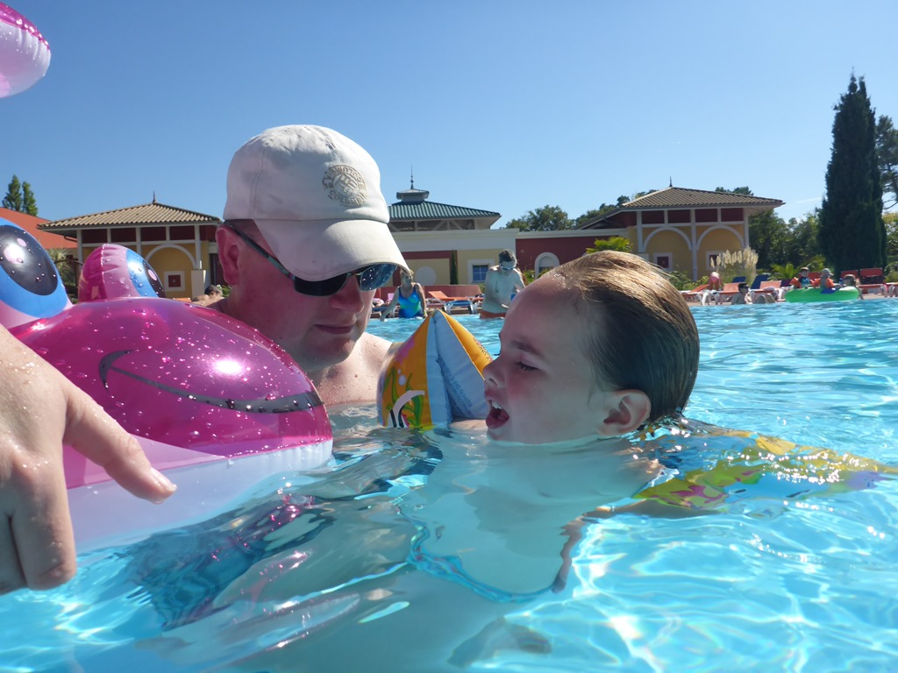
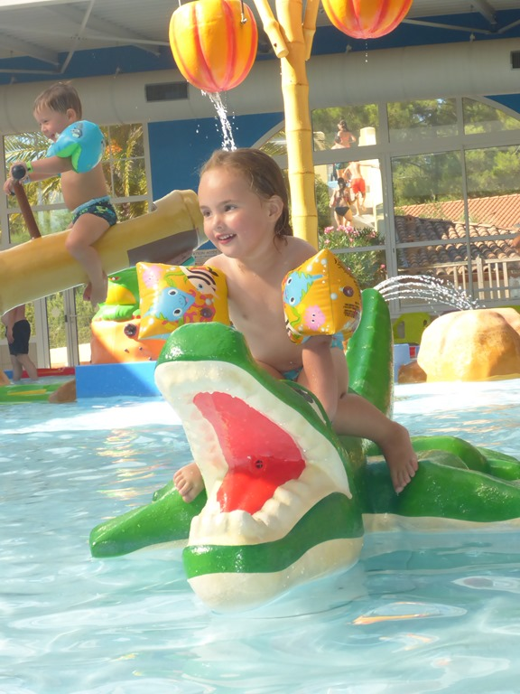
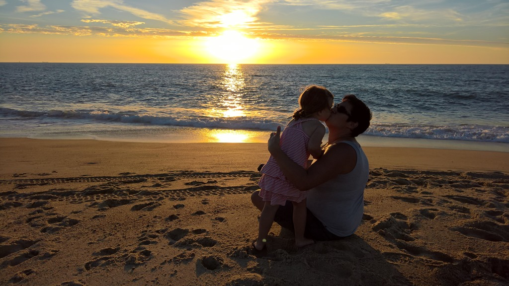
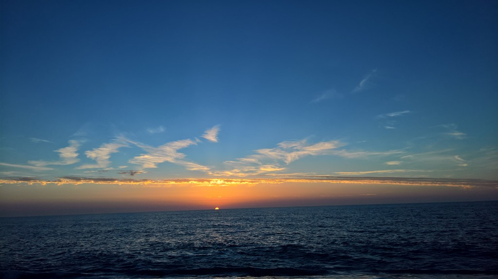

Hoofdstad van Frans Baskenland, beroemd vanwege de bayonette en kwaliteitschocolade. De middelgrote stad heeft een oud, gezellig centrum, met een overdekte markt (Les Halles) en een mooie kathedraal, de Sint-Marie.

Van de markt hadden we ons meer voorgesteld (met name meer chaos), maar het was eigenlijk een keurige, schone bedoeling.

De markt hadden we snel gezien, dus op naar de kathedraal.

Binnen de kathedraal liep een aantal nonnen in witte gewaden, die door Sofie al snel spoken werden genoemd. Samen met mama werd er een kaarsje aangestoken. Sofie begreep niet dat je het kaarsje niet mee mocht nemen (je hebt er immers centjes voor betaald), en uitblazen mocht ook al niet!

Na de heerlijke lunch zijn we weer teruggereden naar de camping, en zijn weer snel het zwembad ingedoken.

Na het avondeten zijn we naar de zonsondergang gaan kijken op het strand.

## 1 opmerking

### Gerard8 september 2016 om 19:02

Toch lekker zo'n korte vakantie. Geniet er maar lekker van. Hoop maar dat Sofie niet van de "spoken" gaat dromen😏.
