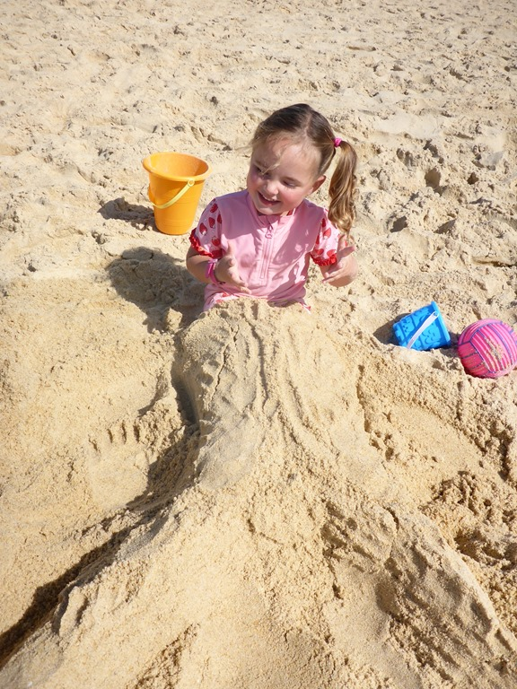
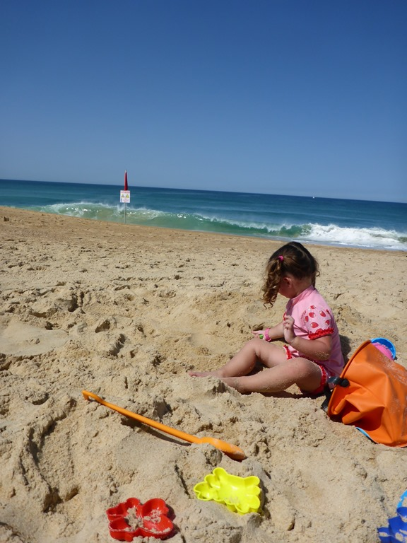
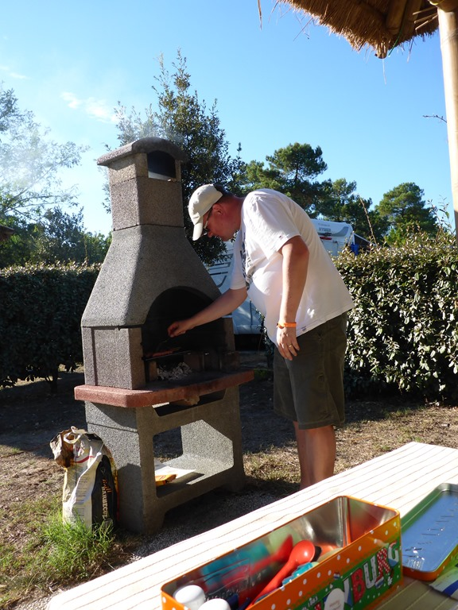
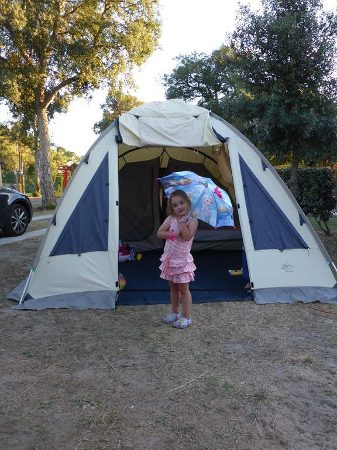

We boffen maar, vandaag wordt het 36 graden... Dus voor de middag naar het strand, om daar van de koele zeewind te genieten. Wederom mogen we niet het water in vanwege de verraderlijke stromingen. Maar dat mag de pret niet drukken: er worden zandkastelen en zeemeerminnen gemaakt!

Na de lunch zijn we weer terug naar het zwembad gegaan, in de schaduw is het prima uit te houden gelukkig.

's Avonds hebben we weer heerlijk gegeten van de BBQ.

