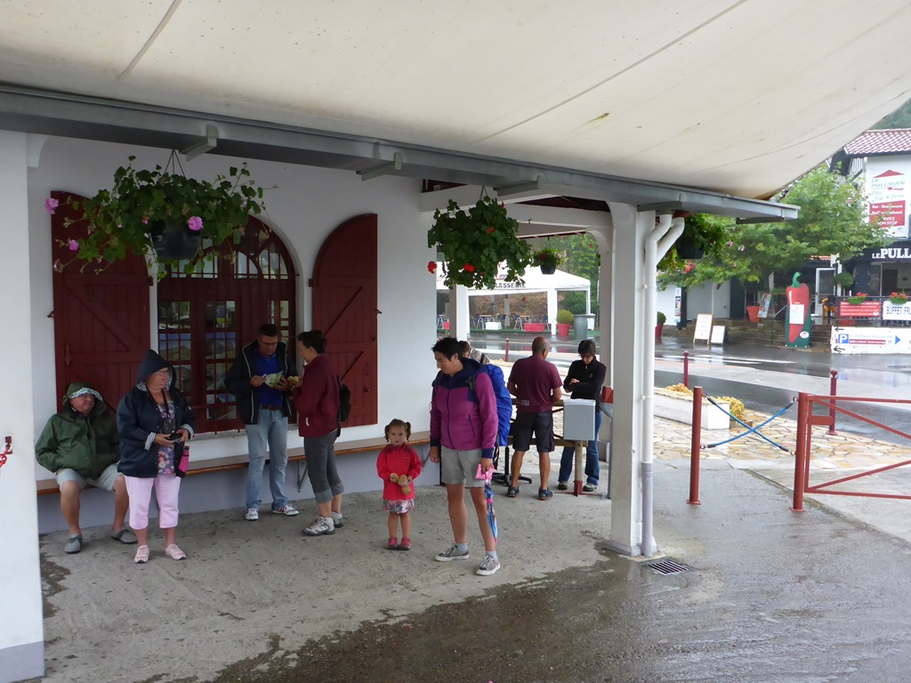
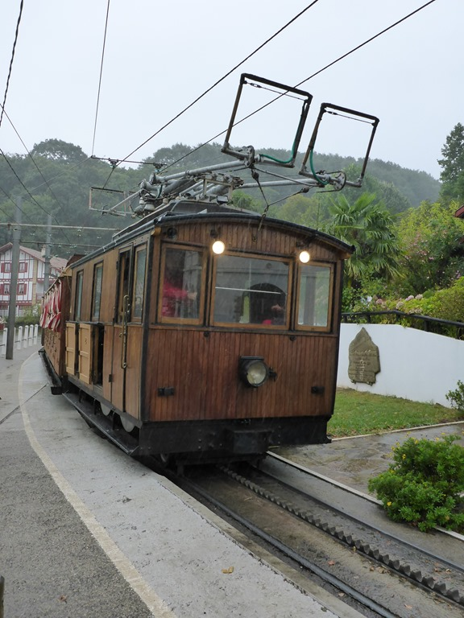
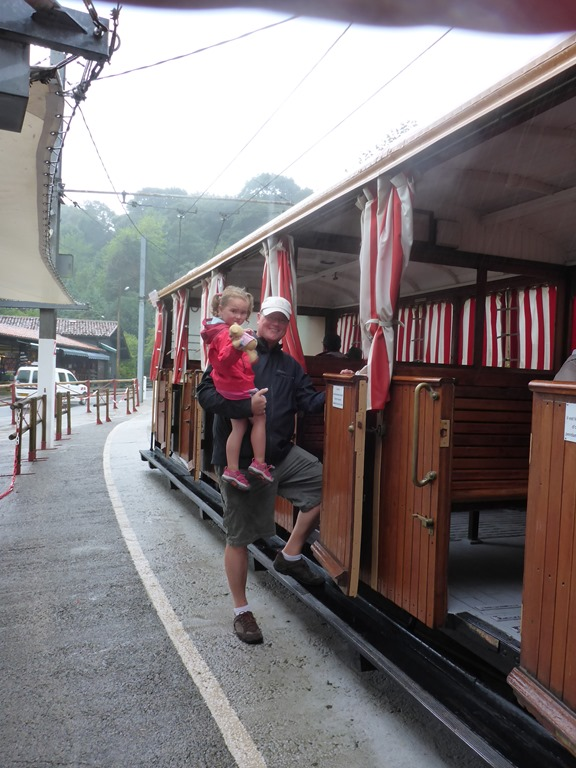
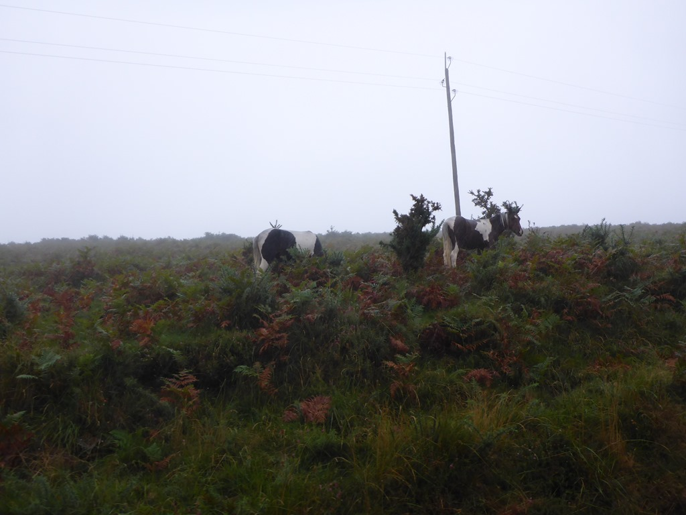
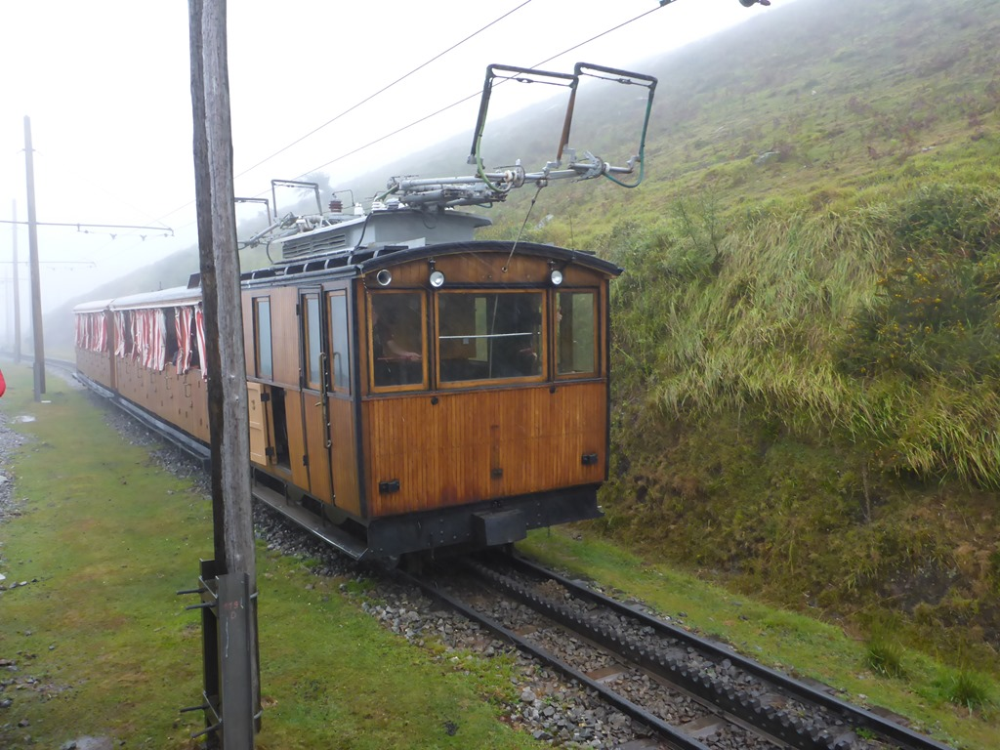
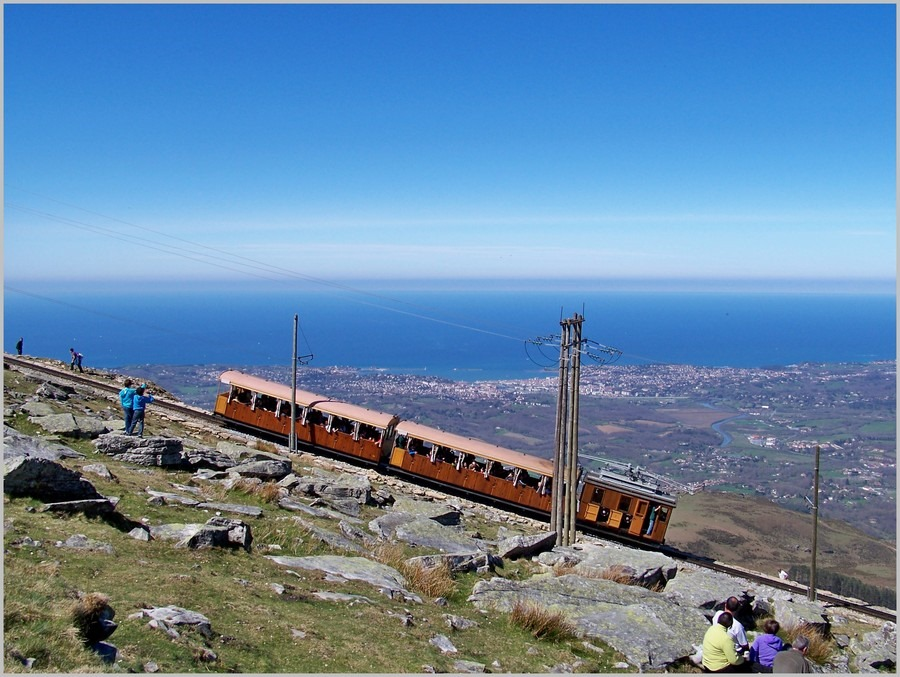

Zo'n drie kwartier rijden richting de Spaanse grens kun je met een tandrad-treintje een berg op. Volgens de brochure zijn de uitzichten onderweg maar zeker op de top overweldigend. Maar we treffen het niet, het is regenachtig en door de laaghangende bewolking zien we enkel het interieur van de trein. Nadat we de kaartjes gekocht hadden, moesten we een paar minuten wachten op het gezellige station.

Instappen maar, en op naar boven! Onderweg zie je de zogenaamde Pottok, een lokaal soort (wilde) pony, die voornamelijk in het westelijke deel van Baskenland voorkomt, met name aan de Franse zijde.

Het spoortje is met 4,2 km niet al te lang, maar met een maximale snelheid van 9 km per uur, duurt de rit ongeveer een half uur, met een maximaal stijgingspercentage van 25%.

Zoals gezegd, wij konden amper 20 meter links en rechts van de trein kijken, maar op mooie dagen kun je dit zien...

Bovenop de top hebben we gelunched in het restaurant aldaar, en om 12 uur de trein weer naar beneden genomen. We hebben Sofie al slapende uit de trein en in de auto getild. Met de navigatie in standje "landschappelijk aantrekkelijk" zijn we teruggereden naar Labenne, zodat Sofie even kan bijslapen. Het zijn tot nu toe drukke dagen geweest namelijk zonder middagdutje.
