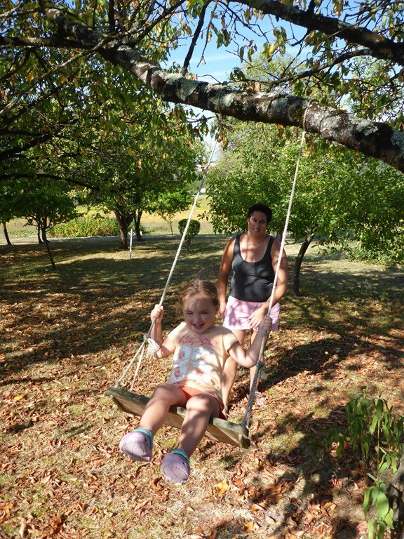
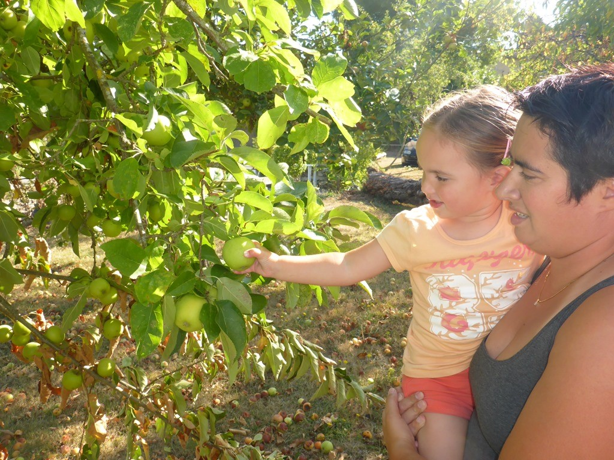
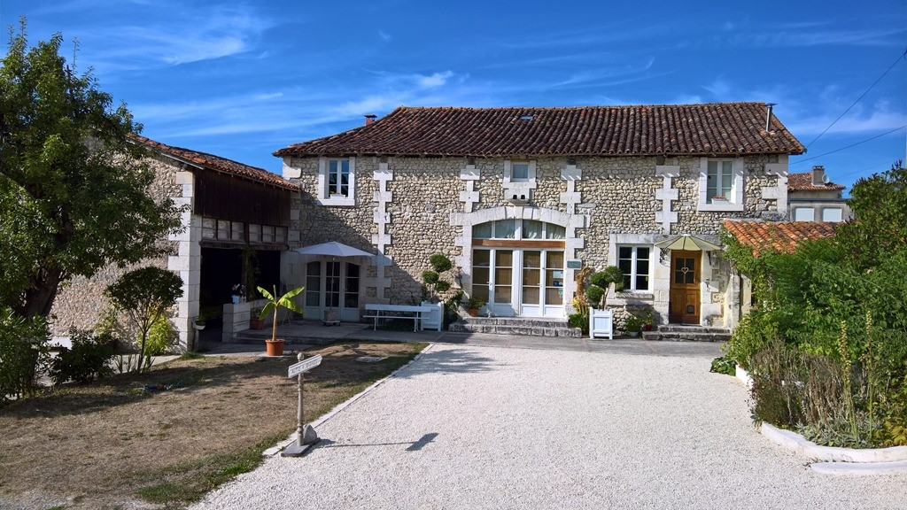
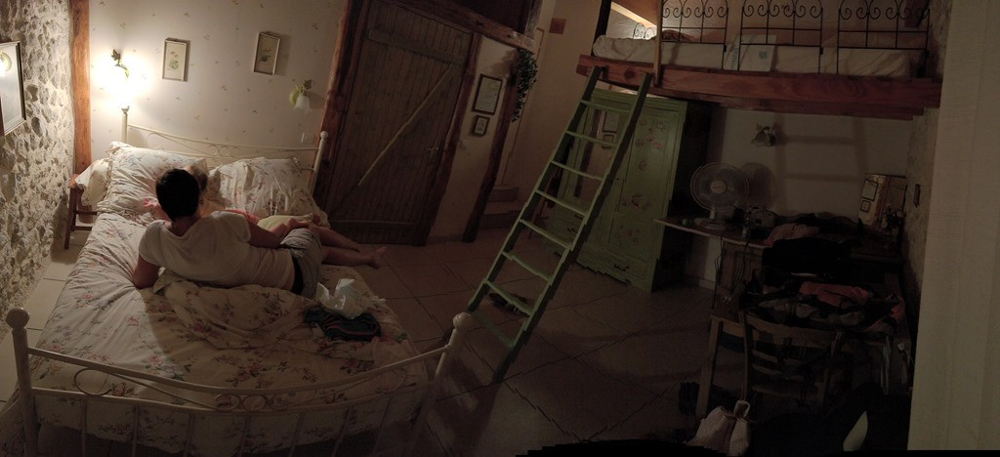
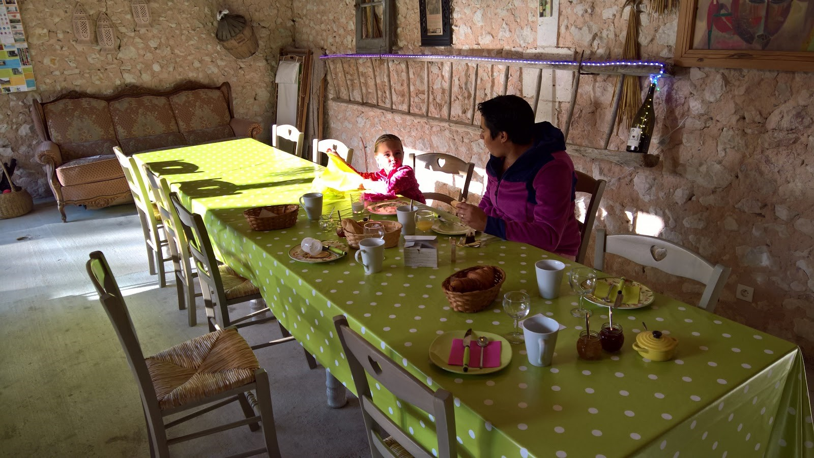
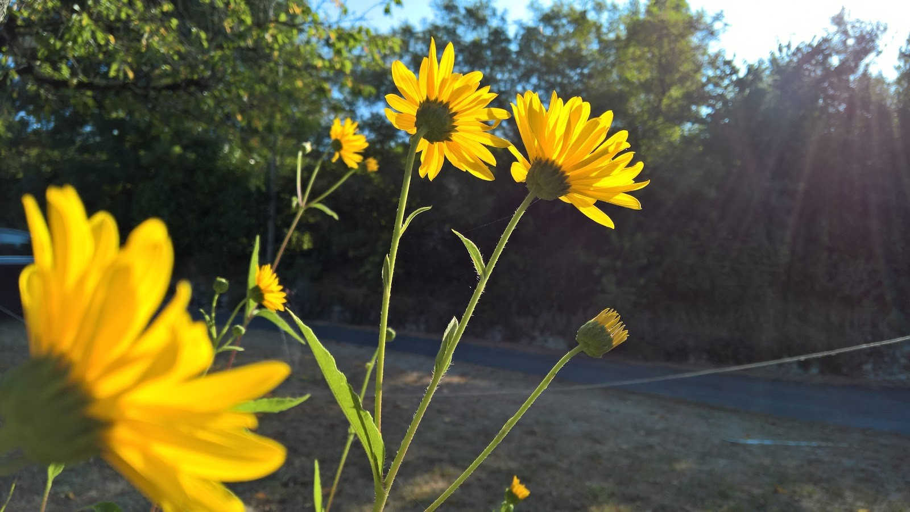
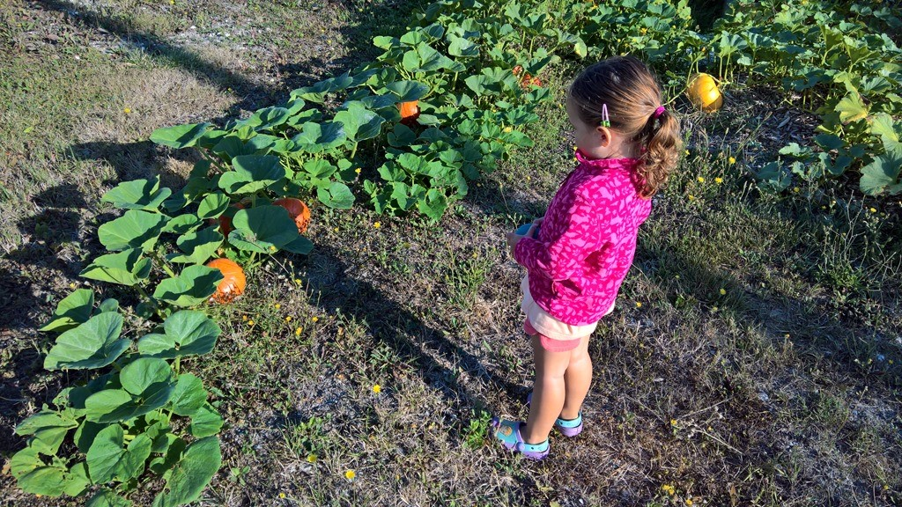
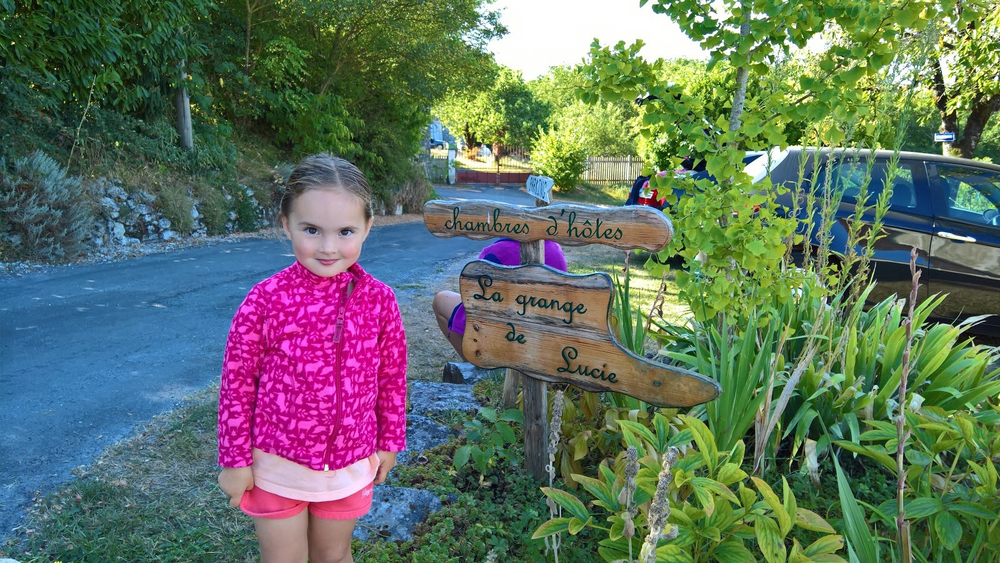
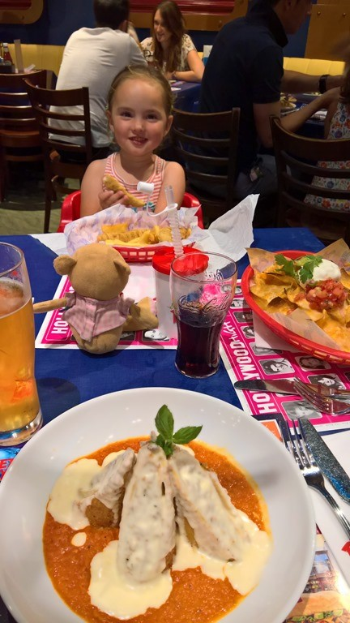

We zijn natuurlijk wat aan het einde van de zomer hier, en dat betekent dat de tent iedere ochtend erg nat is van de dauw. Bovendien was het wat ver rijden van Parijs naar Labenne (ruim 800 km), en dus besloten we om een dagje eerder van de camping te vertrekken. In de Perigord hebben we een leuk chambre d’hote gevonden: la grange de Lucie (letterlijk de schuur van Lucie), een gerenoveerde boerderij. Ontvangst door de gastvrouw en –heer is zeer hartelijk, ze proberen Engels te praten en dat gaat eigenlijk heel aardig. Op het terrein is een fruitboomgaard met wat schommels erin, die Sofie al snel gespot had.

We hadden een leuke kamer, met twee hoogslapers. Mama en Sofie sliepen boven, dus papa had het grote bed voor zichzelf. Op aanraden van de gastvrouw zijn we gaan eten in Le Commerce in Saint Severin. Het was typisch zo'n restaurant waar we normaal gesproken voorbij waren gelopen, maar we hebben heerlijk gegeten. De eigenaar vond Sofie erg leuk, en nam haar mee op de arm om samen een ijs uit te gaan zoeken.

We hebben heerlijk geslapen. Het ontbijt werd in de voormalige schuur geserveerd en was prima: verse croissants en stokbrood en zelfgemaakte aardbei- en perenconfiture.

Na het ontbijt moest er natuurlijk nog even geschommeld worden en door de tuin gelopen.

Daarna zijn we doorgereden naar Marne la Vallee om nog een nachtje in een Disney hotel te slapen, Dream Castle deze keer. 's Avonds zijn we weer met de shuttlebus naar Disney Village gegaan en hebben gegeten bij Planet Hollywood. Ik had een overheerlijke lasagne, met een Californische twist.

Zondagochtend zijn we weer naar huis gereden.

## 1 opmerking

### Gerard13 september 2016 om 11:34

Die kleine Sofie heeft samen met mams en paps toch weer veel leuke dingen gedaan en veel beleefd.
De blog blijft een mooi reisverslag.
