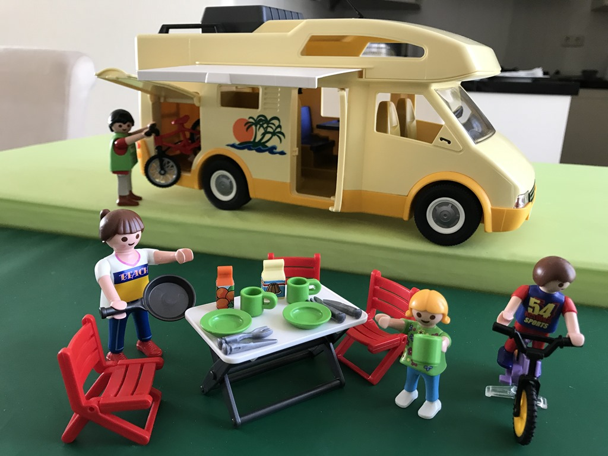

>Een sabbatical of sabbatsjaar is een periode (minimaal een aantal maanden) waarin mensen vrij nemen (of betaald vrij krijgen) en hun gewone beroepsbezigheden onderbreken.

Tot zover Wikipedia deze keer.

Betaald vrij gaat helaas niet op voor ons, maar het artikel heeft wel degelijk gelijk voor wat betreft de onderbreking van de beroepsbezigheden. Voor 2017 staat een rondreis gepland van ruim 9 weken. Deze keer starten we weer eens vanuit San Francisco in California. Met wat omwegen eindigen we ergens in juli in Denver Colorado. De koffers zijn ingepakt, het huis is opgeruimd, dus we kunnen met een goed gevoel vertrekken.

Vrijdag pakken we het vliegtuig naar San Francisco. Daar blijven we een aantal dagen, en dan kunnen we maandag de camper ophalen. De eerste camping is nog in de Bay Area, namelijk in Anthony Chabot Regional Park, dus we hebben alle tijd voor de vehicle inspection en de eerste boodschappen.

## 3 opmerkingen

### Gerard 11 mei 2017 om 13:35

Goede Reis en veeeeel plezier

### 2-op-reis 12 mei 2017 om 08:22

Beste SabBatentjes, spannende uitdaging, veel plezier en jaloezie zijn de eerste kreten die me te binnen schieten. Met name die laatste! We gaan jullie tracken. Goede vlucht en nogmaals een enorm mooie reis met veel plezier toegewenst.

Het achterblijvende BHV-team! (Staande bij)

### opa 12 mei 2017 om 08:50

Goede vlucht
