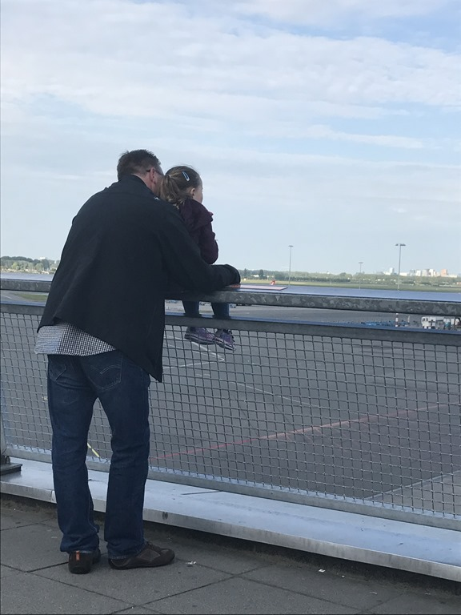
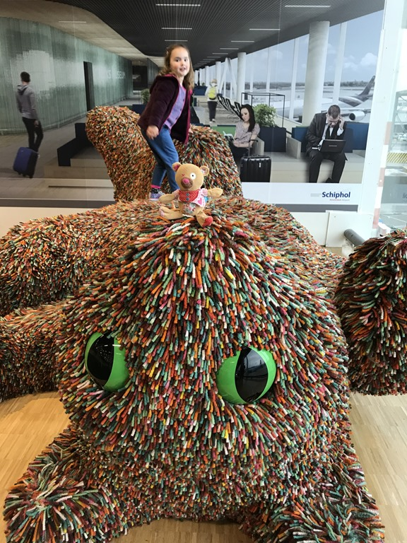
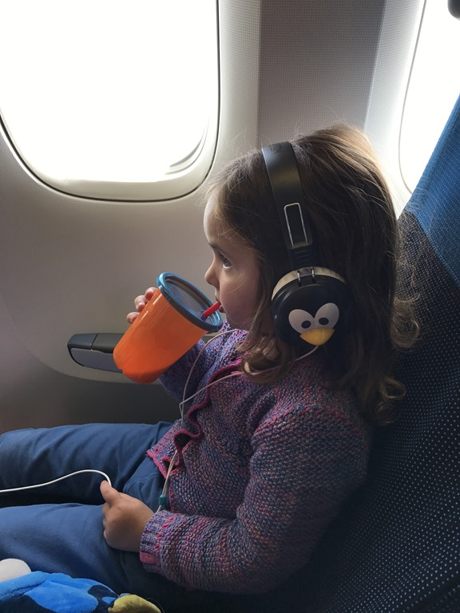
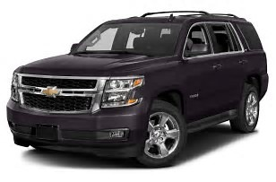

De donderdag voor vertrek zijn we na de lunch al richting Schiphol vertrokken. Nadat we de koffers in onze kamer in de Citizen M, direct naast de vertrekhal gelegen, en de auto op P3 hadden geparkeerd, zijn we richting het panoramadek gewandeld om daar wat te gaan eten en naar de vliegtuigen te kijken. Nu begint het vakantiegevoel al wat tastbaarder te worden.

Na een goede nacht zijn we mooi op tijd bij de incheckbalie, vanuit het hotel een wandelingetje van 10 minuten. Hier is bijna geen wachtrij, en ook bij de security en douane is het helemaal niet druk. We waren er binnen een half uur doorheen gelukkig, en dus kon Sofie nog even spelen bij de Nemo tentoonstelling.

Het blijft natuurlijk een lange zit, 10 en een half uur in het vliegtuig. Toen we boven Londen vlogen vroeg Sofie of we al bijna in San Francisco waren, dus even vreesden we dat het een klein drama zou gaan worden. Maar we zaten comfortabel en Sofie had al redelijk snel een filmpje van Bluey in het entertainment systeem gevonden. Het filmpje duurde in totaal 4 minuten, en ze heeft het wel 40 keer bekeken. Dus alle moeite om zoveel mogelijk Mickey Mouse Clubhuis, Peppa Pig en ander kindervertier op de iPad te zetten waren onnodig.

Sofie (en papa) heeft uiteindelijk bijna 2 uur geslapen. Verder verliep de vlucht prima, en landden we gezond en wel op San Francisco International Airport. Ook hier waren we binnen 10 minuten door de douane heen, en de koffers lagen zelfs al op de band op ons te wachten. Toen hebben we bij Alamo's onze huurauto opgehaald voor de komende dagen. Het is weer een bescheiden Chevy Tahoe geworden. Wat een fantastische wagen blijft het toch... ik zou er best een willen hebben. In het Larkspur Landing hotel hebben we de rest van de middag rustig aan gedaan en zijn vroeg gaan slapen.

