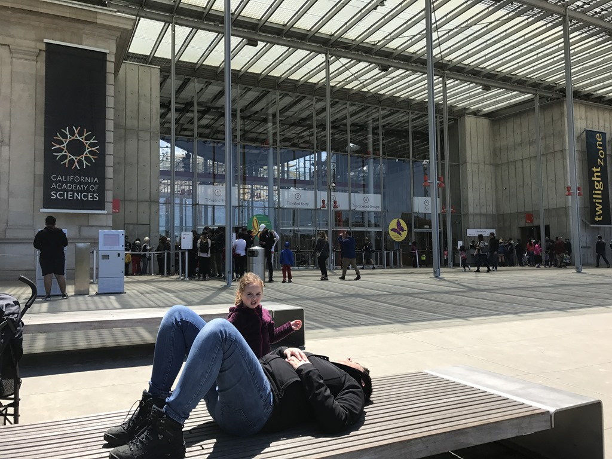
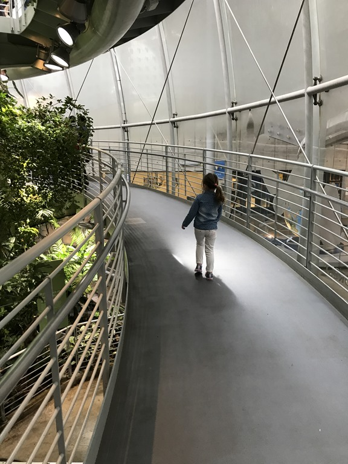
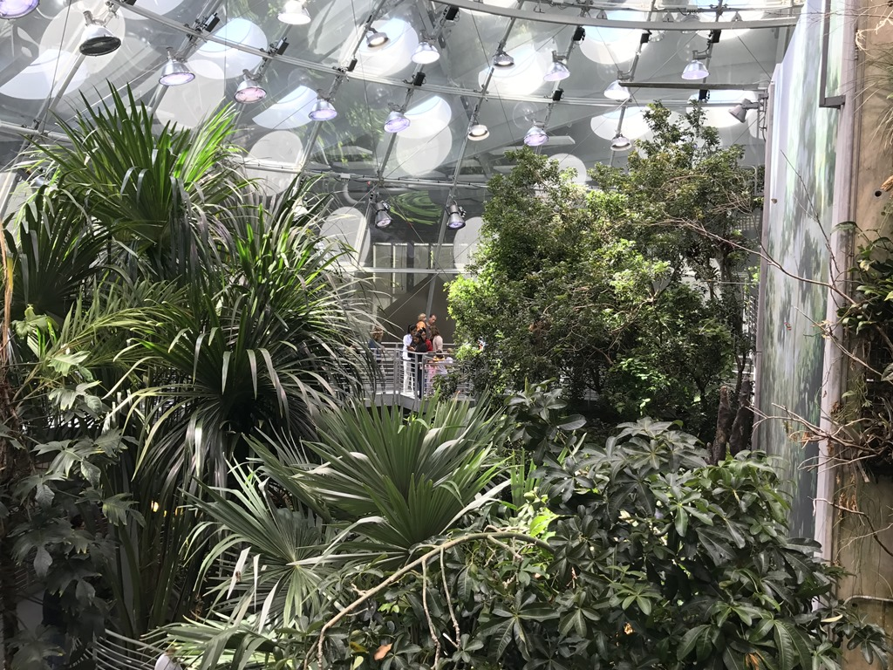
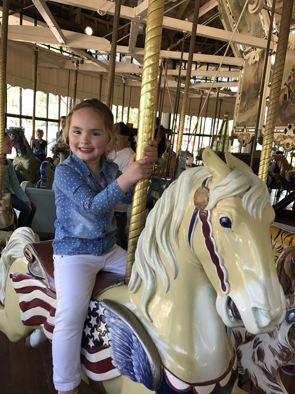
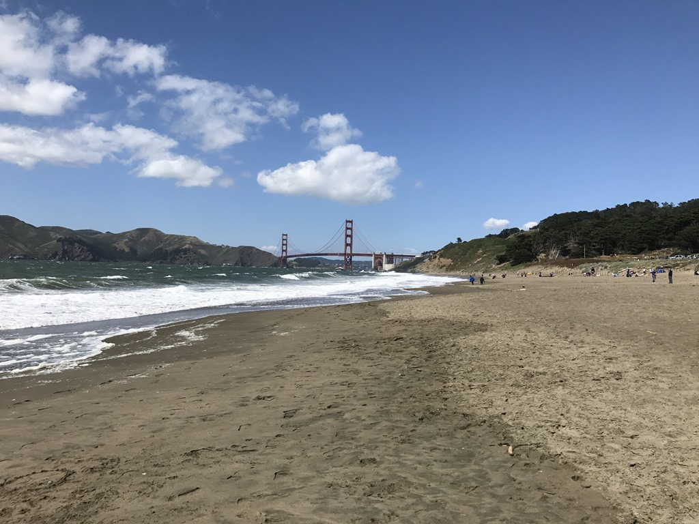

Met dank aan de jetlag waren we alle drie om half drie in de ochtend wakker. Na een beetje filmpje kijken, spelen en lezen hebben we het weten te rekken tot 6 uur. Toen zijn we maar op ons gemak gaan ontbijten bij de IHOP. Het was prima allemaal. Na een korte stop bij de lokale supermarkt voor de eerste boodschappen, zijn we naar het California Academy of Sciences gegaan. Dit moderne museum ligt in het Golden Gate Park, San Francisco's antwoord op het New Yorkse Central Park. Het is een enorm stadspark voorzien van vele recreatie-, sport en ontspanningsmogelijkheden.

Het museum bevat een aquarium, planetarium en natuur-historische tentoonstellingen. We zijn onder de indruk van het dinosaurus- en walvisskelet. Maar het reuzen-ei waarin je via een wenteltrap van de bodem naar de top van de jungle loopt, is indrukwekkend. Er zijn vogels, kikkers, insecten en mooi gekleurde vlinders te bekijken.

Na de lunch zijn we naar een speeltuin (pardon: The Koret Playground & Carousel) in het park gegaan, waar heel hipster San Francisco hun kroost kwam tonen aan elkaar.

Na een uurtje of zo zijn we weer in de auto gestapt en zijn naar Baker Beach gereden. Vanaf dit strand heb je een mooi uitzicht op de Golden Gate Bridge. Jammer van de enorme wind, want we werden gezandstraald, anders hadden we hier leuk kunnen spelen in het zand.

## 2 opmerkingen

### Anoniem 15 mei 2017 om 23:41

Mooie start van jullie reis! Have Fun! Groetjes van de jaloerse 3, die daarom vrij a.s. the plane instappen op weg nr Orlando....

### Gerard 16 mei 2017 om 00:48

Jetlag of niet, jullie eerst dag was erg leuk zo te zien.
