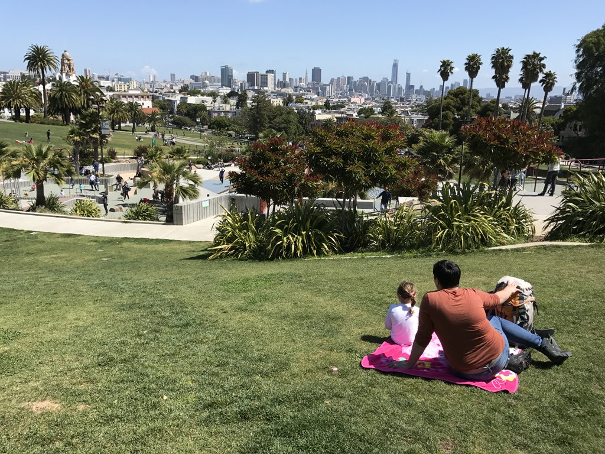
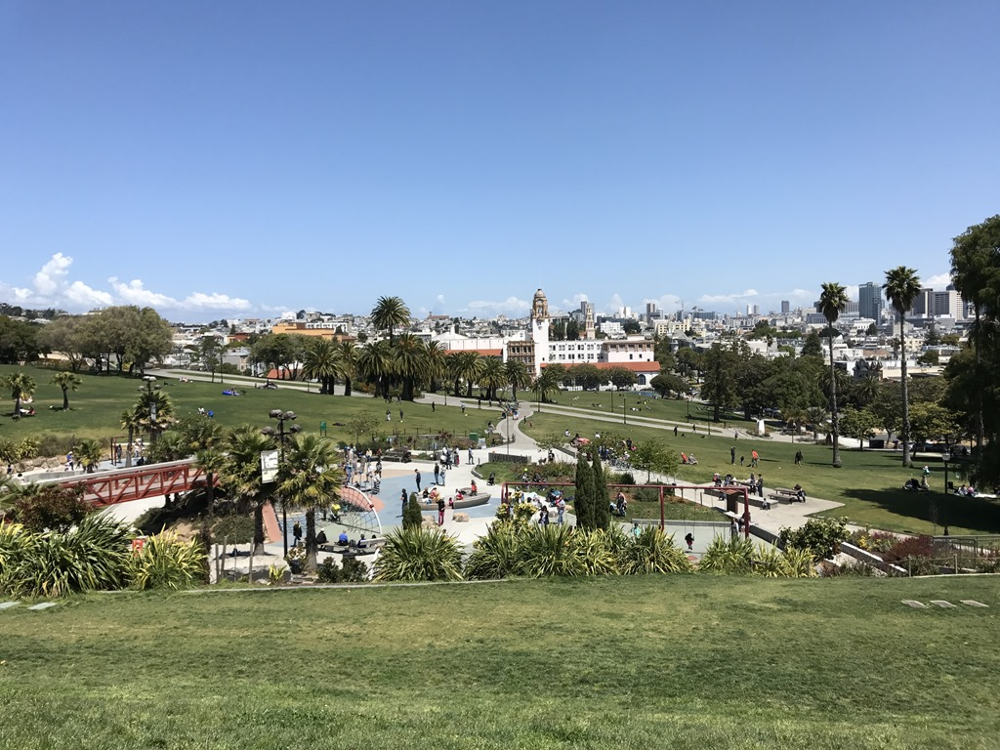
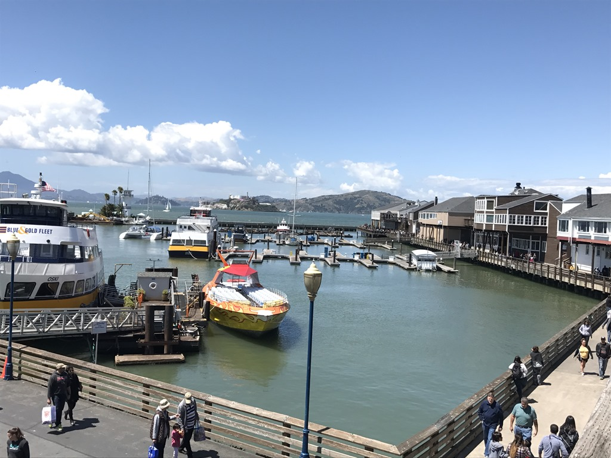

Vanwege de jetlag begon de dag weer vroeg. Na het ontbijt zijn we weer naar een speeltuin geweest, deze keer in downtown San Francisco. Met een fantastisch uitzicht over de stad leefde Sofie zich helemaal uit op de glijbanen, schommels en klimrekken.

De lunch hebben we genoten op Pier 39 in Fisherman's Wharf. Nou ja... genieten... de aanwezig zeeleeuwen rieken nogal onaangenaam.

Toen we het allemaal wel zo'n beetje gezien hadden, zijn we via Lombard street terug naar het hotel gereden. Deze straat is erg bekend vanwege het feit dat je over een lengte van pak 'm beet 300 meter, al zigzaggend naar beneden rijdt. Het is net een knikkerbak. Hoewel erg toeristisch toch een leuk uitstapje. 's Avonds hebben we Italiaans eten laten bezorgen in de hotelkamer. Het was verrukkelijk (chicken parmesian en chicken alfredo). Nadat Sofie in bed lag, hebben we alle koffers weer ingepakt, want morgen gaan we de camper ophalen bij Road Bear.
