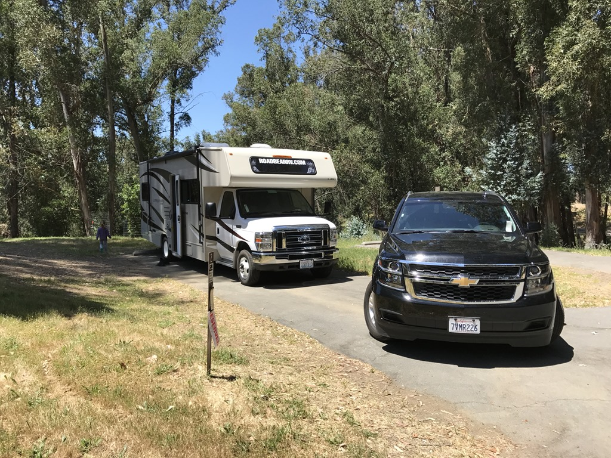
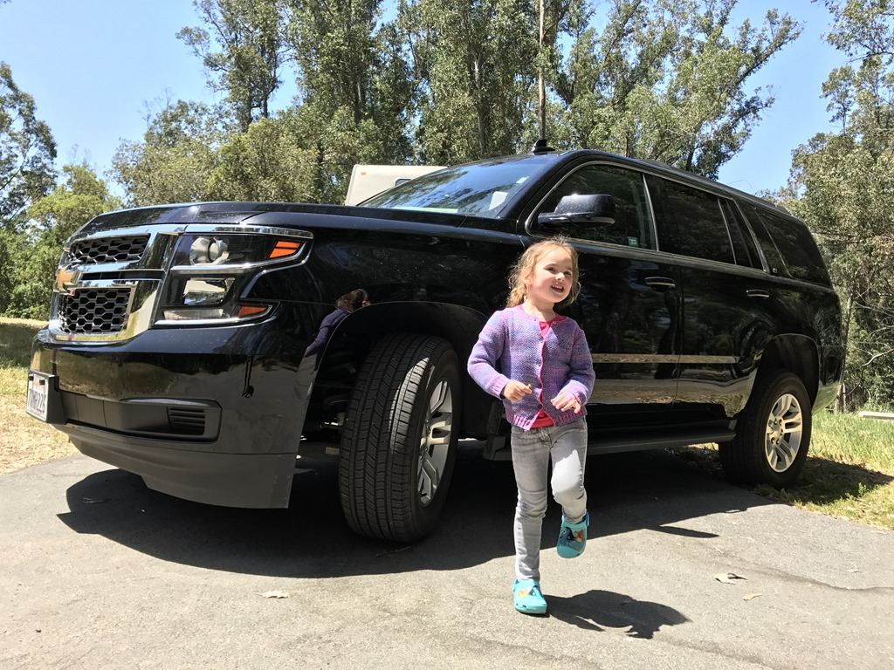
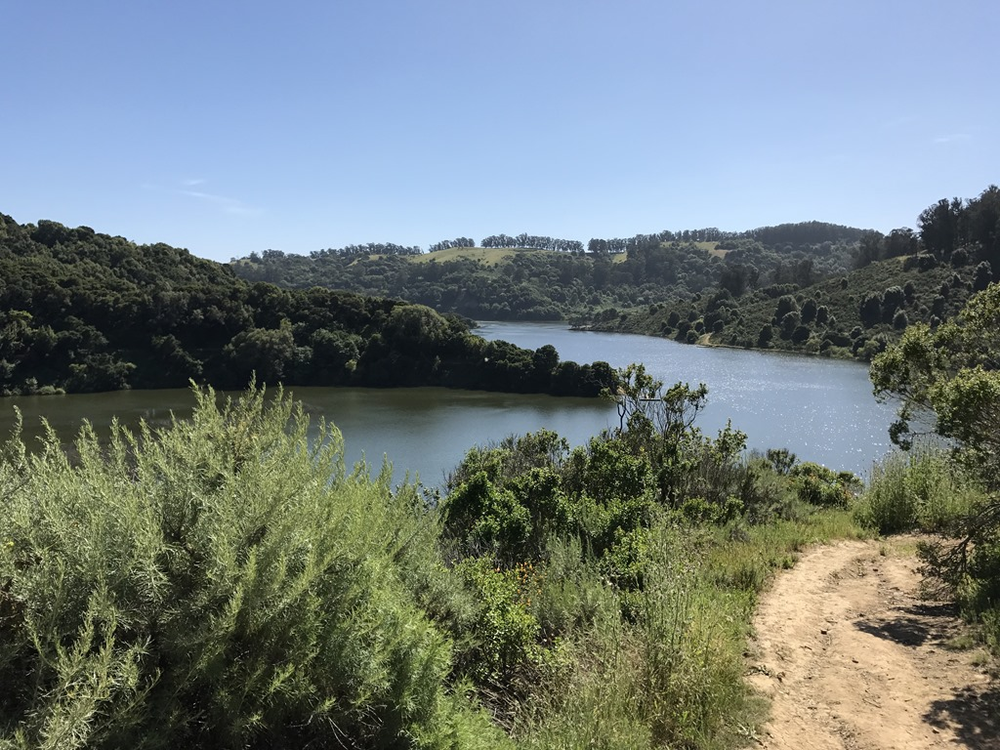
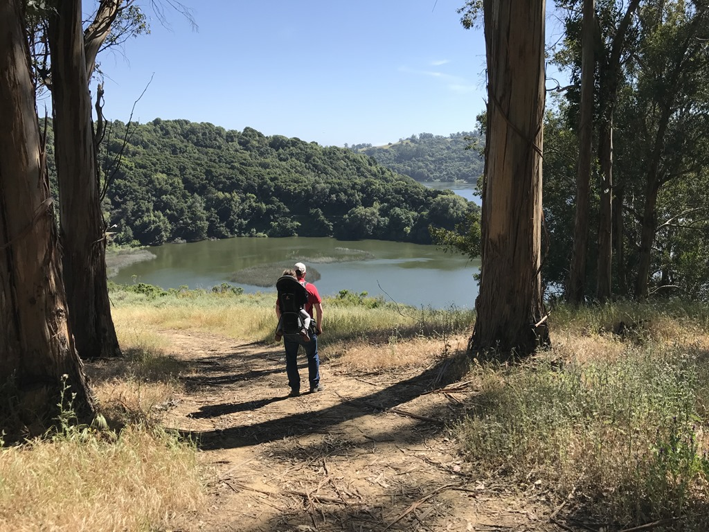
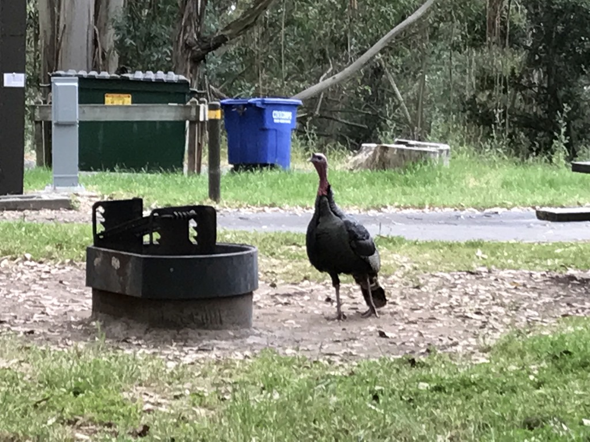
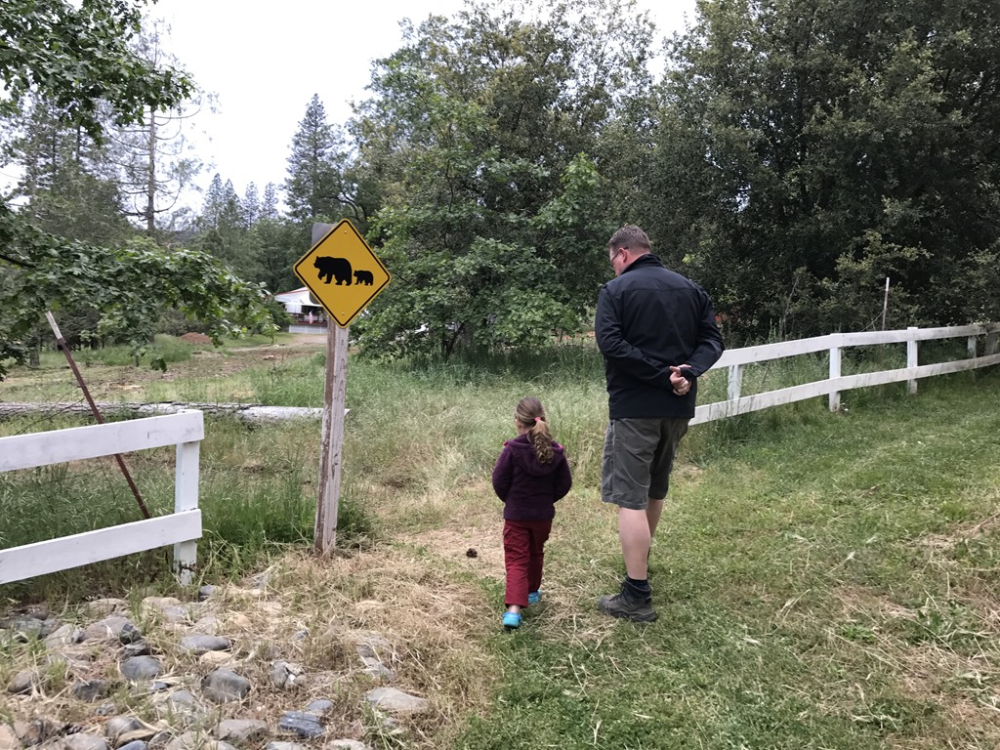
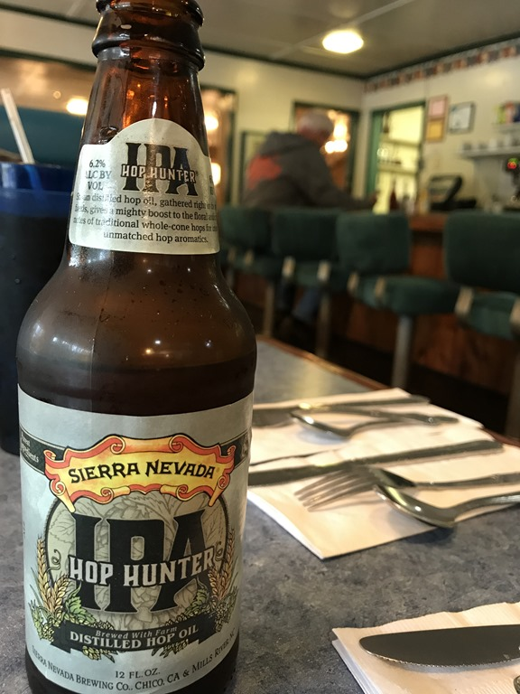

Om acht uur waren we al welkom bij Road Bear. De afhandeling van het papierwerk (contract met 26 initialen en 2 handtekeningen) en de vehicle inspection gingen erg vlot, en al voor 9 uur waren we op weg naar Anthony. Vandaag nog even met twee voitures: de Tahoe mag nog mee naar de eerste camping, die hoeft morgen pas terug naar Alamo. De camping ligt erg mooi. Bij aankomst hebben we eerst alle spullen opgeborgen in de camper, de bedden klaargemaakt en een boterham gegeten. Het is heerlijk weer, dus dat hebben we lekker buiten gedaan.

Overigens, Sofie noemt de Tahoe "snoezig"... daar is het laatste woord nog niet over gesproken natuurlijk! Want deze bak is verre van snoezig, ze komt amper boven het wiel uit :-)

Na de lunch hebben we een wandelingetje gemaakt naar het meer. Steil naar beneden betekent in praktijk meestal ook dat het steil is naar boven. Ook hier gaat deze wet op, het was af en toe op de tandjes bijten, met de jongedame in de rugdrager. Onderweg hebben we nog twee slangen en wat hertjes gezien, maar ook wilde kalkoenen. Die kakelen er driftig op los op de camping.

We hebben allen heerlijk geslapen de eerste nacht in de camper. De volgende morgen hebben we de Tahoe teruggebracht bij Alamo op het vliegveld van Oakland, en zijn daarna richting Yosemite vertrokken. Onderweg bij de Walmart in Tracy hebben we twee fietsen, een BBQ en nog wat meer klein grut gekocht. We zijn nu echt klaar voor de campertrip. Voor ons gevoel begint de vakantie nu pas voor het echt. We overnachten bij Yosemite Ridge Resort, iets ten westen van Yosemite. Bij Resort moet je niet al te veel voorstellen hoor. Het is een klein campinkje met een alleraardigste meneer bij de receptie (ik: "how are you?", hij: "short and grey"). Na even op de lokale schommel gezeten te hebben, zijn we naar het nabijgelegen restaurantje van Buck Meadows gewandeld. Ze draaien er fifties muziek, de meubels komen uit dezelfde tijd, maar je waant je in een film. En dat is leuk!

## 1 opmerking

### Buddy 26 mei 2017 om 07:34

Jeetje, lekker gereden in die tank? :)
