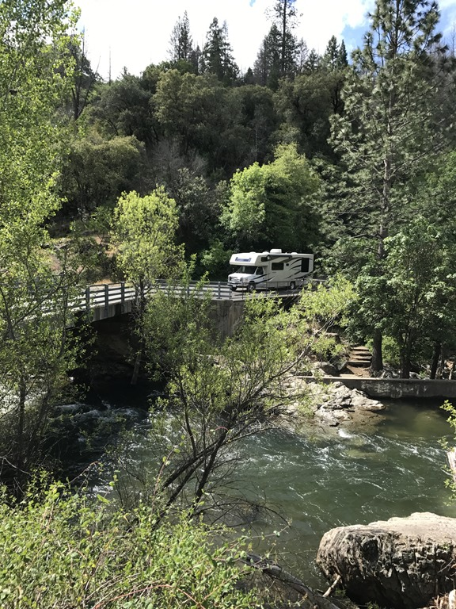
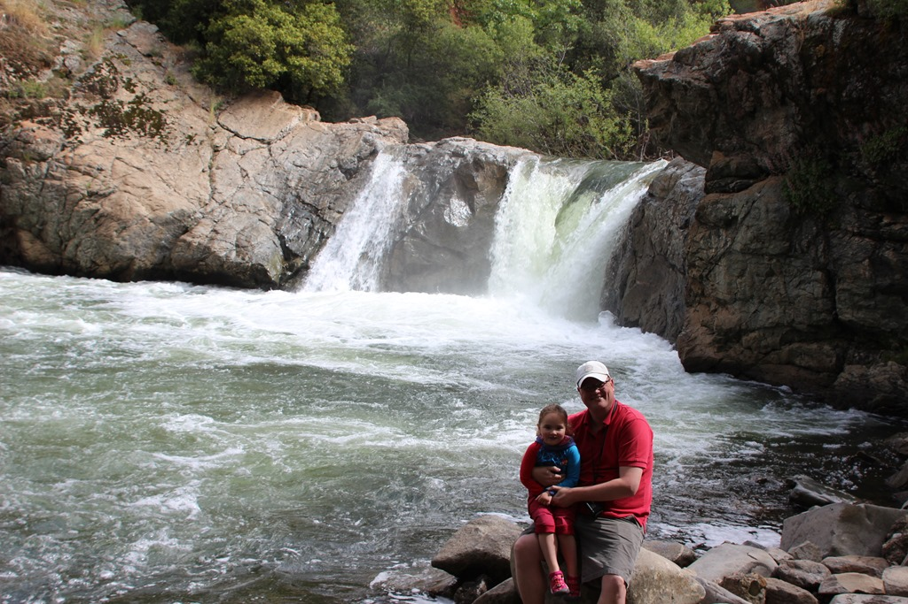
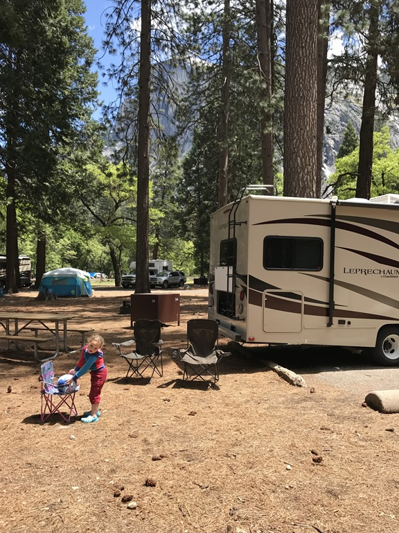
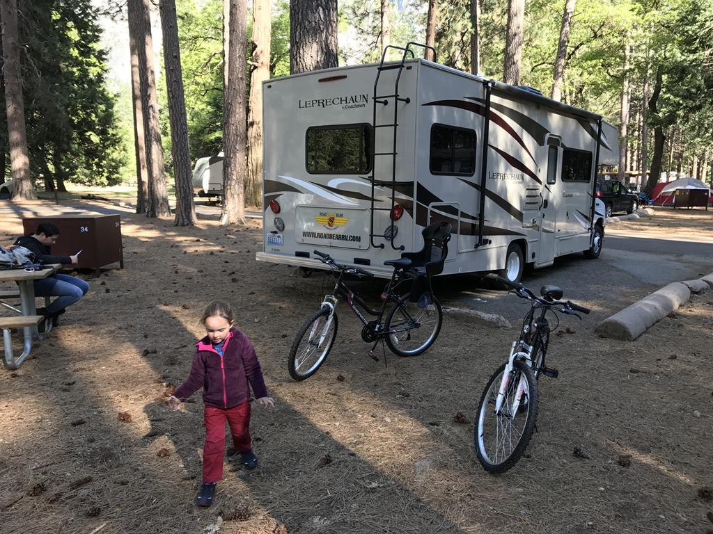
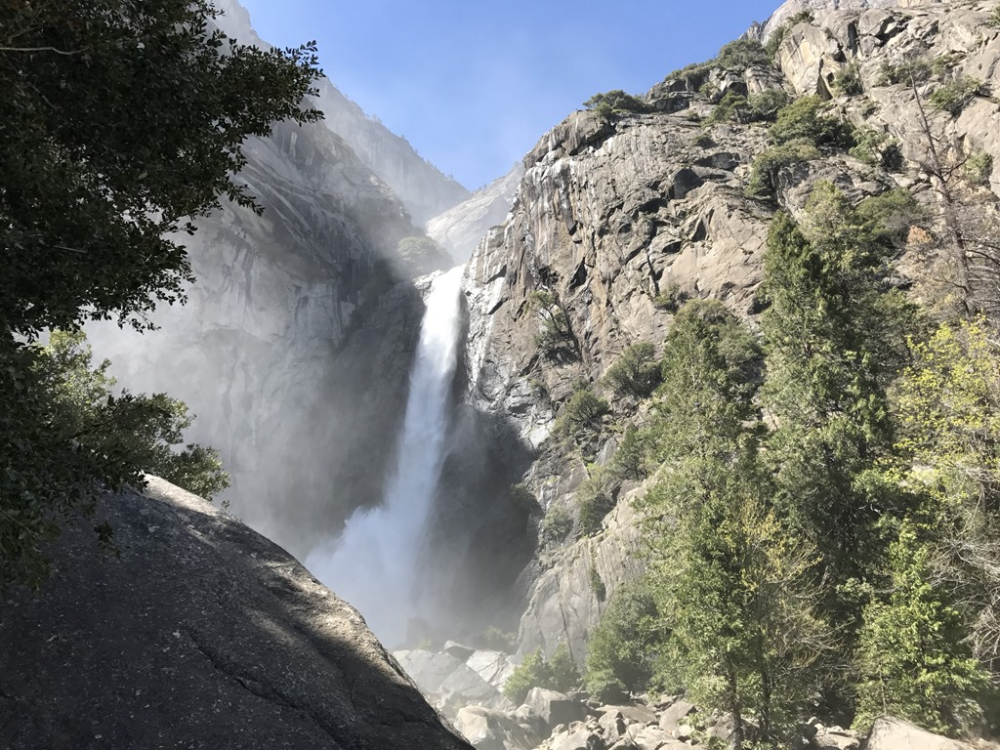

We zijn Yosemite al meerdere malen via de CA-120 in- of uitgereden, maar zijn nog nooit gestopt bij Rainbow Pool. En dat is jammer. Het is een leuk plekje om even rond te hangen, en in de zomer wanneer het warm is, schijn je hier in het riviertje te kunnen zwemmen. Aan het aantal parkeerplekken te zien, kun je dan over de koppen lopen. Nu was het erg rustig, we waren nagenoeg alleen.

Het was opvallend irritant druk in Yosemite Valley. Later bleek dat de grote parkeerplaats bij de visitor center was afgesloten, dus iedereen moest proberen z'n auto kwijt te komen bij de spaarzame parkeerplekken langs de weg. Met de camper geen doen, of je moest erg veel geluk hebben. Gelukkig was het iets voor twaalf uur, dus wij konden direct door naar onze camping voor de eerste nacht: Lower Pines Campground. We hadden een mooie ruime plek (site 34), met uitzicht op de imposante Half Dome.

Toen was het tijd om de handen uit de korte mouwen te steken: de fietsen in elkaar zetten en het van thuis meegenomen fietsstoeltje monteren. Na een klein half uurtje zat alles erop en eraan.

Het is ongelooflijk, maar voor 80 dollar heb je een prima fiets met 21 versnellingen. Fietsstoeltje past ook best, en Sofie zit nog comfortabel ook. Na de lunch zijn we dan ook naar de Lower Yosemite Falls gefietst. Het wandelingetje aldaar is denk ik de meest bekende, en waarschijnlijk ook een van de makkelijkste in de Valley. Het pad is volledig geasfalteerd, en alle tourbussen stoppen hier. Het is dus een drukte van belang van met name de oudere (Aziatische) medemens.

Yosemite is beroemd vanwege de vele watervallen. Dit jaar is boven op de bergen 180% meer sneeuw gevallen dan gemiddeld, en dat is goed te zien aan de watervallen. De Tioga Pass, waarmee je het park van oost naar west doorkruist, gaat dit jaar naar verwachting zelfs pas open in juli, men is nog druk doende met de weg sneeuwvrij maken!

## 3 opmerkingen

### Joost en Birgit 22 mei 2017 om 06:54

Geniet van de vakantie Roger & Chantal, de foto's en verhalen liegen er niet om!
De kleine vermaakt zich ook prima, Birgit deelt de mening over de Tahoe met Sofie: erg snoezig ;)
We zijn benieuwd naar jullie verdere avonturen: op vakantie gaan naar de USA begint weer een beetje te kriebelen bij ons als we dit zo zien.

### Gerard 22 mei 2017 om 09:33

Het begint al goed met erg mooie plaatjes, dat wordt nog wat de komende 8 weken. Geniet maar lekker, wij genieten wel op afstand mee.

### opa 22 mei 2017 om 10:11

Blog volgen blijft leuk !
Mooie foto's en goed verhaal.
Groeten uit Frankrijk
