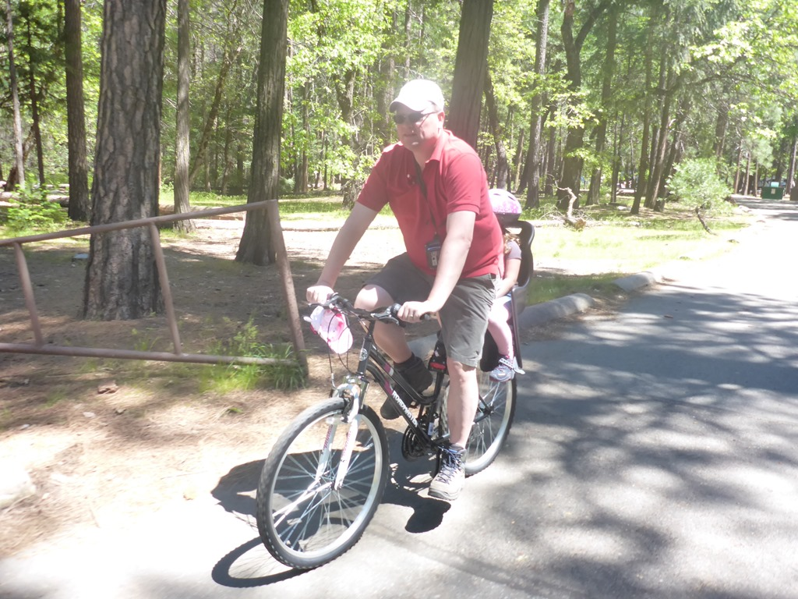
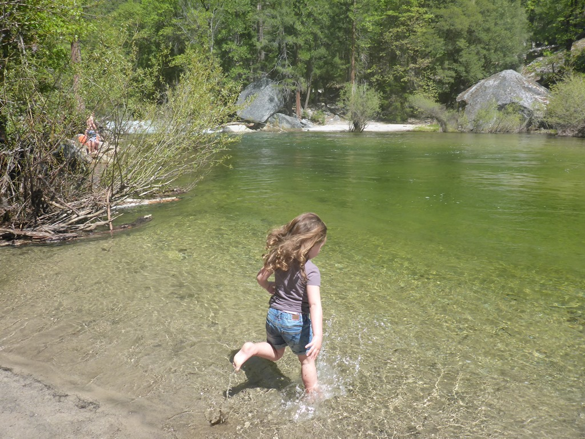
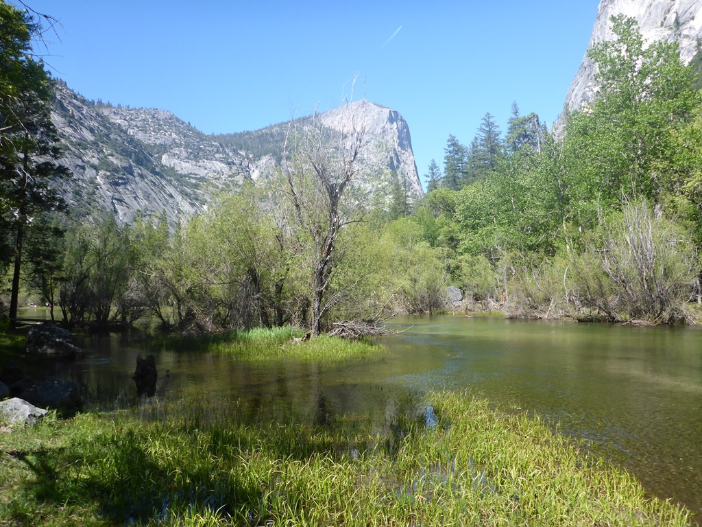
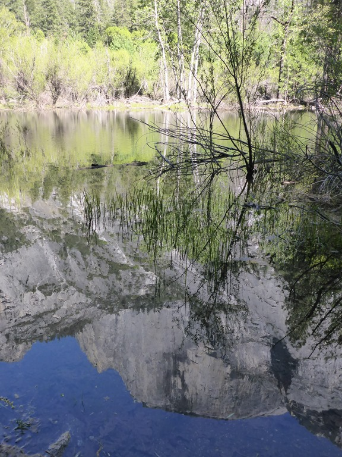

Omdat we niet twee aaneengesloten nachten konden boeken op de Lower Pines campground, moeten we vandaag verhuizen naar de camping aan de overkant van de straat, de Upper Pines campground. Deze camping is een stuk groter, maar de sites zijn in het algemeen niet al te best. Een stuk kleiner, en erg dicht op elkaar allemaal. Wij staan op site 152, pal naast een groepje schoolkinderen die een paar dagen van de great outdoors genieten. We hielden ons hart vast, maar we hebben geen last gehad van de kids. 's Morgens zijn we even met de bus naar de Yosemite Village geweest, en na de lunch met de fiets naar Mirror Lake.

De dames hebben met de voetjes in het ijskoude water gestaan.

Na de snack zijn we weer terug gefietst naar de camping en hebben voor de eerste keer de BBQ aangezwengeld.
