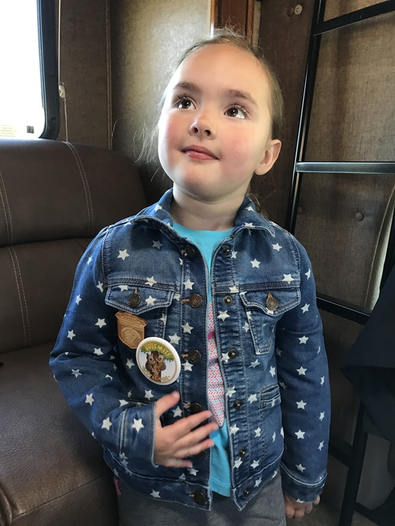
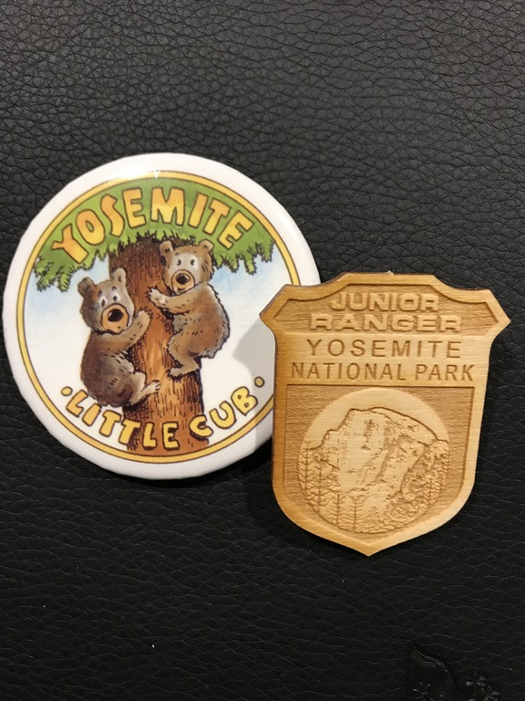
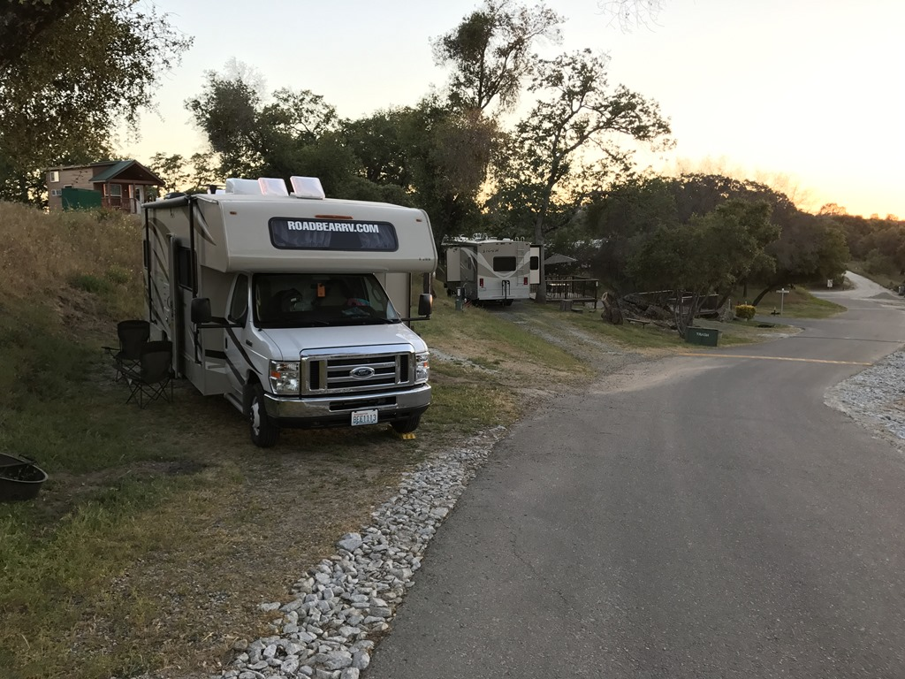
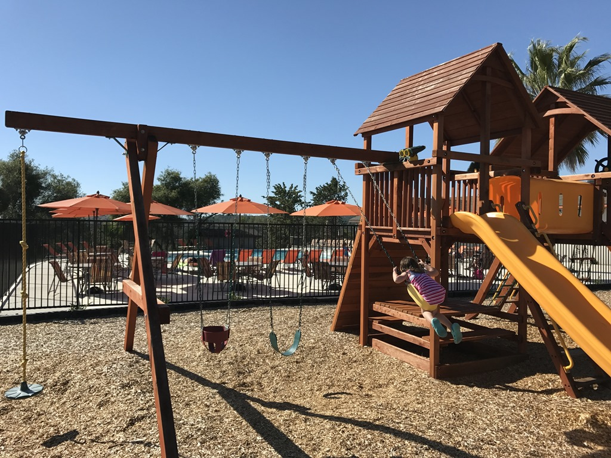

Sofie heeft meegedaan aan het Junior Ranger programma in Yosemite. Ze moet daarvoor een aantal opdrachten uitvoeren, bijvoorbeeld naar een praatje van een ranger gaan of een wandeling doen. Vanmorgen na het ontbijt zijn we naar het visitor center gegaan om de welverdiende batch op te halen. Sofie is zo trots als een pauw!

Na de ceremonie hebben we Yosemite via Wawona verlaten. Op de Yosemite RV Resort in Coarsegold hebben we overnacht. Het is een voormalige KOA camping, en ze zijn druk bezig met renovatie. Gelukkig is de receptie, zwembad en speeltuin al klaar. Dus nadat de camper geinstalleerd was zijn de dames het water ingedoken. Voor papa was het water veel te koud.

## 1 opmerking

### Anoniem 23 mei 2017 om 04:17

Wow Sofie!! Een echte jr ranger. Heb je plechtig de eed afgelegd? Groetjes uit The Sunshine State
