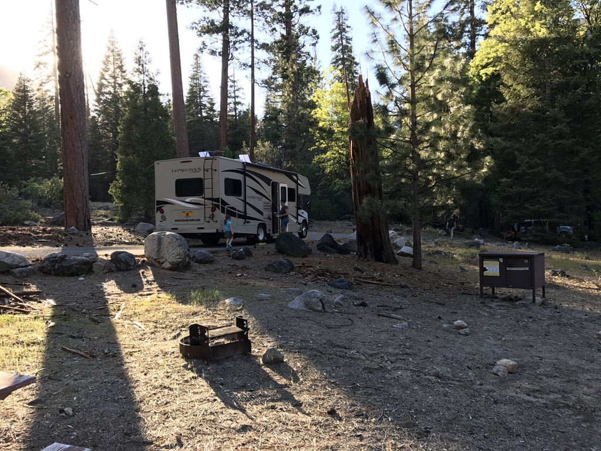
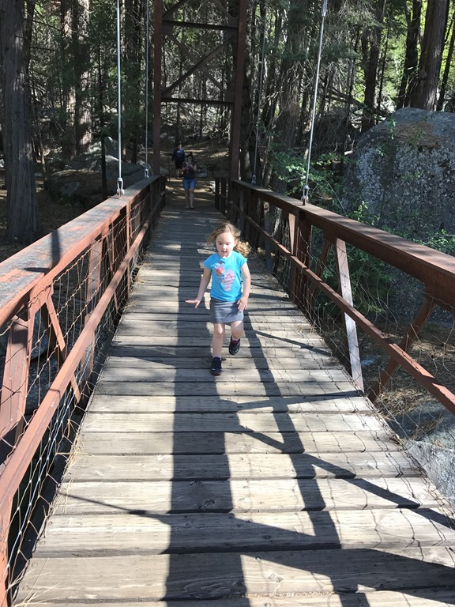
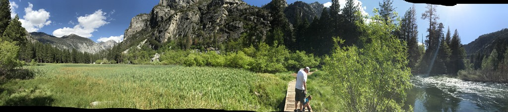
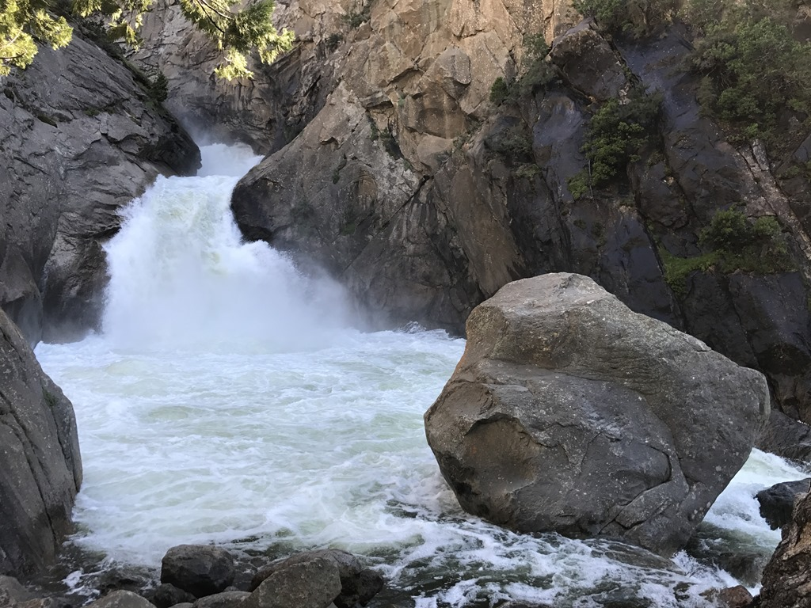
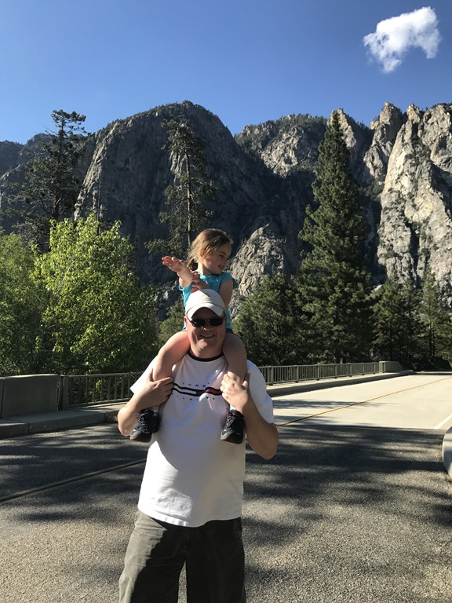
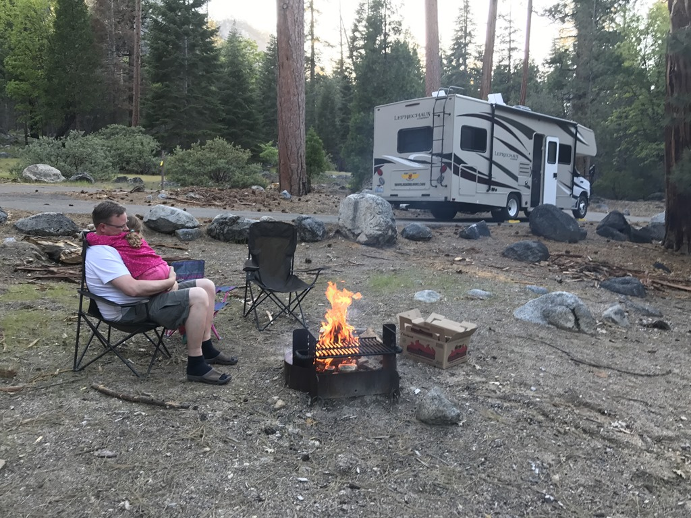

Nadat we 's morgens nog even in de KOA speeltuin zijn geweest, hebben we onze biezen gepakt en zijn we vertrokken naar Kings Canyon National Park. De weg CA-180 naar het park toe is al fenomenaal, maar deze verbleekt bij de weg helemaal naar beneden de Canyon in. Na dik een uur slalom-en kom je bij een aantal campings, waarvan er nu nog maar 1 open is (Sentinel). We konden van te voren geen plekkie reserveren, dus vol goede moed op zoek naar een vrije site. We hadden letterlijk de allerlaatste vrije site (nr 74) te pakken, en het was nog best een mooi plekkie ook.

Nadat we de site voor ons hadden geclaimd, zijn we nog een stukje verder de vallei in gereden om een wandelingetje te maken op de Zumwalt Meadow.

Het wandelingetje naar de meadow was niet al te lang: stukje door het bos, over een brug en door een stroompje.

Op de weg terug zijn we nog even gestopt bij de Roaring River waterval.

En toen weer terug naar de camping voor de fameuze Spaghetti di Papa en een kampvuurtje.

## 1 opmerking

### Jos B 23 mei 2017 om 20:16

Hi Roger en familie, ik zit met enige jaloezie jullie verhalen te lezen... veel herkenning. Geniet ervan!!

Groet, baas Jos ;)
