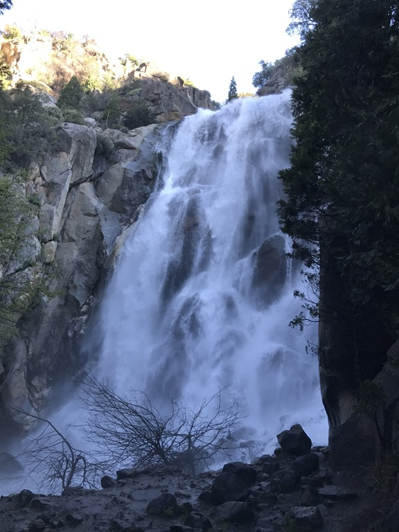
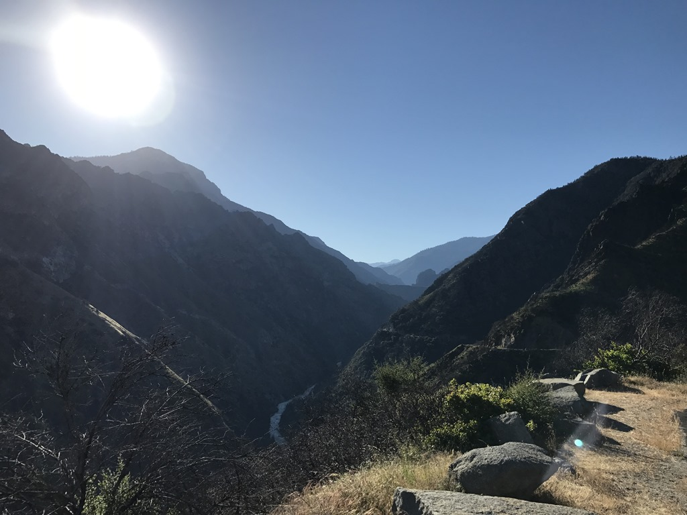
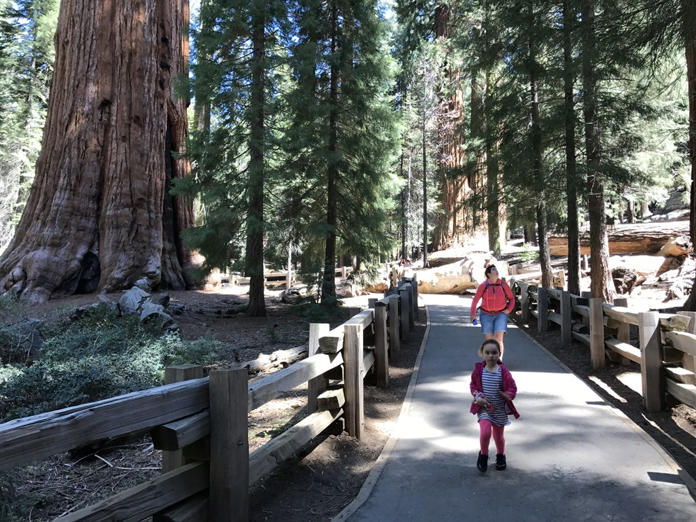
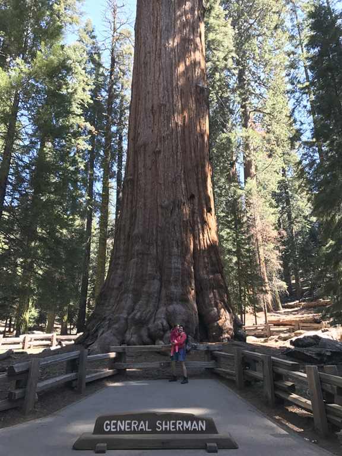
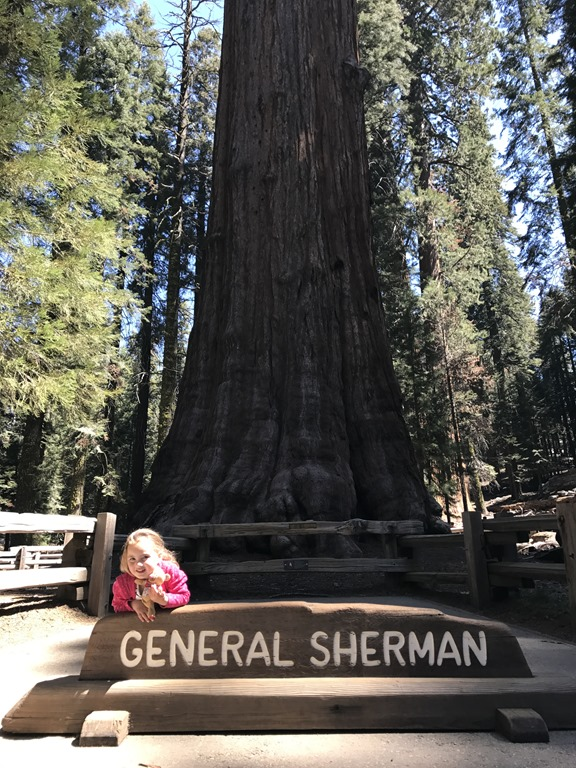
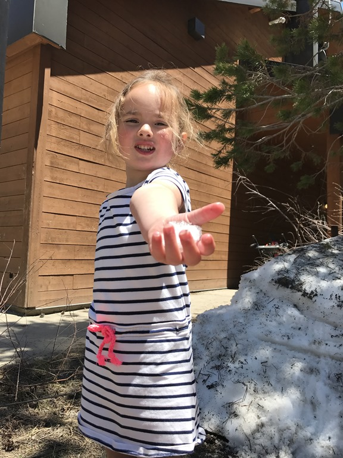
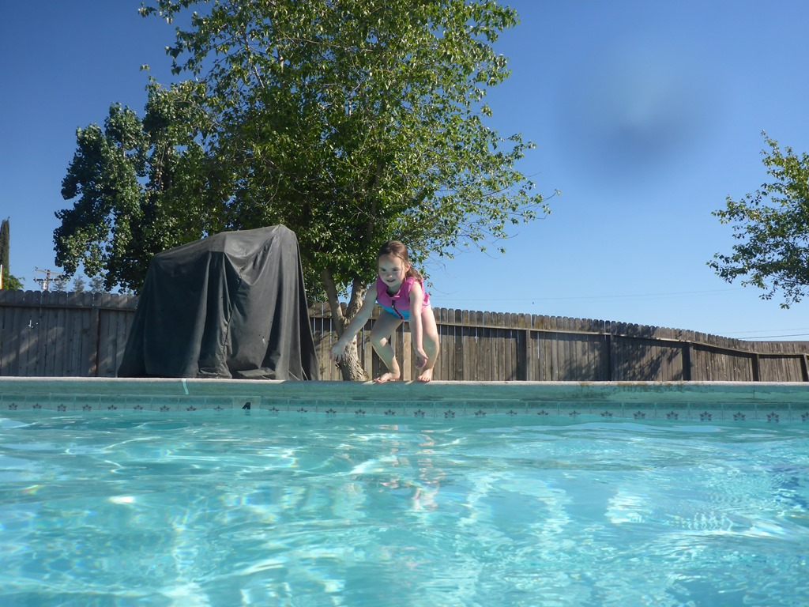
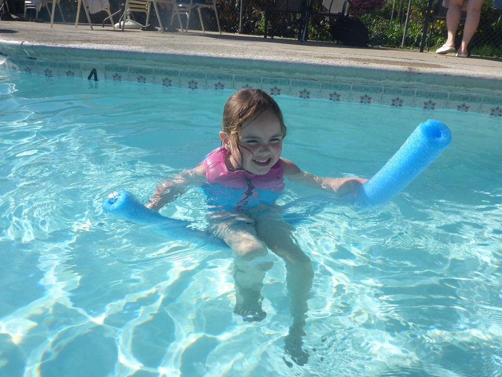

Kings Canyon en Sequoia National Park liggen min of meer tegen elkaar aan. Vandaag doen we een bliksembezoek aan Sequoia, en rijden dan door naar Visalia, al een heel eind op weg naar Los Angeles. De dag begon vandaag vroeg, om zes uur de wekker gezet en om half zeven en route! Eerste stop was de Grizzly Falls. Met veel gedonder en een hele bak met spray komt het water hier naar beneden. Ik heb 20 seconden staan kijken en was doorweekt.

Daarna hebben we de beklimming van de berg aangevangen om helemaal bovenaan linksaf te slaan richting de sequoias. We zijn direct doorgereden naar het hoogtepunt van dit park: de General Sherman Tree. Qua volume is dit de grootste boom ter wereld. Met een hoogte van 84 meter is het zeker niet de hoogste sequoia, maar zoals gezegd vanwege het volume van 1487 kubieke meter staat 'ie wel op nummer 1. De diameter is 11 meter, omtrek 31 meter. De grootste tak aan de boom heeft een diameter van 2 meter, dat is in het algemeen een stuk groter dan onze Nederlandse bomen. Verder blijft het imposant om tussen de sequoia's te wandelen.

Bij de visitor center hebben we van een lekkere lunch genoten, en heeft Sofie nog even in een laatste restje sneeuw kunnen spelen.

Toen zijn we weer terug gereden naar de uitgang van het park en zijn via de waanzinnig mooie CA-245 naar Visalia gereden. De dag zijn we geeindigd met een duik in het heerlijke zwembad van de KOA in Visalia.

