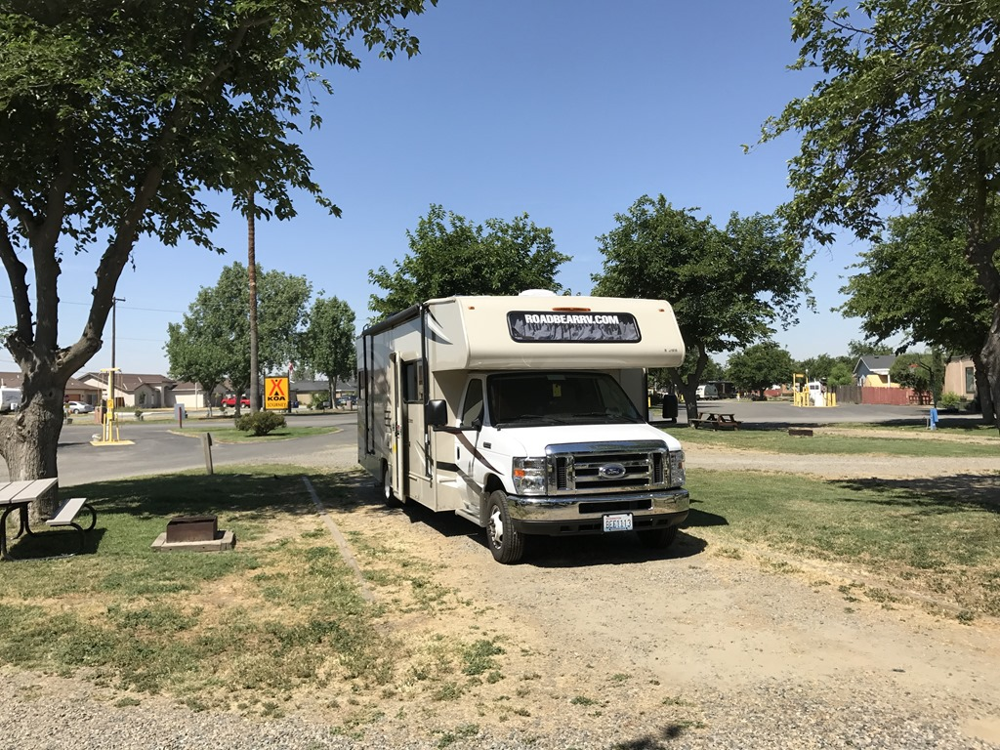
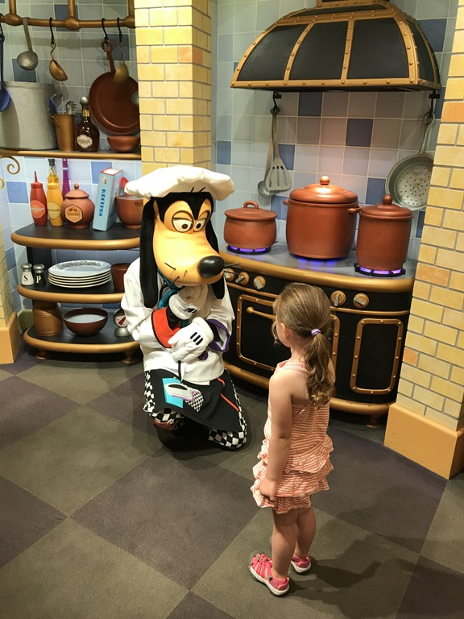
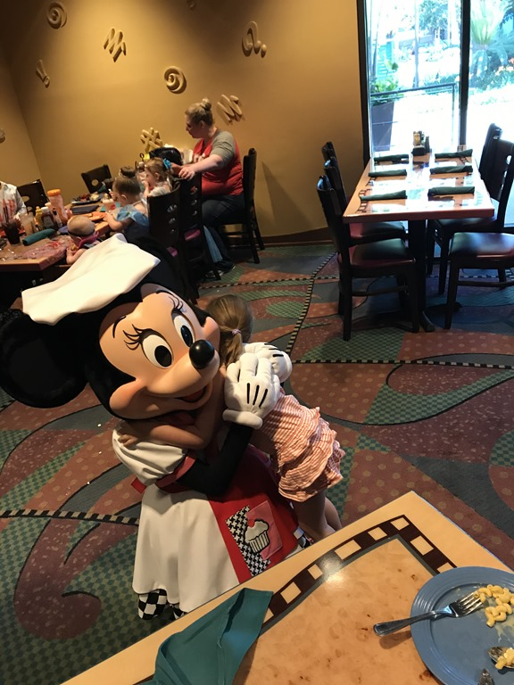
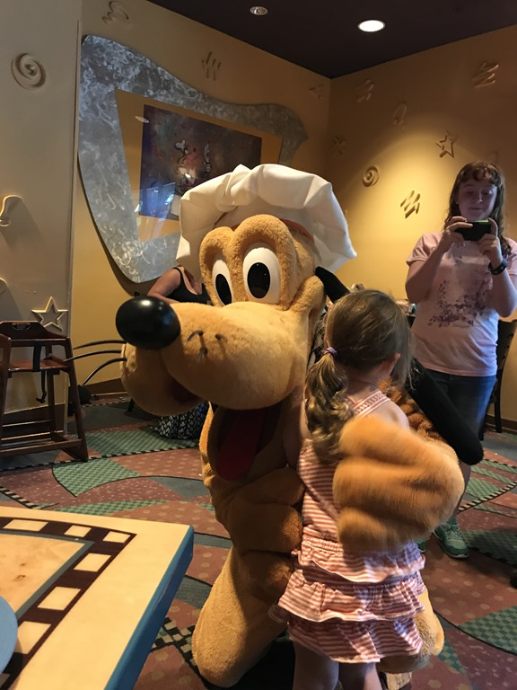
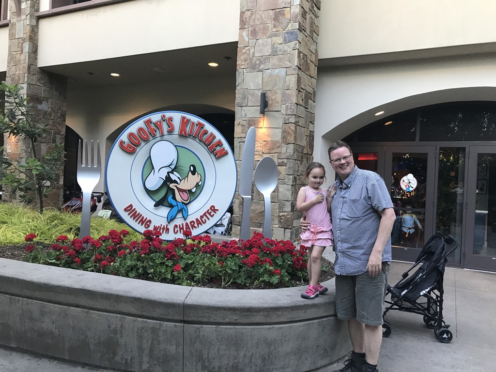

's Morgens hebben we nog even een frisse duik genomen in het zwembad, daarna zijn we vertrokken naar Anaheim. Morgen en overmorgen staan in het teken van Disneyland!

Om half zes hebben we een diner-afspraak met Goofy, dus vertrekken we om een uur of elf vanuit Visalia. We hebben echter de file miserie rond LA onderschat... Uiteindelijk moesten we nog haasten om op tijd bij het Disneyland Hotel te zijn. In de file heeft Chantal zich omgekleed, en ik heb me uitgebreid kunnen scheren. Wat een ellende, bijna 60 kilometer lang langzaam rijdend tot stilstaand verkeer. Het was een verrassing voor Sofie waar we gingen eten, en het was fantastisch te zien hoe ze reageerde toen ze Goofy met koksmuts op zag.

Zo'n beetje alle bekende karakters van Disney liepen door het restaurant en kwamen om beurten aan onze tafel. Heel leuk allemaal, maar van eten kwam natuurlijk niet veel bij de kleine meid. Papa en mama hebben gelukkig wel erg lekker gegeten.

## 2 opmerkingen

### Gerard 24 mei 2017 om 08:47

We kunnen ons voorstellen dat Sofie met al die stripfiguren geen aandacht meer heeft voor een maaltijd. Maar het is wel een leuke belevenis

### opa 24 mei 2017 om 11:24

Beginnen langzaam jaloers te worden ! Willen ook naar Goofy and friends. Leggen ter compensatie maar wat chipolatas op de bbq. Blijven jullie met veel plezier volgen.
Groeten uit Frankrijk
