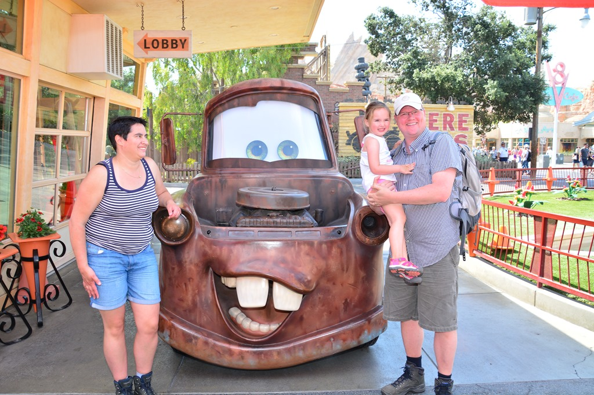
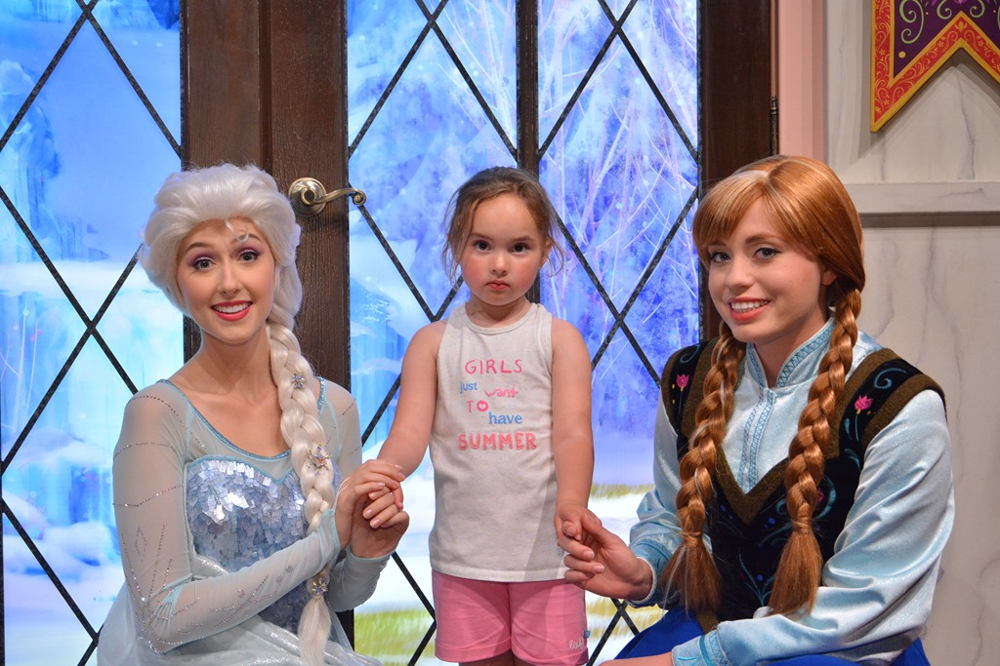
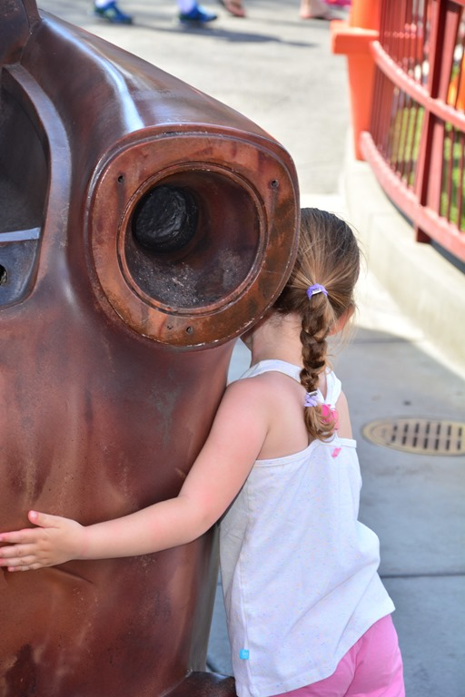
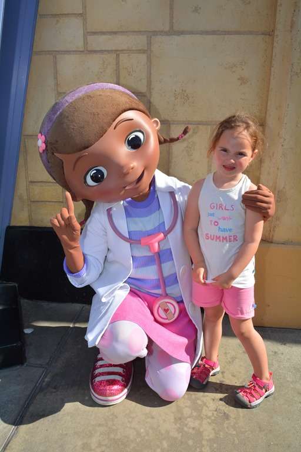

Zo, dat gaat niet in je koude kleren zitten zeg... Twee dagen naar Disney betekent drukte, herrie en wachten. Vooral wachten.

De overnachting op de Anaheim Harbor RV Park was prima. De camping op zich is een betonplaat met stroom, water en riool aansluiting, maar er is een zwembad en in 25 minuten wandelen ben je in Disney Village.

Disney in Anaheim (LA) bestaat uit twee verschillende parken. Dinsdag zijn we naar Disney California Adventure Park geweest. Dit park bevat een groot gedeelte met het Cars thema, en aangezien Sofie heel groot fan van Bliksem en zijn vriendjes is, zijn we hier de dag zowel begonnen als geeindigd. Ze hebben het woestijndorpje Radiator Springs precies als in de film nagebouwd. Hoogtepunt van dit deel van het park is de Radiator Springs Racers attractie. Gezeten in een raceauto bezoek je Takel, Sherrif, Doc Hudson en natuurlijk Mack, Luigi en Guido. Bij het laatste deel ga je racen tegen een andere raceauto, en dat hebben ze erg spectaculair gedaan. Wat een feest! Gelukkig was het niet druk, dus we hebben de rit drie keer kunnen doen.

Sofie was helemaal onder de indruk, want dit zijn natuurlijk wel even de ECHTE Bliksem en Takel he. Bovendien kwamen we ook nog Elsa en Anna tegen!

Takel kreeg zelfs een knuffel :-)

En als kers op de taart kwamen we geheel onverwacht ook nog Doc McStuffins tegen (ook de echte natuurlijk)!

We zijn ook nog in Luigi's Rollickin' Roadsters geweest (dansende autootjes op vrolijke deuntjes), Mater's Junkyard Jamboree (draaiende traktoren) en The Little Mermaid (Ariel). Aan het einde van de middag hebben we nog naar de parade gekeken, daarna gegeten, en toen weer terug naar de camping gewandeld.

Het was een topdag, lekker warm en niet druk.

## 1 opmerking

### Gerard 26 mei 2017 om 20:32

Erg leuk al die cars, mooie plaatjes en weer een blije belevenis voor Sofie. Ook erg vermoeiend lijkt me. Bij Anna en Elsa lijkt de koek bijna op.
