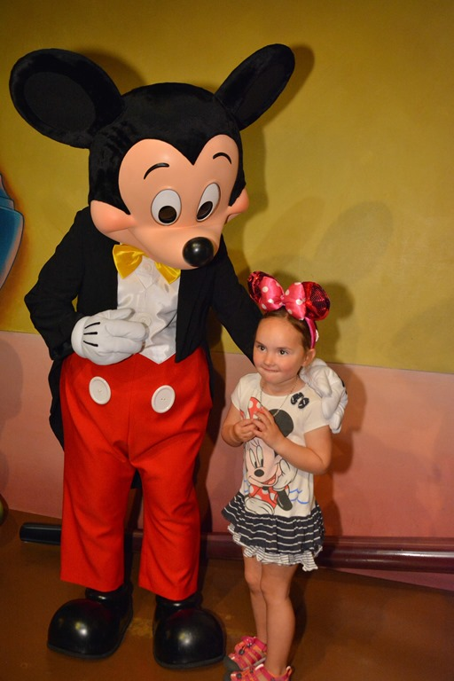
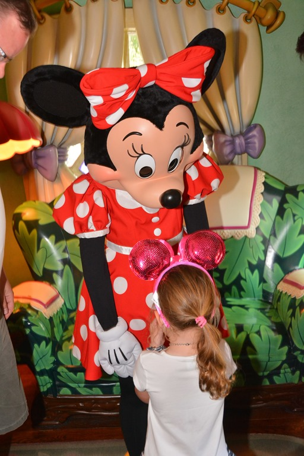
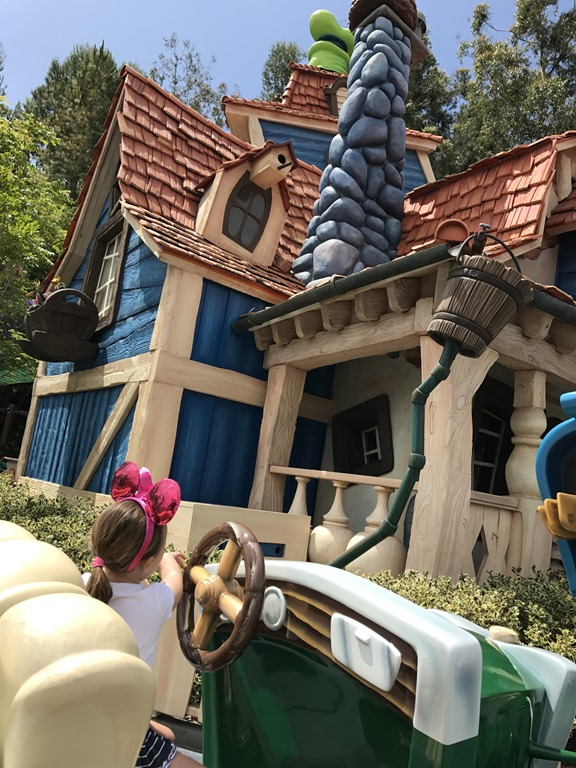
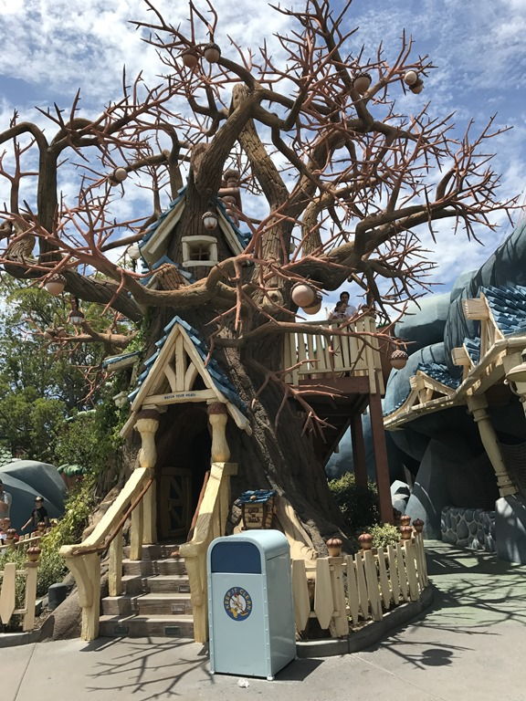
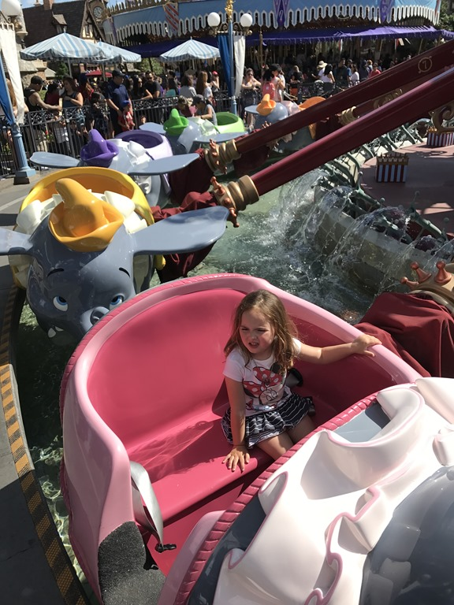

Vandaag staat het Disneyland Park op het programma. Het was erg druk, maar bij de typische kinderattracties viel het gelukkig wel mee. Als eerste zijn we in Splash Mountain geweest, waarbij je in een boomstam het verhaal van Broer Konijn te zien krijgt. En oh ja, je wordt best wel nat.

Hierna zijn we naar Toon Town geweest waar we het huis van Mickey, Mini, Goofy en Knabbel en Babbel bezocht hebben.

Na deze doldwaze avonturen hebben we geluncht en hebben we een ritje in de carousel en Dumbo gemaakt. Van Ariel kreeg Sofie niet genoeg, dus daar zijn we twee keer in geweest.

Na de parade hadden papa en mama er genoeg van en zijn we terug gewandeld naar de camping. Sofie viel net buiten Disney in slaap, dus we hebben nog even een koffietje gehaald bij de Starbucks.

## 1 opmerking

### Gerard 28 mei 2017 om 14:10

Sofie geniet in volle teugen, maar ik denk dat twee dagen in deze parken erg veel energie vraagt, ook van mama en papa
