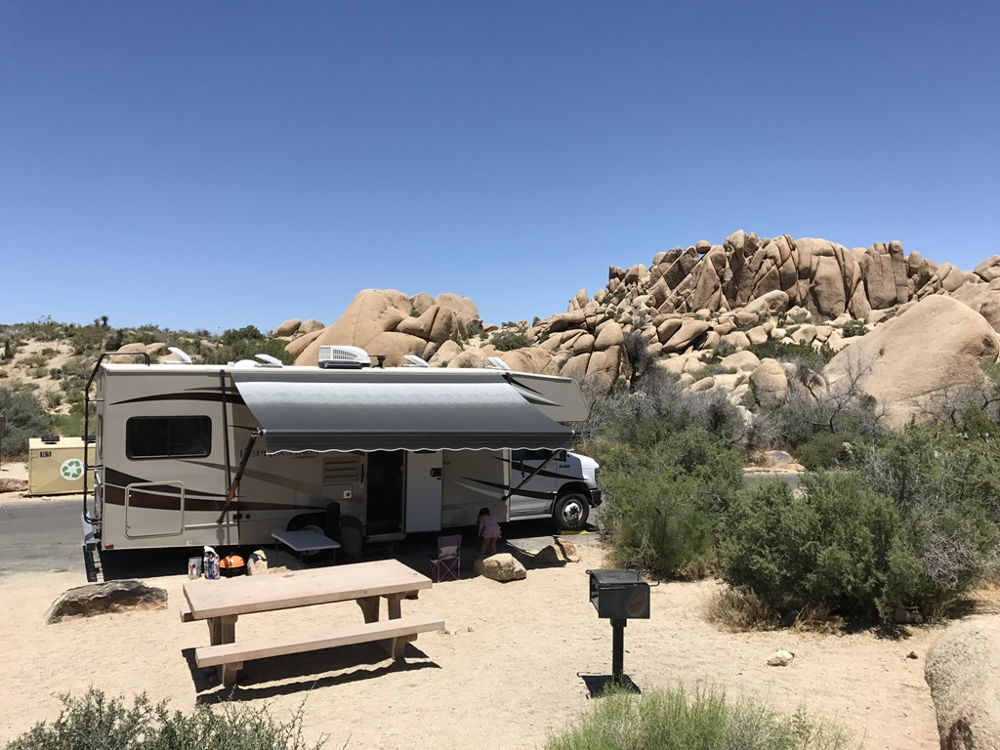
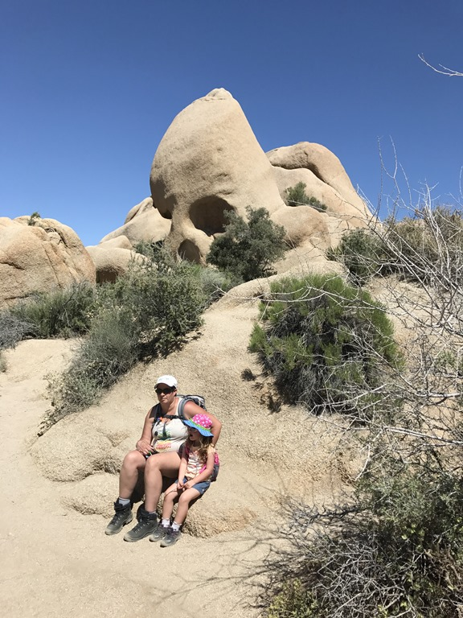
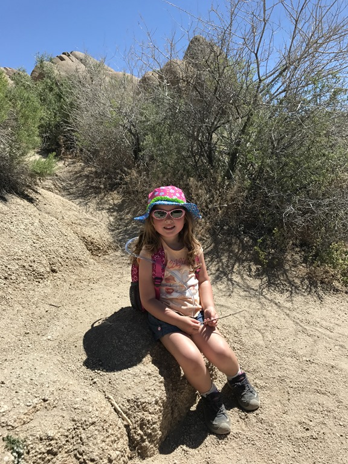
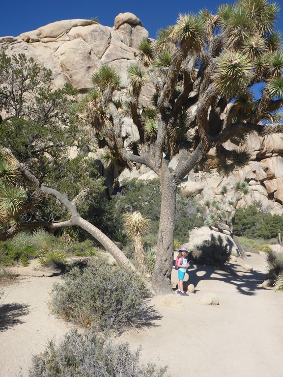
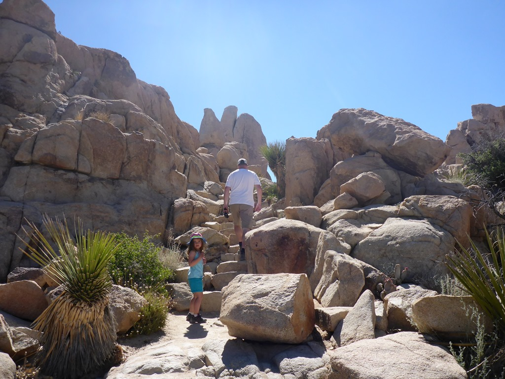
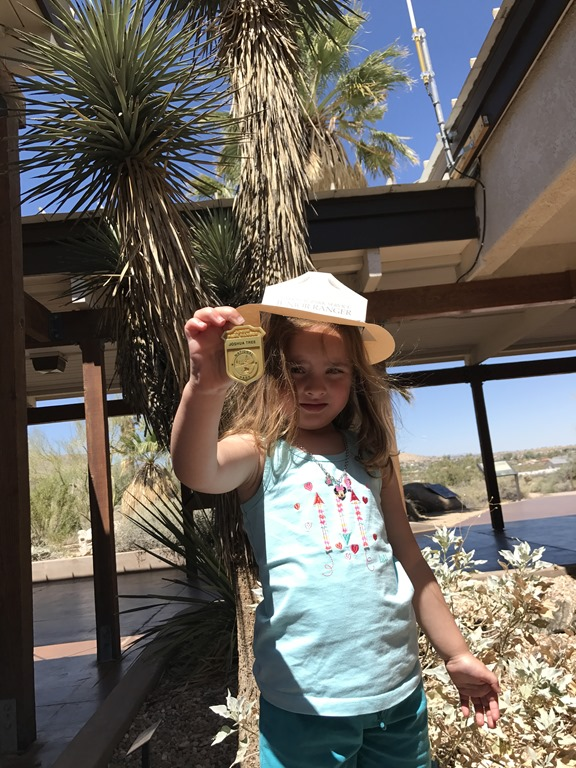
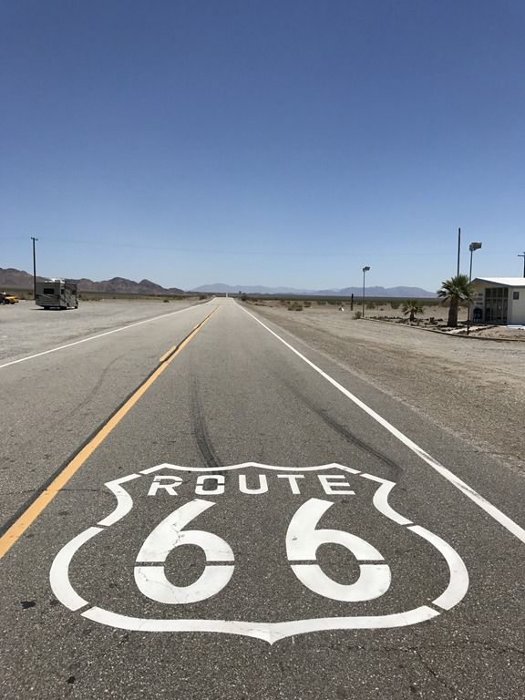
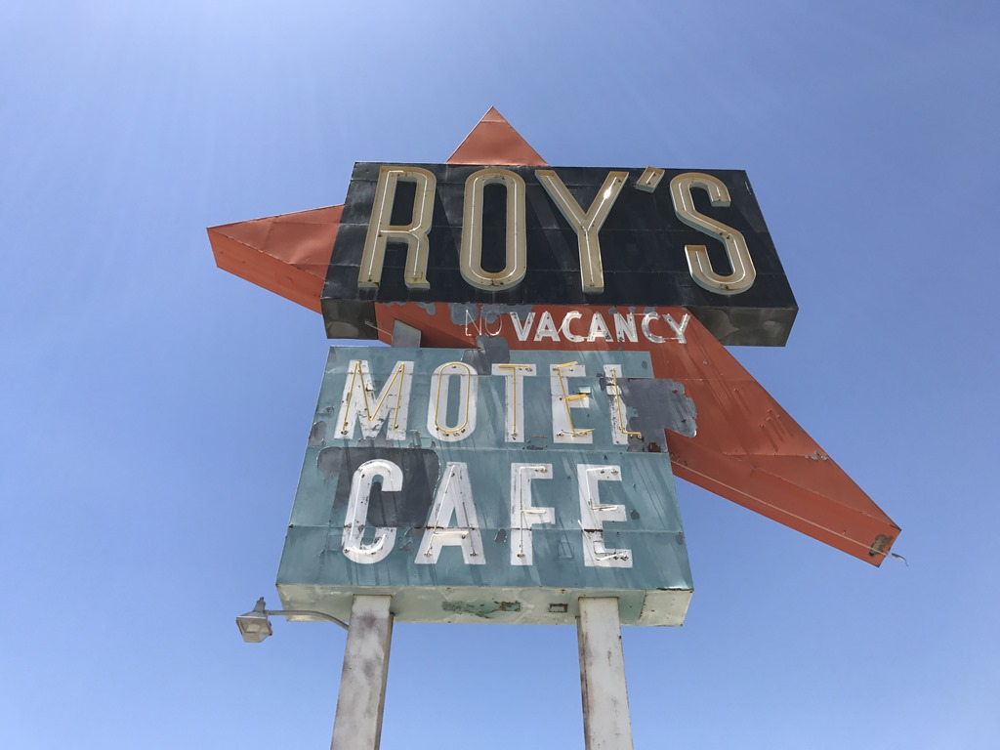

Vandaag nemen we afscheid van de gekte rondom LA, en zoeken de rust weer eens op in Joshua Tree National Park. We willen graag kamperen op de Jumbo Rocks camping in dat park, en deze camping konden we niet reserveren van te voren: first come, first serve. En dat betekent vroeg uit de veren om op tijd op de camping te zijn om een plekje te claimen. We waren om 11 uur ter plaatse, en hadden een van de laatste vrije sites (nr 93). Het is Memorial Day Weekend en dus is het overal druk.

Ons stekkie ligt pal tegenover de Skull Rock trailhead. Toen de ergste hitte over was, hebben we de stoute wandelschoenen aangetrokken en zijn de Skull gaan zoeken. Met wat fantasie is de schedel te herkennen. Onderweg kon Sofie al aardig wat opdrachtjes uitvoeren voor haar Junior Ranger programma.

's Avonds hebben we de BBQ aangezwengeld, en hebben van de zonsondergang genoten. De volgende morgen weer vroeg op, want we hebben een lange dag voor de boeg. Eerst hebben we een wandelingetje gemaakt in de Hidden Valley.

Op de foto hierboven staat Sofie onder een Joshua Tree. Het stikt hier van die dingen, vandaar de naam van het park ;-)

Na de laatste opdrachtjes voltooid waren, kon Sofie haar welverdiende badge ophalen bij de ranger in het visitor center in 29 Palms. Deze keer ging het plechtig en moest Sofie de eed afleggen dat ze een goede vriend zal zijn voor de natuur.

Na dit alles hebben we Joshua Tree NP voorgoed achter ons gelaten en zijn we via Amboy, Kelso en Cima dwars door de Mojave National Preserve naar Las Vegas gereden. We kregen zelfs een stukje Route 66 voor onze kiezen.

Uiteindelijk kwamen we rond 3 uur in de middag aan op Oasis Las Vegas RV Resort, min of meer onze vaste camping wanneer we in Vegas zijn.

## 1 opmerking

### Anoniem 29 mei 2017 om 16:03

Jumbo Rocks vinden wij ook erg mooi! Veel plezier in Vegas!
Groetjes de Ex-Florida Gangers
