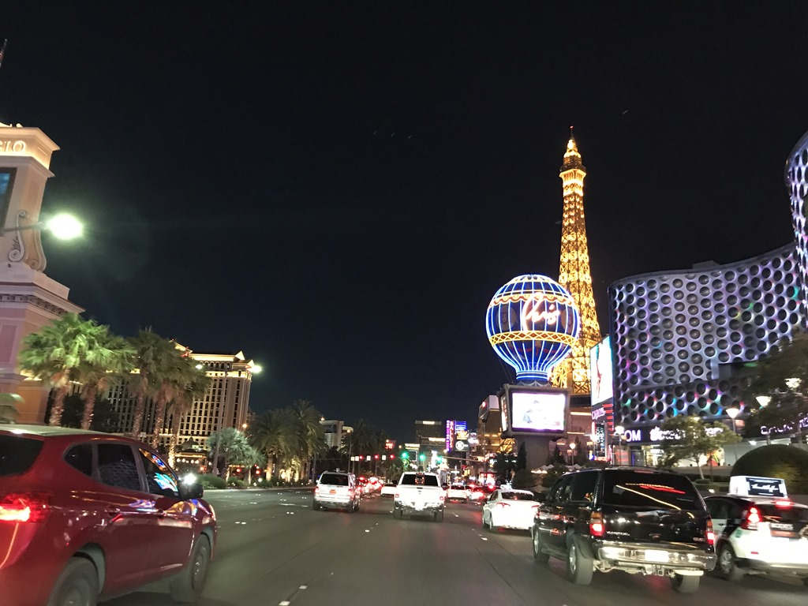
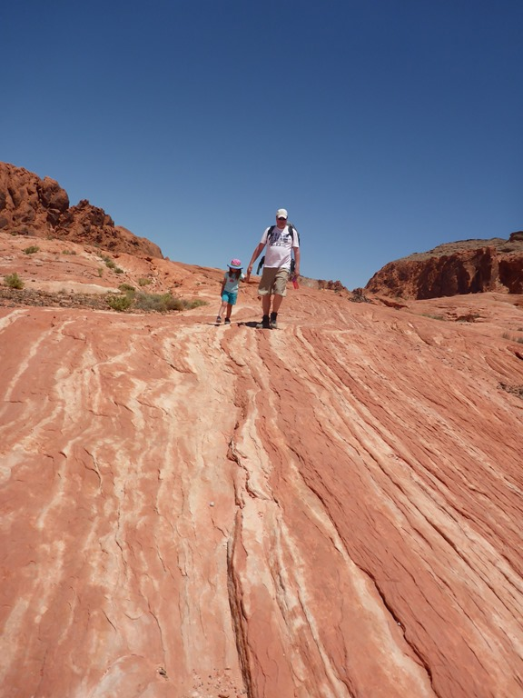
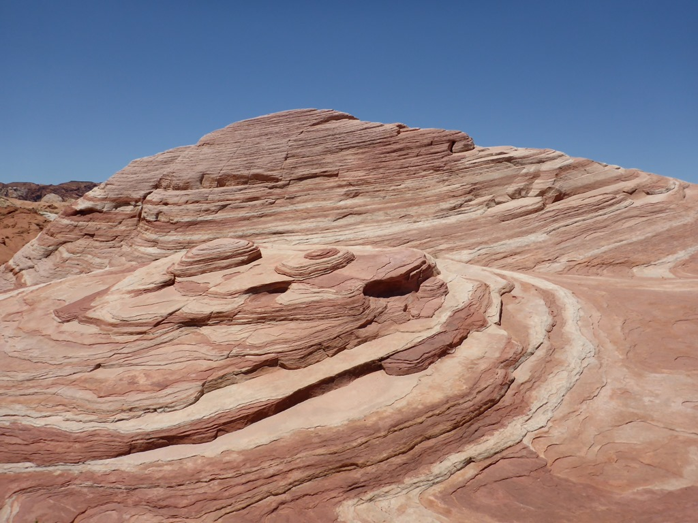
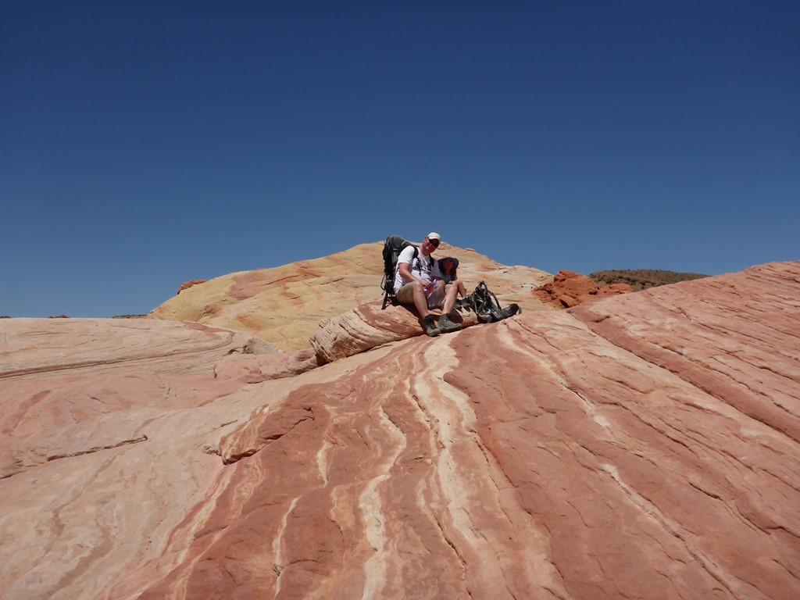
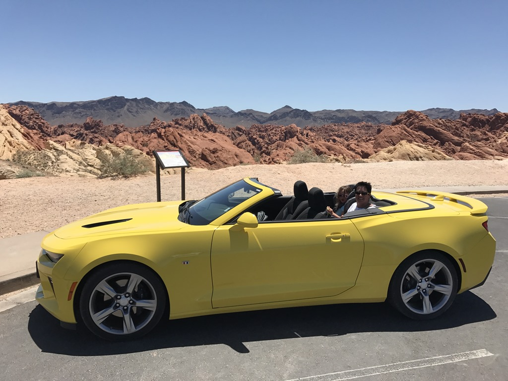

Nadat we de camper geinstalleerd hadden, zijn de dames meteen het zwembad ingedoken en ben ik onze huurauto gaan ophalen bij Alamo. Het is een toepasselijk karretje geworden: een hagelnieuwe Chevrolet Camaro Super Sport Convertible met een V8, 6.2 literblok die maar liefst 455 PK oplevert. Wat een bak! In sport-mode trekt 'ie door tot 6000 toeren en brult de motor dat het een lieve lust is, heel wat anders dus dan de camper.

Aan het einde van de middag zijn we naar de outlet geweest om een beetje te shoppen, en hebben daar ook maar meteen gegeten bij de Cheesecake Factory. Daarna was het donker en zijn we lichtjes gaan kijken op de Strip. De kleur van de auto is op z'n minst twijfelachtig, je valt als het ware in de auto, waarna je helemaal klem zit, een kofferbak van niks (bijna alle boodschappen moesten op de achterbank), verbruik heb ik niet eens durven bekijken, maar het is wel erg leuk om met dit ding over de Las Vegas Strip te cruisen. We hadden heel wat bekijks met Sofie in de autostoel (of was het doordat K3 op de radio moest?)

Bij cruisen over de Strip hoef je je niks romantisch bij voor te stellen trouwens, het is een vijf-baans weg en je staat eigenlijk constant stil, naast de meest foute pickups en semi-sport wagens met snoeiharde bassen, of vrolijke Mexicaanse deuntjes, en/of gillende meiden die half uit auto's hangen.

De volgende dag zijn we met de Camaro naar Valley of Fire state park gereden en hebben daar een mooie wandeling gemaakt.

Het was heel erg warm, dus we zijn direct na de wandeling weer teruggereden en zijn gaan zwemmen.

{<< youtube 54IZkvKQWiw >>}

## 2 opmerkingen

### opa 31 mei 2017 om 22:03

Nou nou, doe maar ruig! Wil ik ook wel eens in rijden.
Weer mooie foto gemaakt en zo te zien vervelen jullie je niet.
Hier ook alles ok. Groeten uit Frankrijk

### Anoniem 1 juni 2017 om 22:25

Een oerdegelijke V*lva-rijder turns into Sjonnie Camaro!!! Haha!!!
Gave bak hoor!!! Of zoals we hier zeggen " schoon waoge "!!
Vergeet de fluffy dices niet!!
