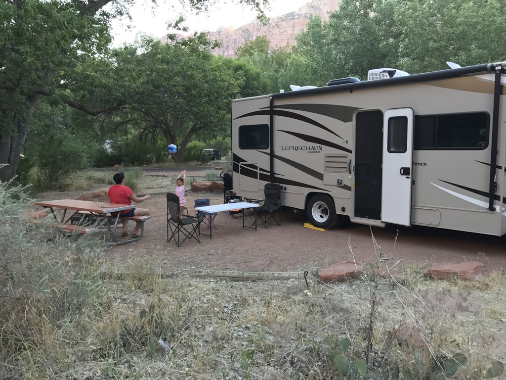
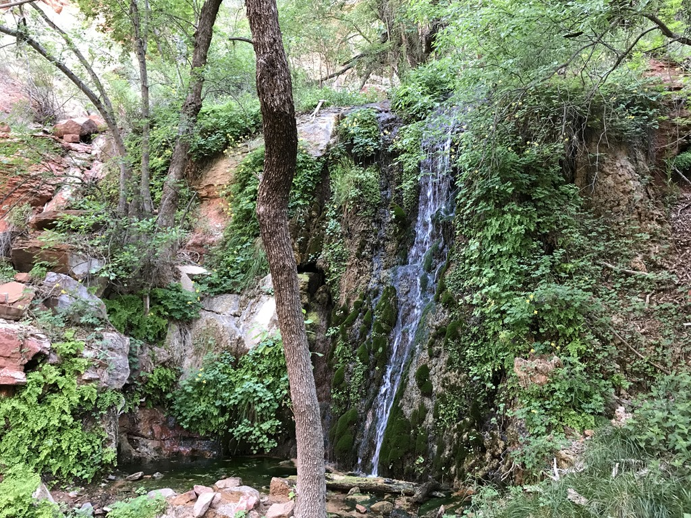
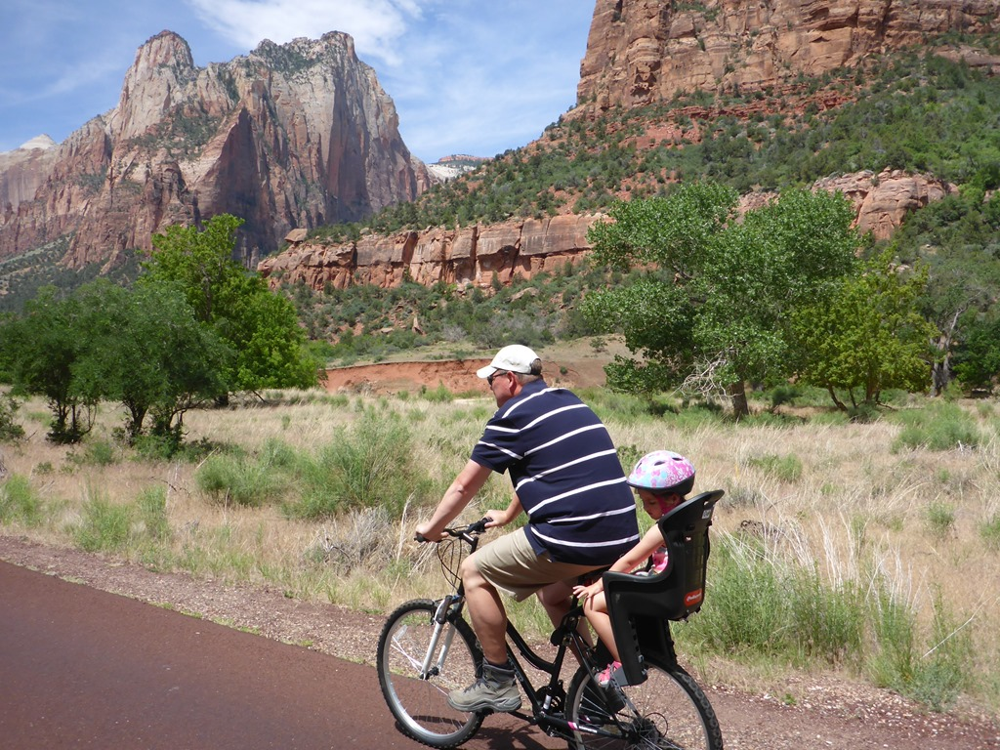
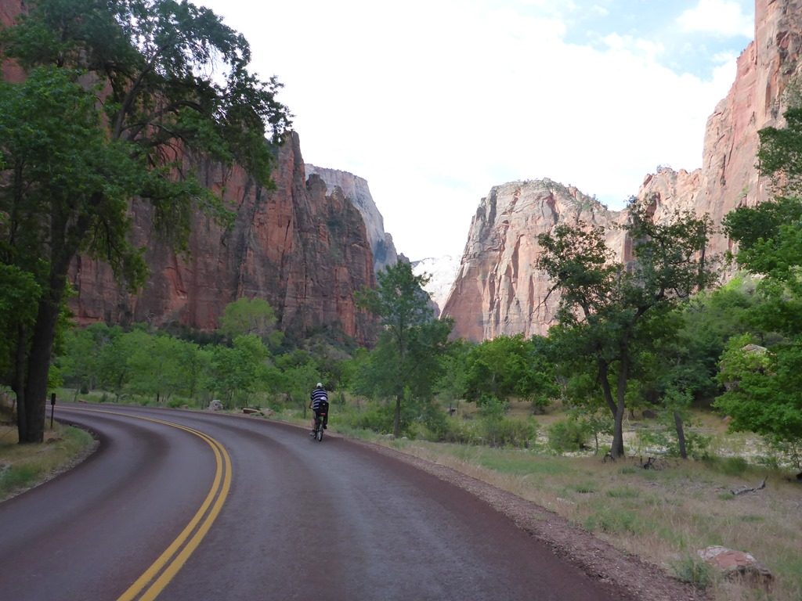
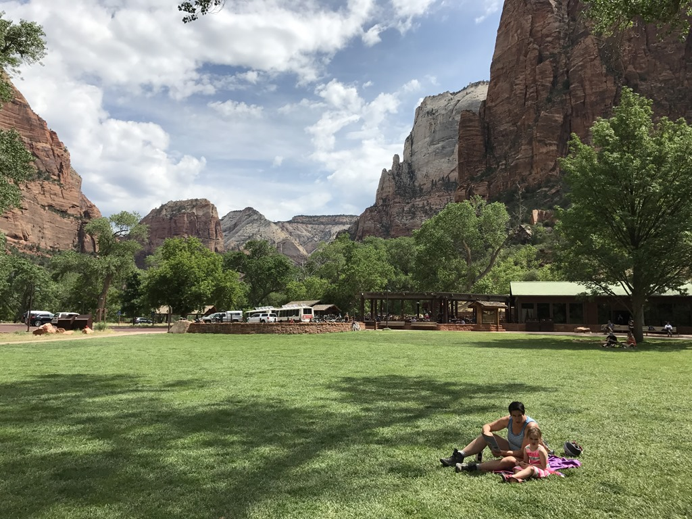
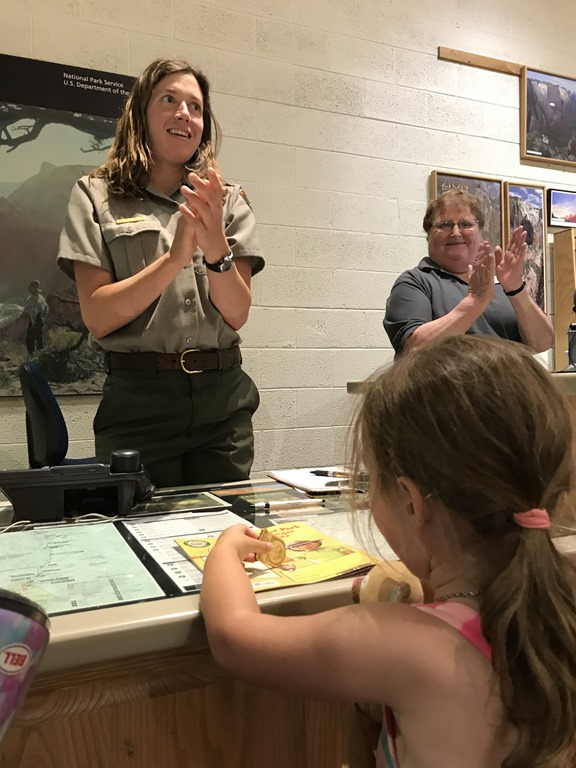
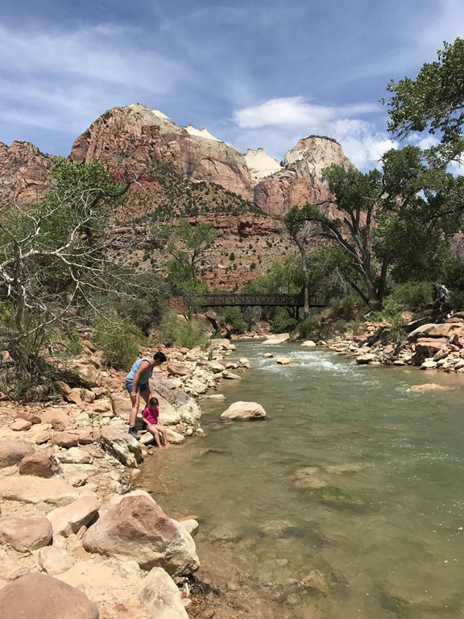
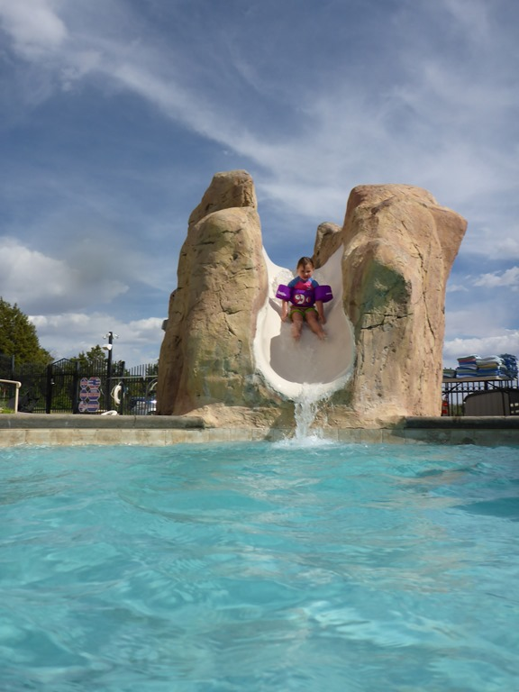

Na nog even gezwommen te hebben, zijn we gaan douchen en aankleden en hebben we met pijn in het hart afscheid genomen van de Camaro. Vervolgens zijn we via de oersaaie I-15 (want 180 km rechtdoor door de woestijn) naar Zion National Park gereden. Bij aankomst op de Watchman campground maar meteen naar de visitor center gewandeld, want een nieuw Nationaal Park betekent natuurlijk een nieuw Junior Ranger programma! Vanwege het extreme brandgevaar mogen we geen kampvuurtje maken, en zelfs geen BBQ gebruiken. Zelfs roken mag niet, maar dat vinden we niet zo erg natuurlijk. Gelukkig hadden we nog een zwikkie doggiebags van de Cheesecake Factory in Vegas, dus geheel in VS stijl hebben we een ping-maaltijd genuttigd.

We konden maar een nacht op deze camping staan helaas, dus de volgende morgen in alle vroegte hebben we de camper geparkeerd op de day use parking. Je mag de canyon zelf niet in met de eigen voiture, je bent aangewezen op de vele shuttle bussen die op verschillende strategische plekken stoppen. Gelukkig hebben ze ook voorop een fietsenrek, dus wij hebben onze stalen rossen voor op de bus gezet en ons helemaal naar het eindpunt laten vervoeren. Van daaruit zijn we helemaal terug gefietst naar de camping. Het is heerlijk rustig fietsen, we waren nagenoeg de enigen, op af en toe een voorbij razende shuttle bus na.

In de ochtend was het best frisjes, maar na de middag werd het ineens erg warm (35 graden).

Op het grasveld bij de Zion Lodge hebben we geluncht, en heeft Sofie nog even verstoppertje en tikkertje gespeeld met een ander Nederlandse peuter.

Daarna konden we bij de Ranger de Junior Ranger badge ophalen. Sofie was weer zo trots als een pauw!

Daarna hebben we nog even lekker in de Virgin River de voetjes nat gemaakt en zijn we doorgereden naar de volgende camping Zion Ponderosa Ranch.

Op de nieuwe camping hebben we even gezwommen, om daarna van de lokale cuisine te genieten in Ray's Restaurant. Na het eten konden we nog even spelen in de speeltuin en springen op de trampoline.

## 1 opmerking

### Gerard 2 juni 2017 om 23:35

Mooie plaatjes en een bezige Sofie. Slaapt ze nog wel rustig met alles wat ze meemaakt en beleeft. Geniet er maar lekker van. Wij doen dat ook met de blog.
