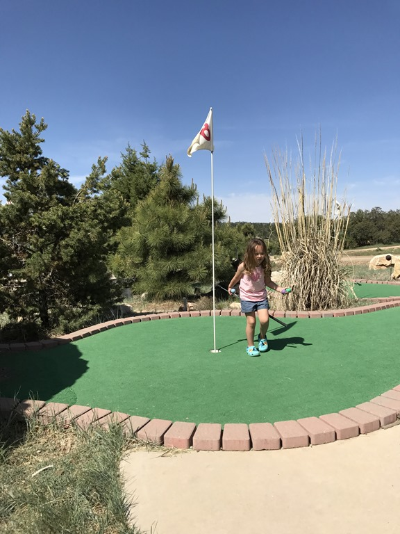
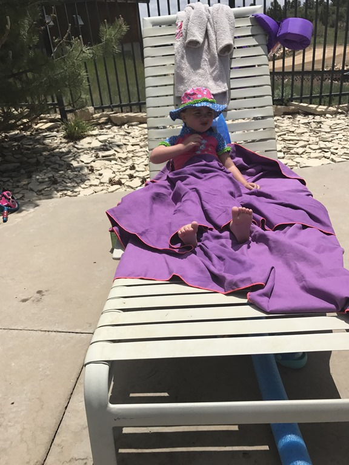

We waren van plan om via Lees Ferry naar Page te rijden, maar het beviel zo goed op Zion Ponderosa, dus hebben we besloten om een extra dagje daar te blijven. 's Morgens na het ontbijt hebben we de mini golf baan aan een grondige test onderworpen. Sofie vond het geweldig en we hadden eigenlijk best veel plezier met z'n allen.

Na dit spektakelstuk zijn we naar het zwembad gegaan. Beetje zwemmen, beetje bubbelen, beetje lezen. We waren toe aan een echte rustdag zou ik maar zeggen. 's Avonds zijn we weer gaan eten in het restaurant op de camping.

