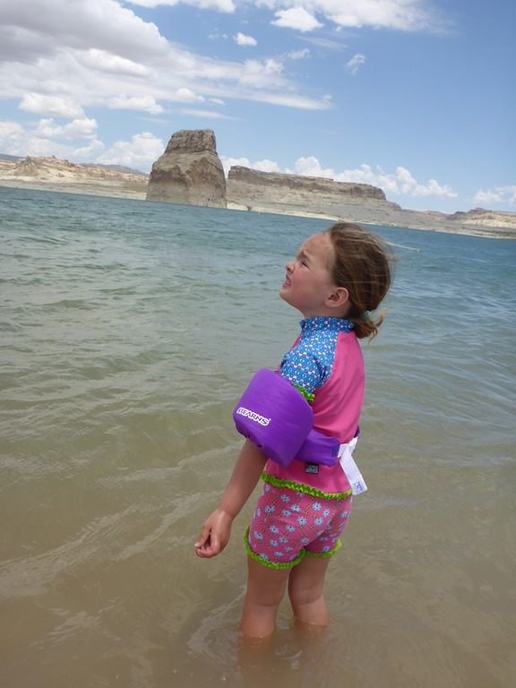
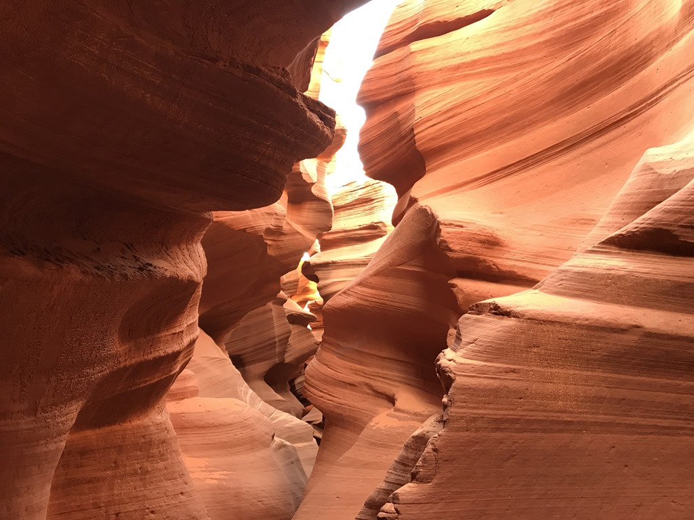
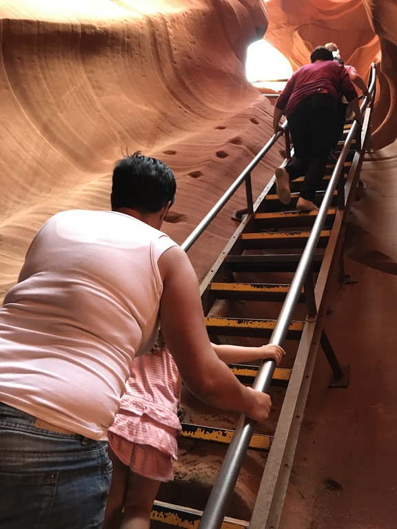
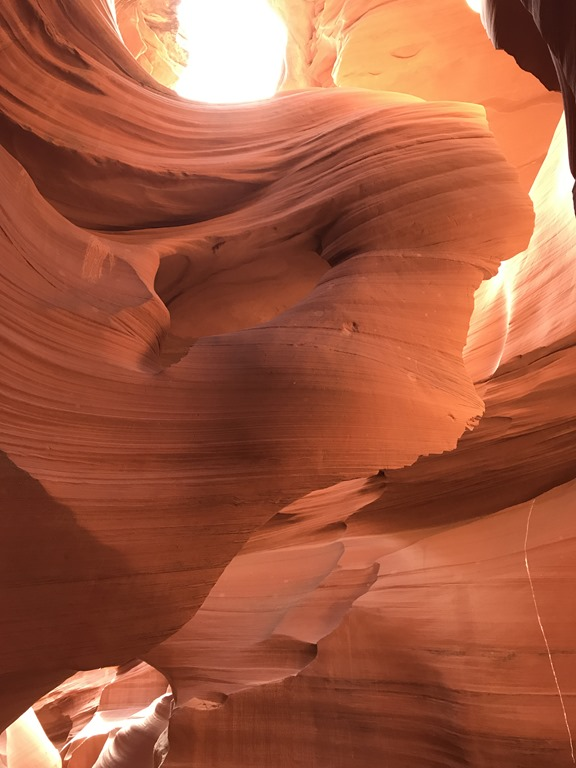
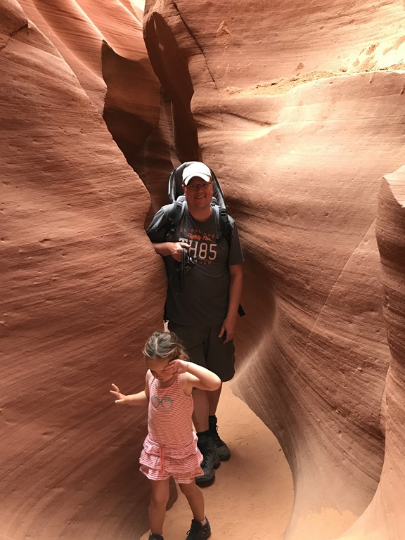
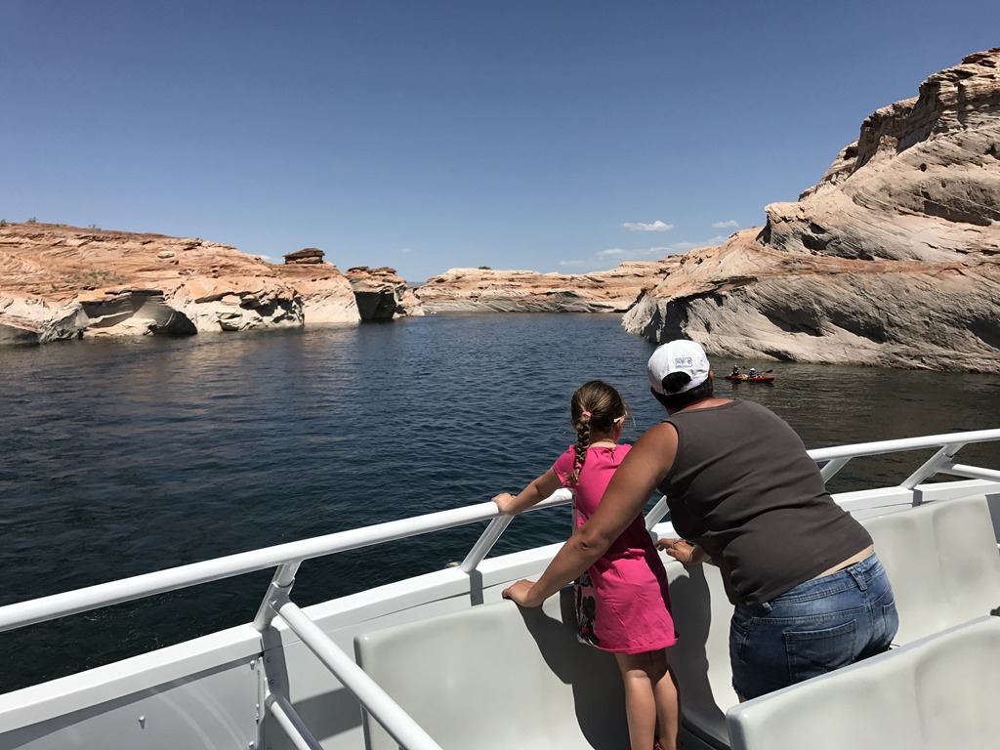

Het asfalt op Zion Ponderosa wordt op de hele camping vervangen, dus het is een komen en gaan van vrachtwagens, bulldozers en asfalteermachines. Na het ontbijt zag ik de asfalteermachine op de enige uitgang van de camping verschijnen, dus ben ik maar even gaan vragen aan de heren asfalteerders wanneer wij met onze bescheiden RV over het nieuwe asfalt kunnen. Dat blijkt dus pas over 2 uur te zijn. Wij waren redelijk ontstemd dat de dames aan de receptie hier niets over gezegd hadden. Uiteindelijk konden we via een offroad weggetje alsnog de camping verlaten. Na wat gehobbel hebben we de camping heelhuids kunnen verlaten en konden we op weg via de 89 naar Page rijden, een ritje van zo'n 2.5 uur. Die 2.5 uur zijn landschappelijk gezien niet heel interessant (zand en rechtdoor), maar hoe dichter we bij Page kwamen, hoe donkerder de wolken werden. Paar spatjes regen gehad, maar toen we wilden gaan lunchen bij Lone Rock (een strand bij Lake Powell waarop je met je camper kan overnachten) leek het redelijk op te klaren. Dus hebben we de camper op het strand geparkeerd, stoeltjes naar buiten, zonnescherm naar beneden, de dames de zwembroek aan. De dames zetten twee voeten in het water van Lake Powell, en toen begon het ineens keihard te waaien.

Dus in allerijl het zonnescherm weer in, zowel de dames als de stoelen weer naar binnen en als de wiedeweerga van het strand af. We zaten midden in een zandstorm. Links en recht storten tentjes in en vlogen parasols de lucht in.

Zo snel de storm kwam, was 'ie ook weer weg. Maar wij waren toen al bij de Wahweap campground om ons plekje te claimen. Direct daarna zijn we doorgereden naar de Lower Antelope Canyon. Hier bezoek je met een gids de beroemde slot canyon. Na een wandelingetje van een minuut of 10 ga je met een trap een meter of 20 ondergronds om de canyon te betreden. We hadden geluk, de zon brak door en dus komt de canyon tot leven met de meest fantastische kleuren.

De canyon is op somminge plekken slechts enkele tientallen centimeters breed, dus af en toe was het passen en meten met de fysiek.

De volgende morgen hebben we een rondvaart gedaan over Lake Powell. Het was een mooi tochtje van anderhalf uur.

Na nog wat boodschappen bij de Walmart zijn we naar onze volgende bestemming gereden: Cedar Breaks National Monument.

## 1 opmerking

### Gerard 6 juni 2017 om 16:52

Prachtig die canyon
