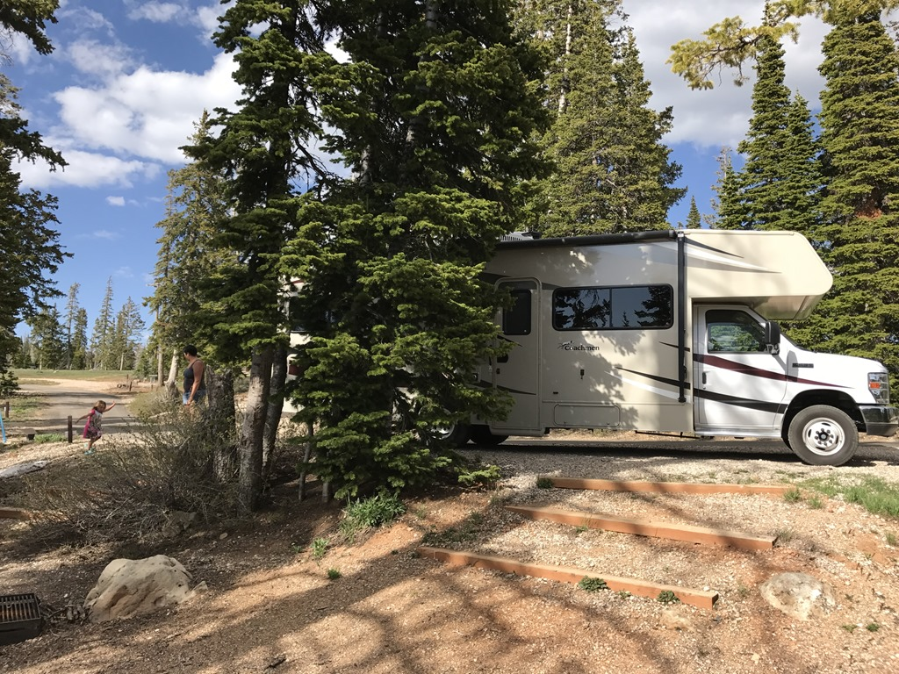
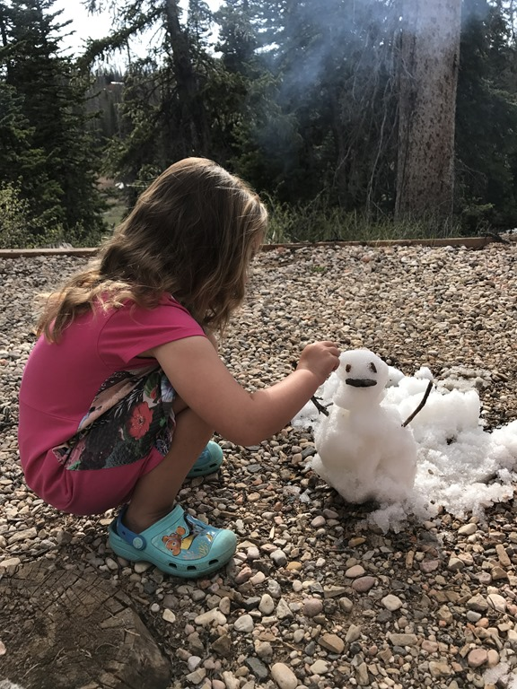
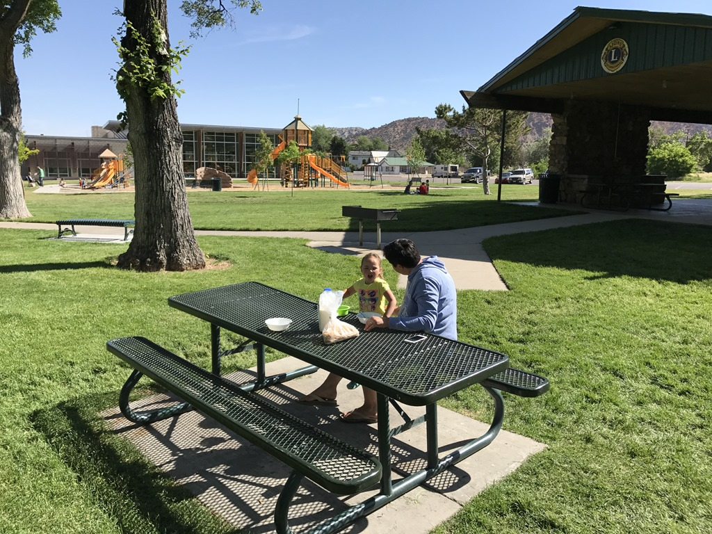
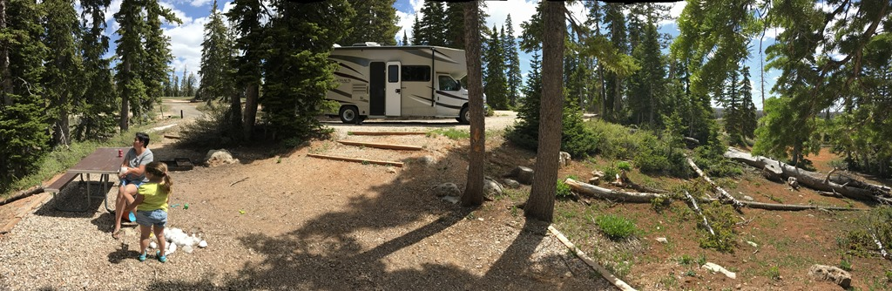
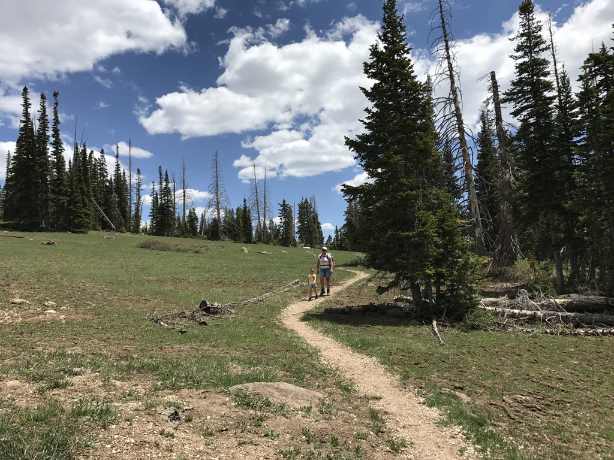
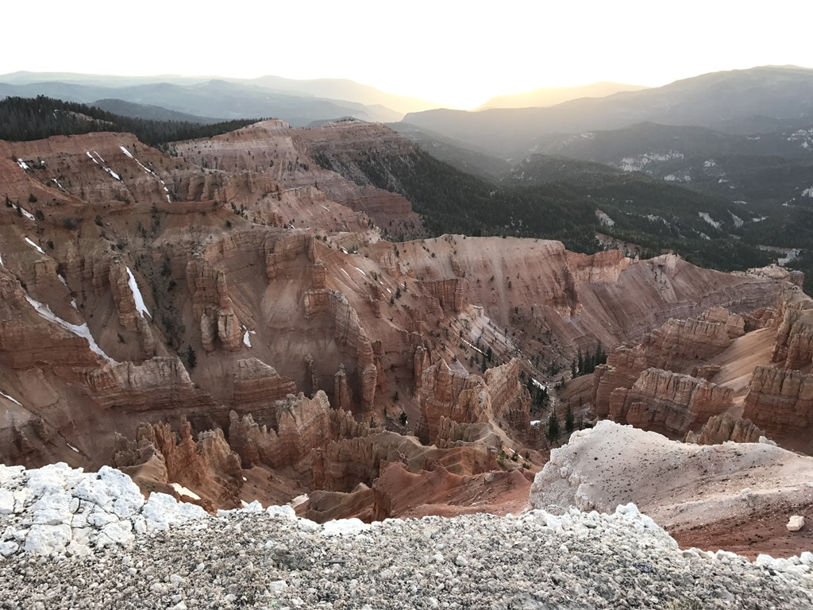

Wat een fantastisch mooie plek is dit zeg! Cedar Breaks is het kleinere broertje van Bryce Canyon. Ook hier vind je hoodoo's, windows en walls in de meest mooie kleurschakeringen, maar het lijkt nog niet echt ontdekt door het grote publiek. Hier dus geen toerbussen met Aziaten, files en overvolle parkeerplaatsen en campings. Het park ligt op een hoogte van 3100 meter, dus het is hier (gelukkig) een heel stuk koeler dan in Page. De camping is vandaag voor het eerst open, en we werden welkom geheten door onze hosts, een jong gezin die hier de hele zomer gastheer zijn. Pal naast onze site (nr 10) lag nog een hoop sneeuw, dus we hebben de gelegenheid aangegrepen om een mini-sneeuwpop te maken.

We hebben lekker de BBQ en een kampvuurtje aangezwengeld, en daarna lekker geslapen. De volgende morgen kwamen we er achter dat het CHECK lampje aan was van de koelkast. Bleek dat onze gastank wat aan de lege kant was, dus de zaterdagochtend zijn we maar snel naar Cedar City gereden om bij de lokale KOA camping gas bij te laten vullen. Daarna hebben we maar meteen van de gelegenheid gebruik gemaakt om bij de plaatselijke speeltuin te ontbijten en de kleine dame wat te laten ravotten.

's Middags zijn we vanuit de camping naar het visitor center gewandeld om een nieuw Junior Ranger boekje op te halen. De wandeling die we eigenlijk wilden doen was helaas nog van een laag sneeuw en modder voorzien, dus als alternatief zijn we maar naar de Sunset overlook gewandeld. De uitzichten zijn fraai, maar minder groots dan Bryce.

's Avonds zijn we naar de Star Party geweest. Er stond een heel zwikkie telescopen opgesteld om naar de maan en Jupiter te kunnen kijken. Het was erg leuk om te zien allemaal, hoewel het voor Sofie allemaal wat lang duurde. En in het donker terug naar de camper wandelen met je zaklamp is natuurlijk wel spannend.

## 2 opmerkingen

### opa 6 juni 2017 om 10:05

Ziet er allemaal fantastisch uit, volgende reis gaan wij ook naar Amerika. Kan onze caravan in een vliegtuig?
Groeten uit Frankrijk

### Gerard 6 juni 2017 om 17:05

Het is toch een geweldige omgeving. Voor Sofie een hele belevenis, zeker met een zaklamp in het donker lopen
