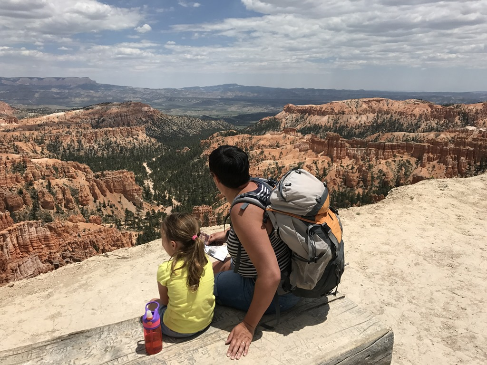
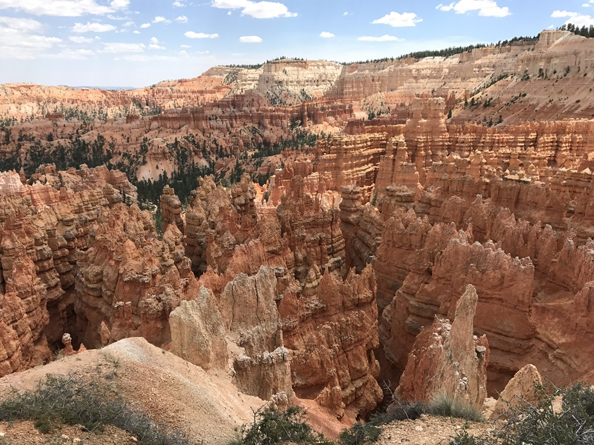
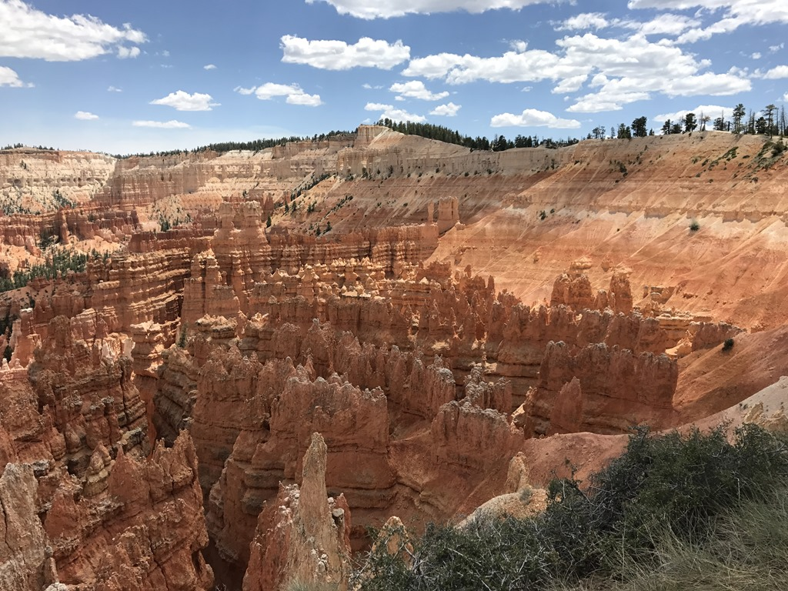
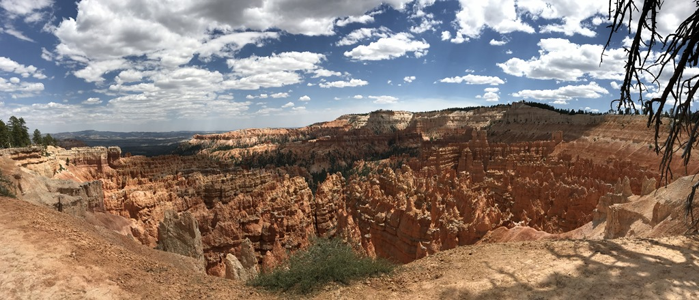

Qua Junior Ranger badges was het vandaag een topdag: Sofie heeft vanmorgen eerst de badge opgehaald in Cedar Breaks, en vanmiddag konden we de badge ophalen in Bryce.

Via de fantastische UT-143 zijn we via Panguitch naar Bryce Canyon gereden. Toen we daar aankwamen konden we meteen lunchen en zijn daarna met de shuttle bus naar Inspiration Point gereden. Van daaruit zijn we teruggewandeld richting de camper, die we bij de Visitor Center hadden geparkeerd.

In tegenstelling tot Zion was het hier gelukkig helemaal niet druk. Aan het einde van de wandeling heeft Sofie nog een film moeten kijken in het visitor center en daarna mocht ze haar mini boswachter badge ophalen. Daarna zijn we nog een uurtje doorgereden naar Kodachrome Basin State Park, onze overnachtingsplaats voor de komende nacht.

## 1 opmerking

### Gerard 7 juni 2017 om 00:24

Wat een immense schoonheid, om stil van te worden..
