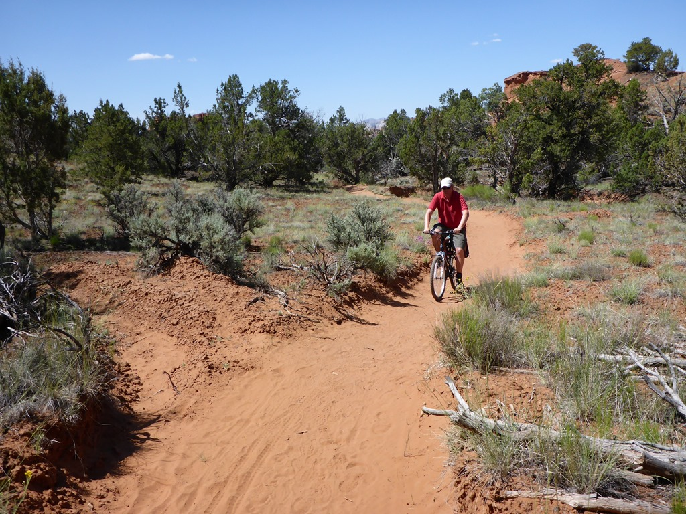
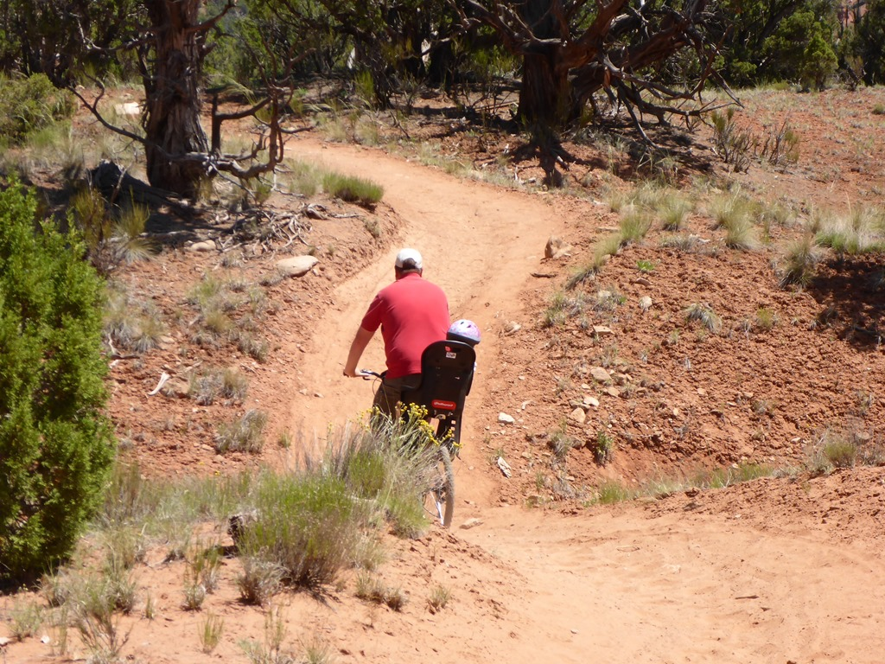
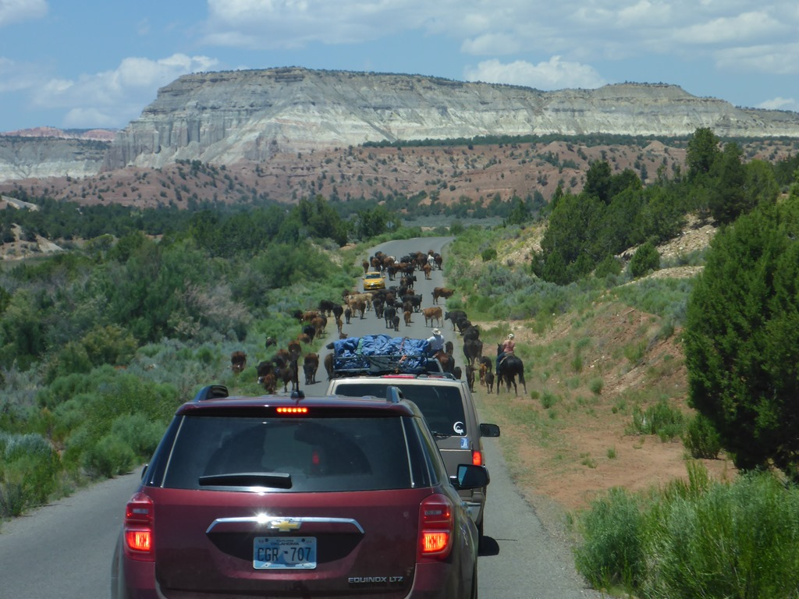

Het was heerlijk weer in Kodachrome, dus hebben we de fietsen gepakt, en hebben de Panorama Trail gefietst. In het begin gaat het padje erg op en neer en is het pad niet al te best. Het leek af en toe wel of we in een zandbak aan het fietsen waren.

Maar het is de inspanning uiteindelijk best wel waard, en met vermoeide benen en een bezweet voorhoofd zetten we koers richting de volgende stop: Escalante Petrified Forest State Park. Een hele mond vol voor een stelletje versteende bomen. Toen we het park verlieten werden we nog getrakteerd op een stukje lokale folklore. Een kudde koeien moest verhuizen van het ene naar het andere weiland, en dat moest natuurlijk uitgerekend via de weg die wij moesten rijden. Dus hebben we een aantal minuten naar cowboys en cowgirls kunnen kijken.

