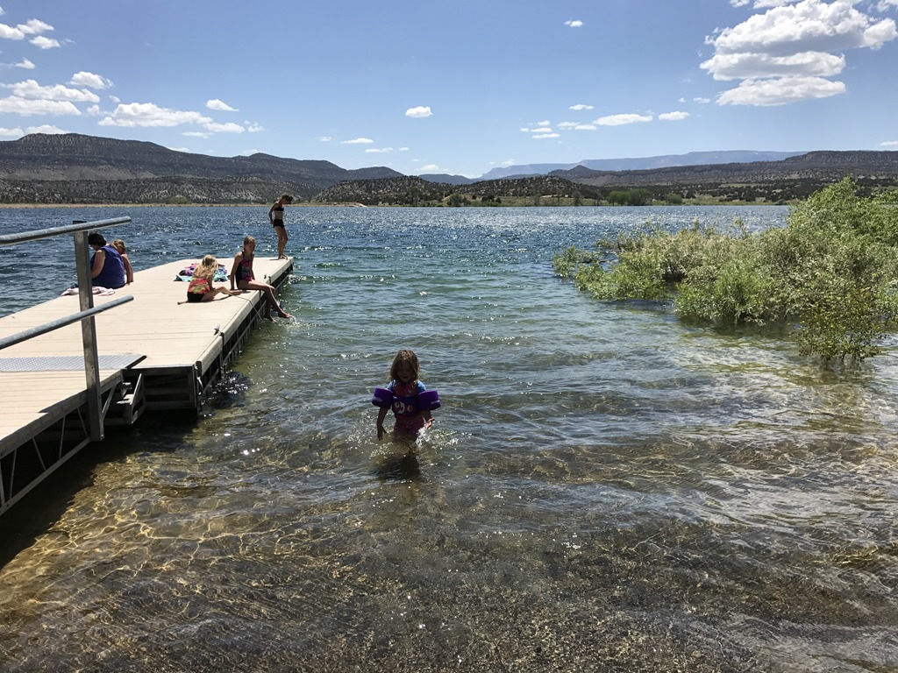
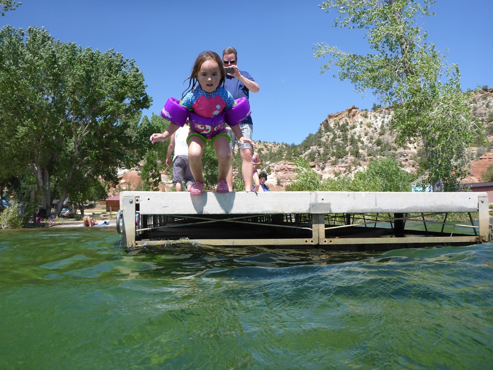
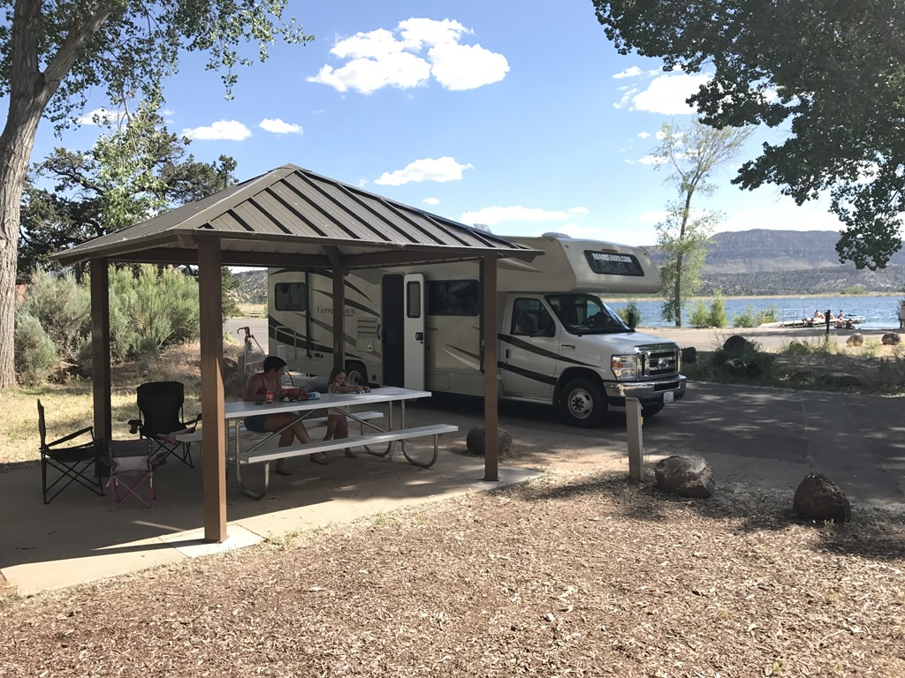
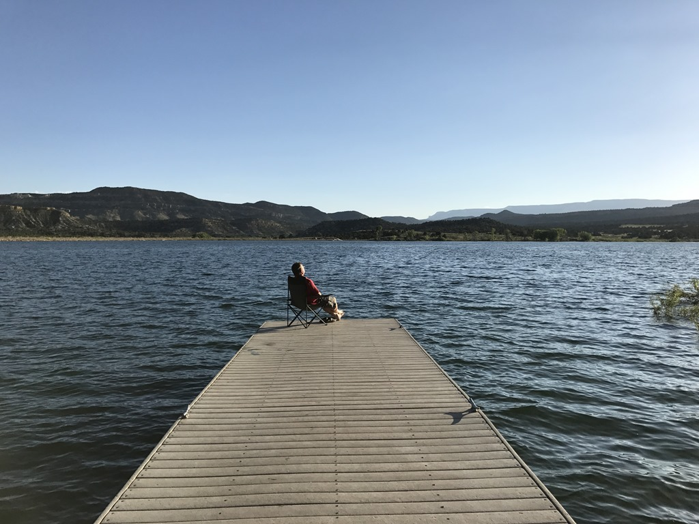

Het gezegde luidt: wanneer iets te goed klinkt om waar te zijn, dan is het waarschijnlijk niet waar. En jawel, we hadden een fantastisch mooie site op de camping (numero 22 om precies te zijn), met een prieel-achtig ding en een indrukwekkend uitzicht op het meer. Wat helaas ook indrukwekkend was, was de geur die van de vuilnisbakken kwam. Een of andere koekebakker heeft blijkbaar z'n gevangen vis schoongemaakt en de restanten in de prullenbak gemikt. Met als gevolg een penetrante vislucht die over de hele camping hangt. Gelukkig viel de stank wel mee wanneer we dicht tegen onze camper gingen zitten. Maar wel jammer natuurlijk...

De lucht weerhield de dames echter niet om een duik te nemen in het (naar later bleek) zeer koude meer.

De rest van de middag hebben we een beetje rondgehangen rond de camper.

En na het eten hebben we nog even de voetjes in het meer gedompeld.

We waren eigenlijk te lamlendig lui om naar de versteende bomen te gaan kijken. Een snelle google-actie leverde wat plaatjes op die ons niet direct motiveerde om de korte wandeling van 1 mijl te gaan ondernemen.

## 1 opmerking

### Gerard 10 juni 2017 om 11:17

Toch wel leuk zo'n prieel, er valt dan niets ongewenst in je eten. Het lijkt erop of Sofie geen enkele last heeft van het koude water. Trouwens, lui of niet lui, er mag ook wel eens een relaxdag zitten tussen de drukke bezigheden. Lekker even bijtanken.
