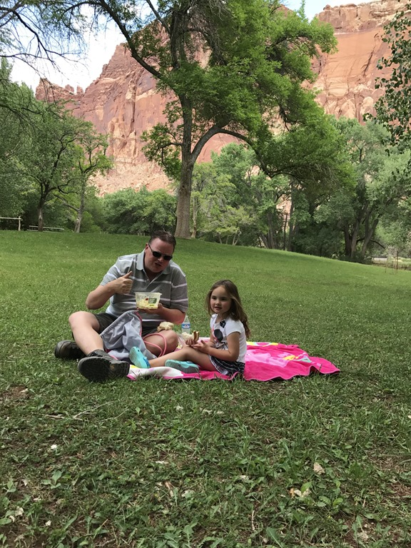
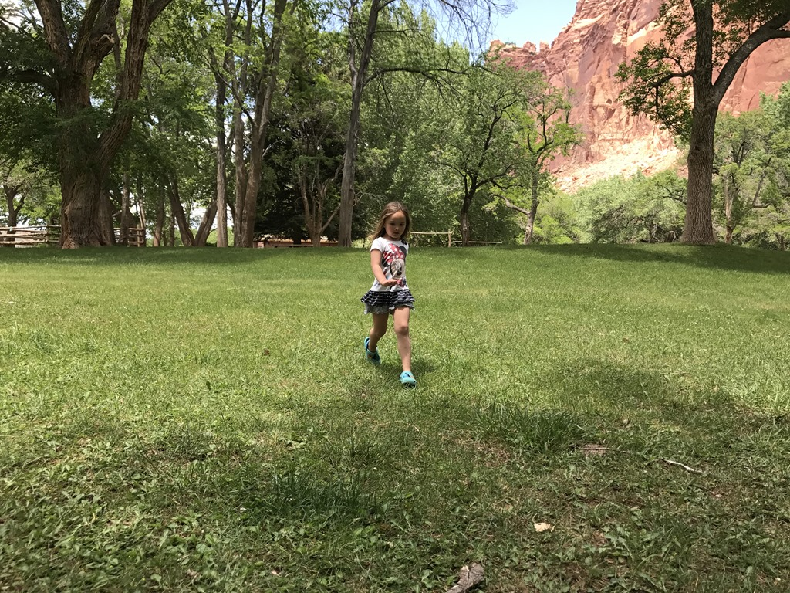

De rit vanuit Escalante Petrified Forest naar Capitol Reef gaat via de fabelhafte All American Road UT-12. Het lijkt wel of de heren wegenbouwers hun best hebben gedaan om zoveel mogelijk bochten, steigingen en afdalingen te combineren in iets van 100 kilometer. Het landschap is waanzinnig mooi en op een gegeven moment rijd je bovenop de bergkam met links en rechts duizelingwekkende afgronden. Nadat we de top van 9600 feet hadden bereikt, dalen we langzaam maar zeker weer richting de zandbak en rotsformaties van Capitol Reef.

Het is lunchtijd dus we rijden direct naar het grasveld iets voorbij het visitor center en eten een lekkere boterham en aardappelsalade. We spelen nog wat met de bal, en daarna gaan we naar onze camping 1000 Lakes in Torrey. Er moet weer eens gewassen (en gezwommen) worden. We eten 's avonds lekker in het restaurant van de camping.

## 1 opmerking

### Anoniem 9 juni 2017 om 00:25

Blijft mooi het Escalante plateau! We genieten van de plaatjes. Groetjes BHV
