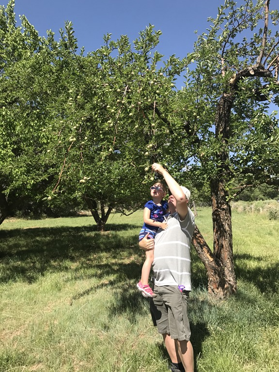
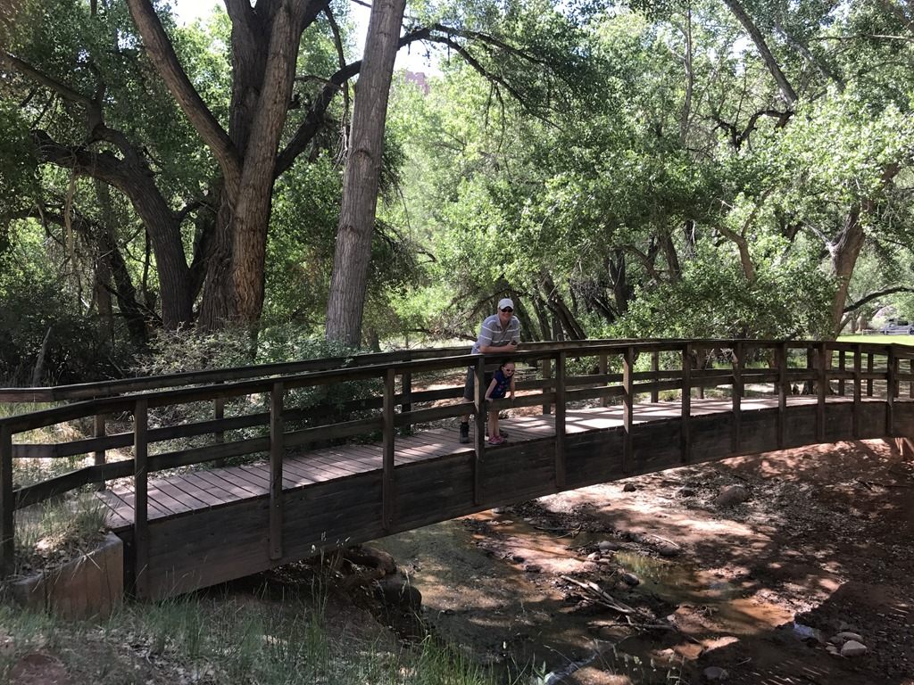
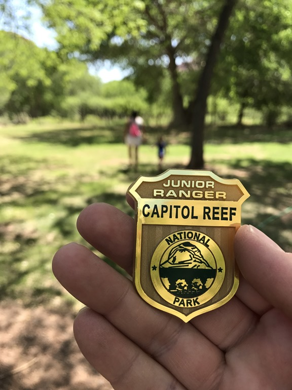
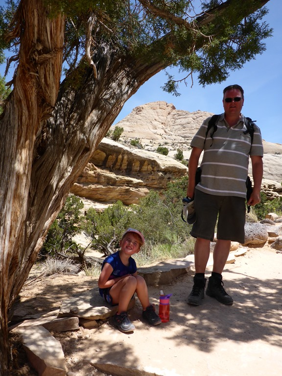
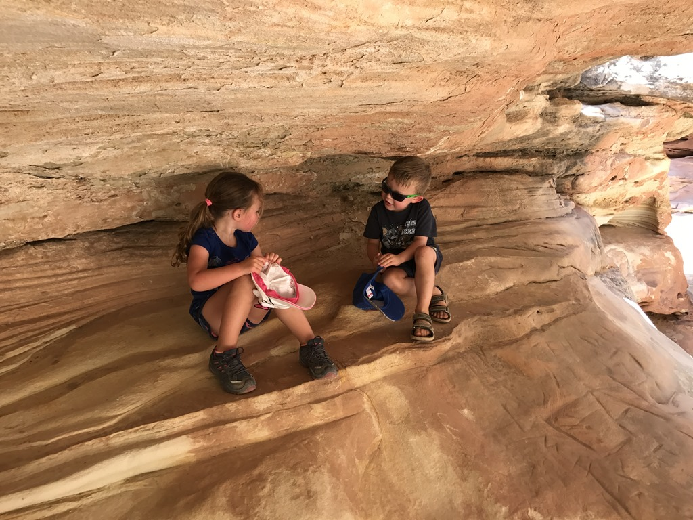
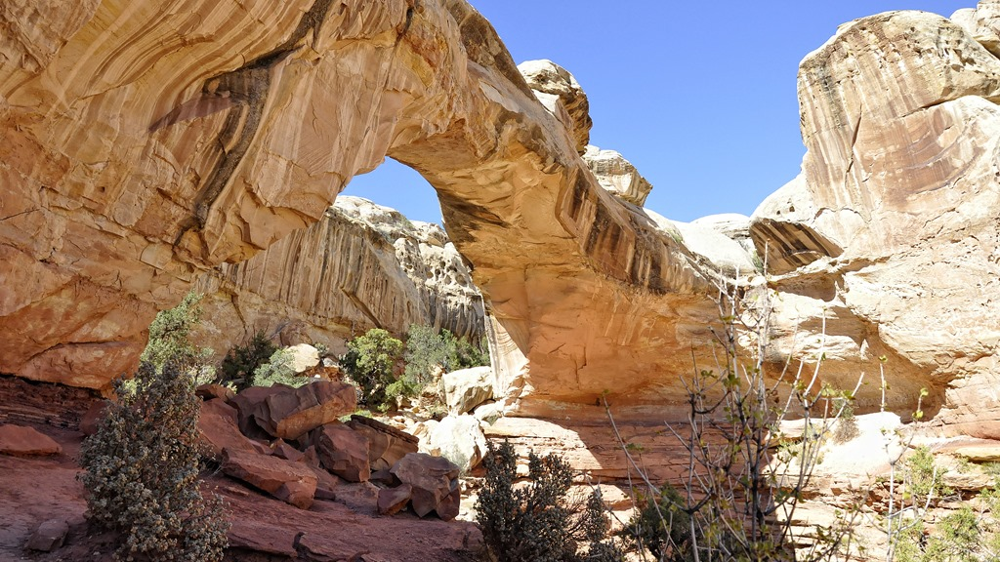
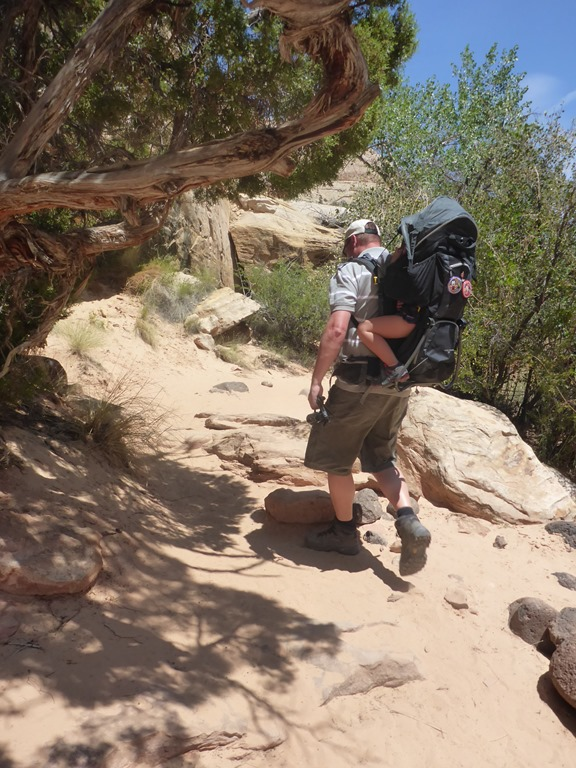
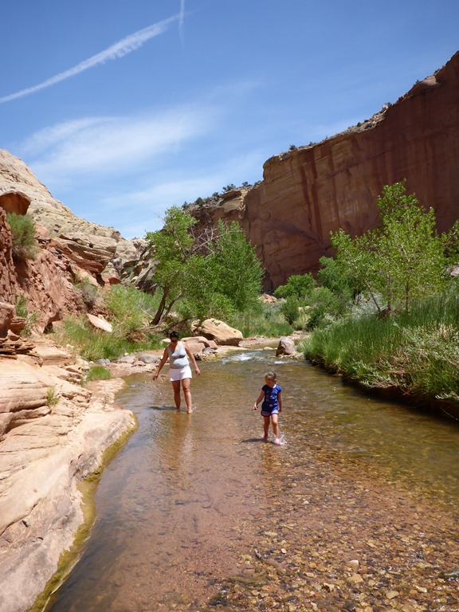
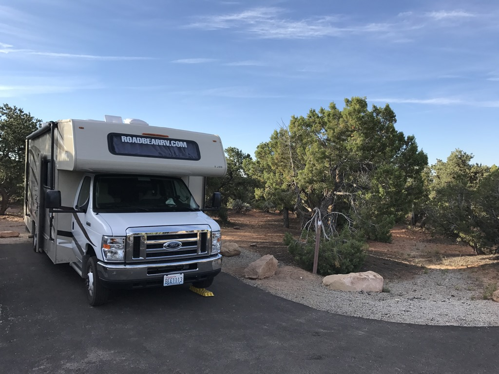

We zijn 's morgens weer naar het grasveld voorbij de visitor center gegaan, omdat de laatste activiteit voor het Junior Ranger programma, een praatje van een Ranger bijwonen, daar in de buurt plaatsvindt. Dus Sofie heeft weer even lekker kunnen rondrennen, en we hebben de fruitboomgaard bekeken.

Van het praatje van de ranger hebben we in ieder geval twee dingen opgestoken:

- Kleine ratelslangen zijn gevaarlijker dan grote, omdat zij bij een beet het gif niet doseren. Je krijgt dus de volle laag toegediend. Dat is voor een mens waarschijnlijk niet dodelijk, maar schijnbaar wel pijnlijk en je krijgt een lelijke wond. Een volwassen slang weet dat je geen prooi bent voor 'm, dus de dosering gif is voldoende om je af te schrikken, en hij houdt nog wat over voor z'n echte prooien.

- De Joker uit Batman is verzonnen door een meneer die een tijd in Capitol Reef heeft gewerkt en gewoond.

Na het verhaal van 20 minuten was het tijd voor de eed, en Sofie kreeg haar nieuwe badge uitgereikt.

Na de lunch zijn we op zoek gegaan naar de Hickman Bridge. Het padje was niet al te moeilijk, maar het was wel heel erg warm, dus al met al toch best een beproeving. Bij de bridge kwamen we een Zwitsers stel tegen met een even oude peuter als Sofie, die de voorgaande nacht naast ons op de camping hadden gestaan. Sofie heeft onder de bridge even gespeeld.

De heenweg heeft Sofie zelf gelopen, maar de terugweg mocht ze in de rugdrager.

Na de wandeling hebben de dames nog even de voetjes nat gemaakt in het riviertje.

Hierna zijn we op weg gegaan naar onze volgende camping. Oorspronkelijk was het plan te overnachten bij het noord-oostelijke puntje van Lake Powell (bij Hite), maar aangekomen op de camping hadden we er niet zo'n goed gevoel bij. Er was werkelijk helemaal niemand! Dus zijn we maar doorgereden naar Natural Bridges National Monument. We hadden wederom geluk: de laatst beschikbare site van de aanwezige 13 was voor ons! En nog een mooie plek ook.

## 2 opmerkingen

### Anoniem 9 juni 2017 om 23:01

Hoi Chantal, hebben wij beiden ons al jaren afgevraagd of je er kon staan met de 30 voeter.
Nou prima en mooi plekkie hoor in Natural Bridges NM. Ben benieuwd hoe het er is. Groetjes H.

### Gerard 10 juni 2017 om 11:25

Erg mooie plaatjes weer. Ik zie dat Sofie een goed gesprek heeft. Die twee zitten er ontspannen bij
