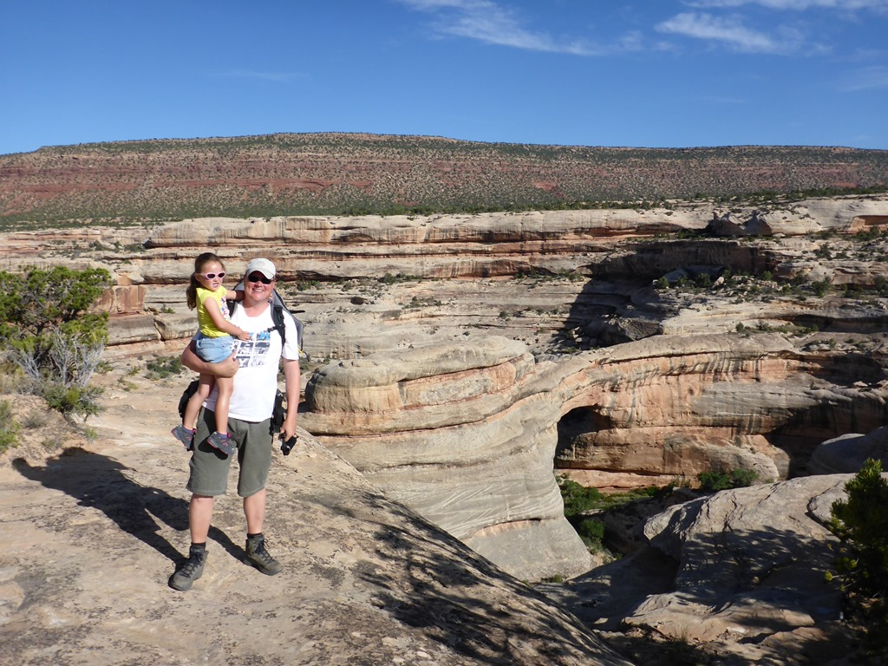
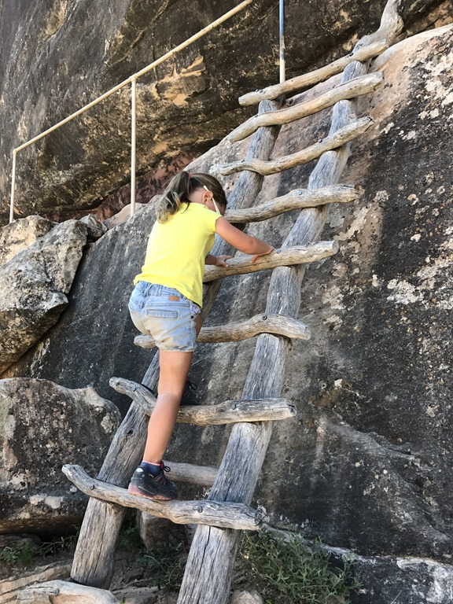
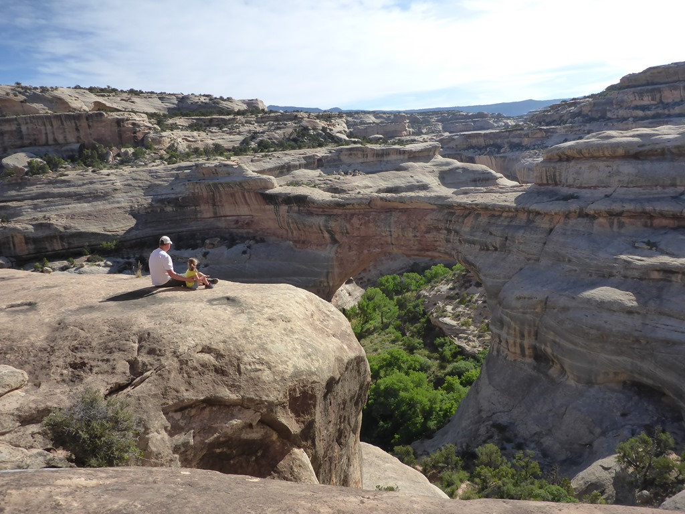
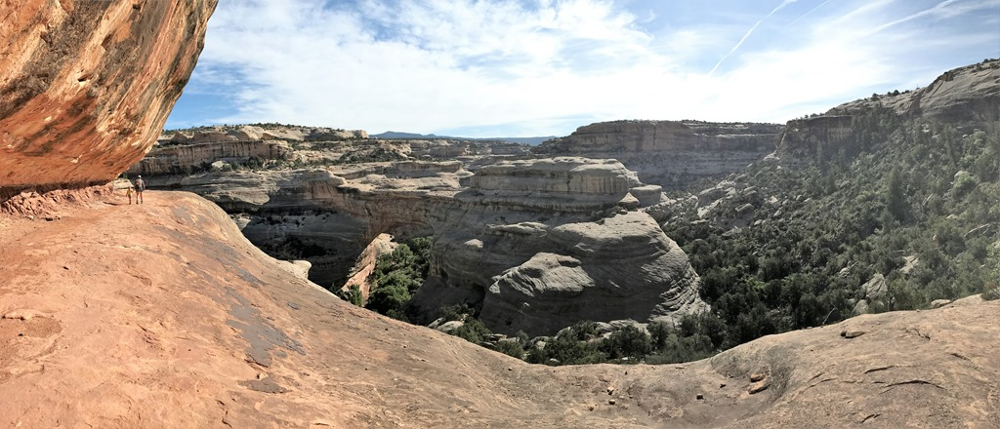
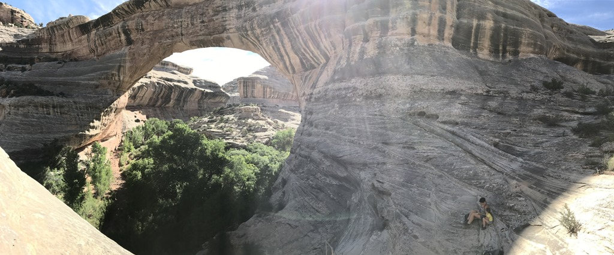
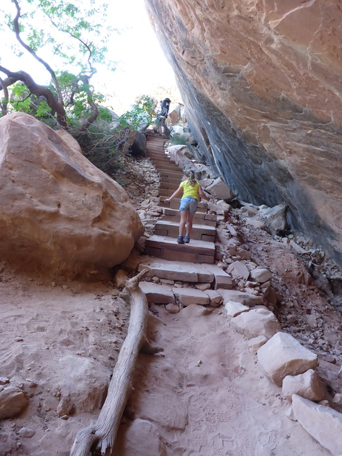
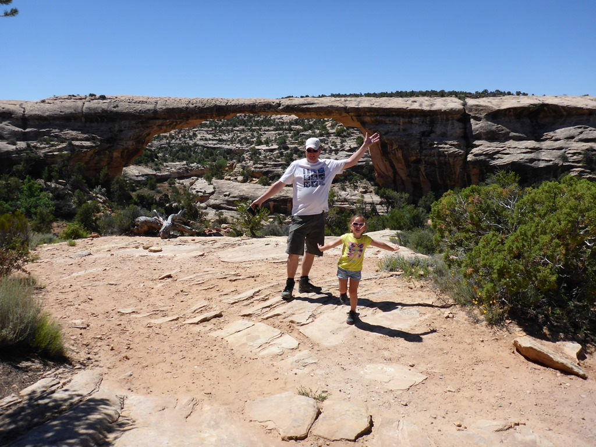

Om de hitte maar ook de drukte bij de trailheads voor te zijn, zijn we om 7 uur vertrokken van de camping om de scenic loop van 9 mijl af te leggen. Onderweg kom je bij een drietal natuurlijk gevormde bruggen met makkelijk te onthouden namen, Sipapu, Kachina en Owachomo, ter ere van de indianen die hier ooit gewoond hebben. De eerste en laatste brug hebben we vereerd met een bezoek, de Kachina hebben we enkel bewonderd vanaf de parkeerplaats.

Als eerste gingen we dus de vallei in om de Sipapu van dichtbij te bekijken. Het heeft met 82 meter de op een na grootste overspanning ter wereld en is daarmee dus de Joop Zoetemelk onder de natuurlijke bruggen.

Met behulp van een aantal trappen en ladders moesten we naar beneden klauteren.

Onderweg had je op sommige plaatsen een erg mooi uitzicht op de brug.

Bij de voet van de brug hebben we een fruitje gegeten en zijn toen weer naar boven geklommen. De rugdrager hebben we voor niets meegenomen, met behulp van wat kleine omkoperij heeft Sofie helemaal zelf naar boven gelopen.

Ondanks de beperkte lengte van 1 km enkele reis, was dit een van de leukste paadjes die we ooit gewandeld hebben.

De wandeling naar Owachomo is slechts 400 meter, maar de brug is zeker ook de moeite waard.

Hierna was het tijd om de Junior Ranger badge op te halen bij het visitor center, en zijn we doorgereden naar onze overnachtingsplaats in Cortez. Na een boodschap bij de Walmart, rijden we naar Mesa Verde RV Resort. Kleine camping, niet zo heel bijzonder, maar wel een mooi zwembad, dus daar hebben we maar gebruik van gemaakt. Mesa Verde National Park ligt op een steenworp afstand, maar bij een eerder bezoek vonden wij het niet zo interessant om er nogmaals naar toe te gaan. Die slaan we dus maar over deze keer.

## 2 opmerkingen

### Gerard 11 juni 2017 om 12:22

Wat een prachtige omgeving. En Sofie, wij vinden dat je groot wordt, niet te snel groeien hoor.....

### Anoniem 11 juni 2017 om 22:39

Altijd leuk zo'n onverwacht pareltje! Van die uitzichten, die je in een foto niet kan bevatten!
Dank voor de mooie tip! Groetjes BHV
